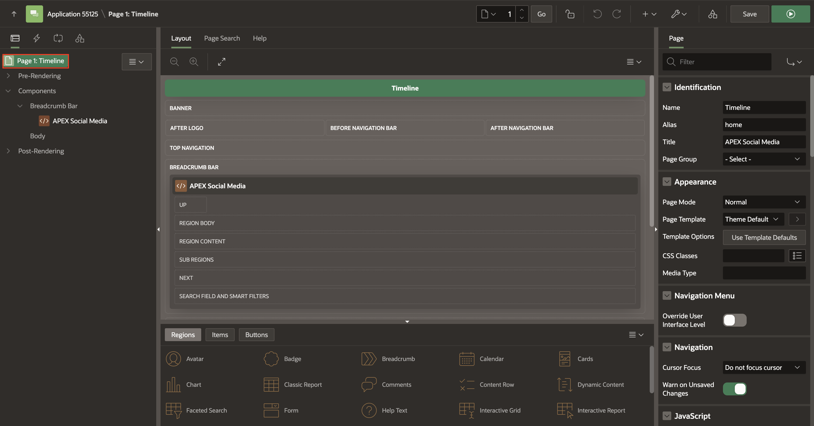
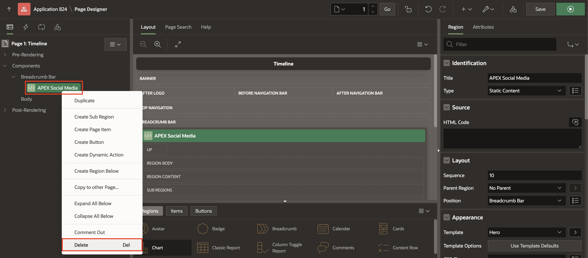
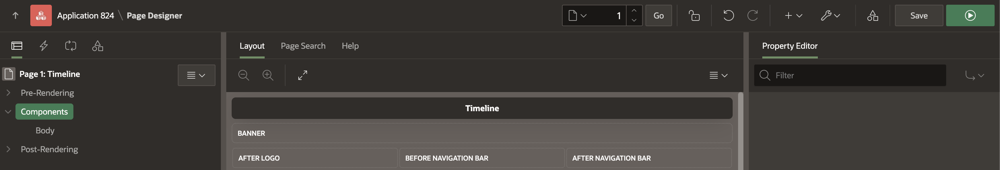
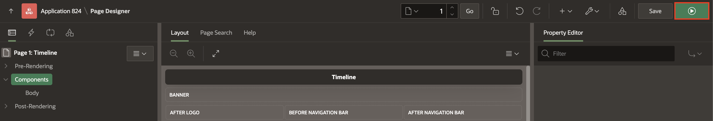
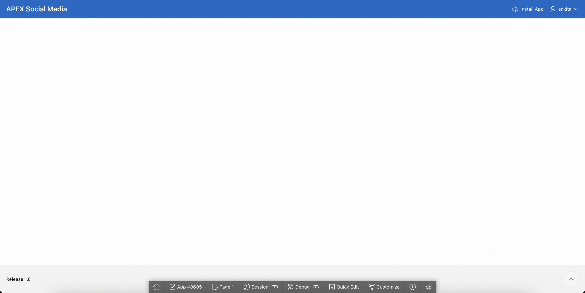

# Customizing the App Homepage

## Introduction
In this lab, you will take advantage of the low code development by customizing the Social Media App declaratively. You will learn to navigate and modify the application and page properties.

Estimated Time: 10 minutes

## **Task 1**: Remove the Navigation Menu

1. The first thing we want to do is configure the page to not show any
navigation menu. We do this by ensuring that the top-level rendering
tree entry is selected on the left section (**Page 1: Timeline**), and
then by looking at the Page details on the right. Look for the Navigation Menu section in the list.

    

2. We want to click the switch **Override User Interface Level** and leave
the List option at the default of *Do not show the Navigation Menu List*.

    

## **Task 2**: Remove the Breadcrumb Region

Since our app is going to be a Single Page Application, we do not need or want a breadcrumb bar at the top of the page. Let us go ahead and delete the one that got created by default.

1. In the Rendering Tree, navigate to **APEX Social Media** under Components > Breadcrumb Bar and then press your
keyboard delete key.

    

2. Observe how the tree reflects after the breadcrumb was deleted.

    

3. Click **Save and Run** to see how they have affected our app so far.

    

    **Once your signed in (if you weren't already), your app should look
like this:**

    

    **Note:** This will be our process of iterating over the app development: Make
changes, Save and Run and review the effects of our changes.

    With the navigation list and the breadcrumb removed, we have a nice
clean slate to proceed with.

    Switch back to your browser tab with **Page Designer**.

## **Acknowledgements**

 - **Author** - Jayson Hanes, Principal Product Manager; Apoorva Srinivas, Senior Product Manager; 
 - **Last Updated By/Date** - Apoorva Srinivas, Senior Product Manager, March 2023