# Build the Page Regions

## Introduction

In this lab, you will create regions that represent APEX features and serve as content containers for the page. These regions will contain page items and buttons.

The first region will be a **FORM** region, and the second will be a **CARDS** region. The  **FORM** region will present a UI that enables users to choose an image file from their device (or take a picture on mobile) and enter an associated comment for the post.

The Cards region will display photos and images in a grid layout as they are inserted into the SM_POSTS table through the Form region. This region will also serve as the foundation for additional features, such as displaying post comments, reaction counts, and buttons for reacting/liking a post or deleting one's own posts.

<!-- Watch the video below for a quick walk-through of the lab.
[Create an APEX App](videohub:1_myqq59w2) -->

### Objectives

In this lab, you will:

- Create and configure a Form region.

- Customize page components and layout.

- Create buttons and dynamic actions.

- Configure a process to insert records into the database

### Prerequisites

- All previous labs 1-4 are executed.
- If you are starting the workshop from Lab 5, ensure that you have executed the **Alternate Time Saver** task in Lab 4.

Estimated Time: 15 minutes

## Task 1: Add a Form Region

1. Switch back to **Page Designer** and on the Application home page, navigate to **Page 1 - Timeline**.

    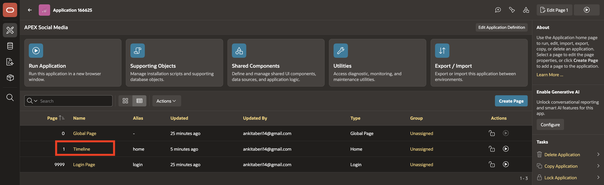

2. In the left pane, right-click **Body**, and select **Create Region**.

    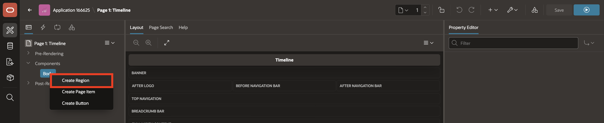

3. In the Property Editor, enter/select the following:

    - Under Identification:

        - Name: **Post**

        - Title: **Post**

        - Type:  **Form**

    - Source > Table Name: **SM_POSTS**

    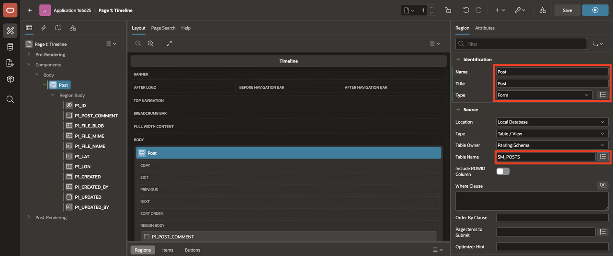

    You will see that APEX automatically populates the available table columns as form fields in the form (visible on the left in the tree view and in the layout view).

4. Click **Save and Run** and view the app.

    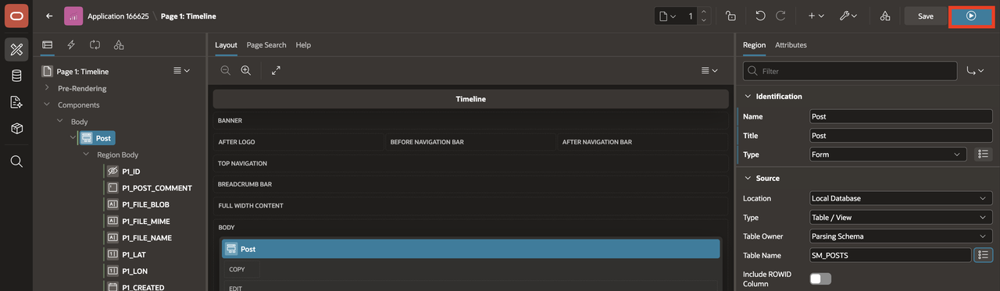

    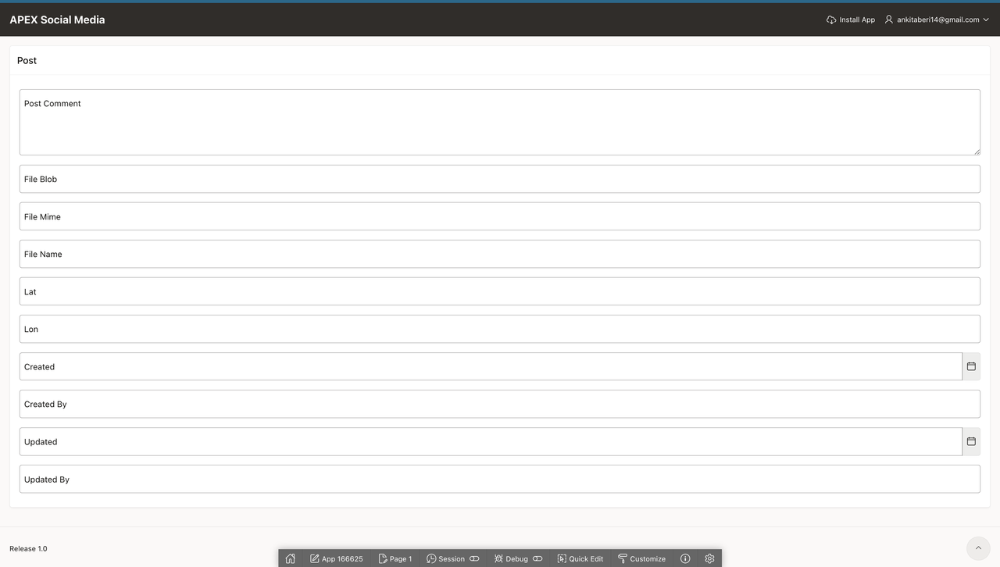

## Task 2: Clean up and configure the Form UI Page Components

1. Again switch back to Page Designer. Currently, the form displays input fields for the table columns, but it does not save any data yet and requires some adjustments. Some of the generated page items are not needed, while others need to be modified.

    To refine the form, select each of the following page items individually and press **Delete**. Alternatively, use **Control + Click** to select multiple items and delete them at once.

    - **P\_FILE\_MIME**

    - **P1\_FILE\_NAME**

    - **P1\_CREATED**

    - **P1\_CREATED\_BY**

    - **P1\_UPDATED**

    - **P1\_UPDATED\_BY**

    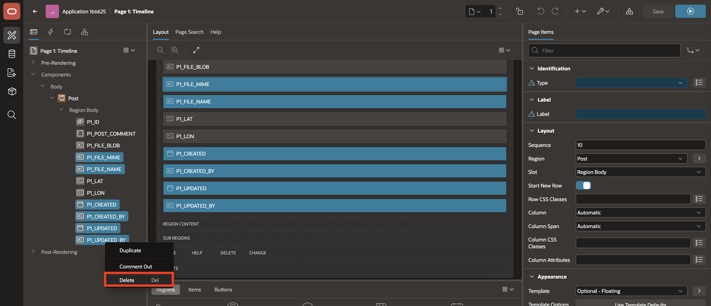

    After deletion, the Rendering tree of columns in the Post Form region will look like this:

    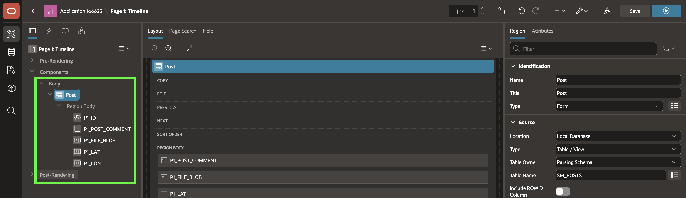

    **If you made a mistake** , you can easily re-synchronize all the Region Page items back and repeat the process. To do this, **right click** on the **Post** region and select **Synchronize Page Items**. Then, carefully delete the items that are not needed.

    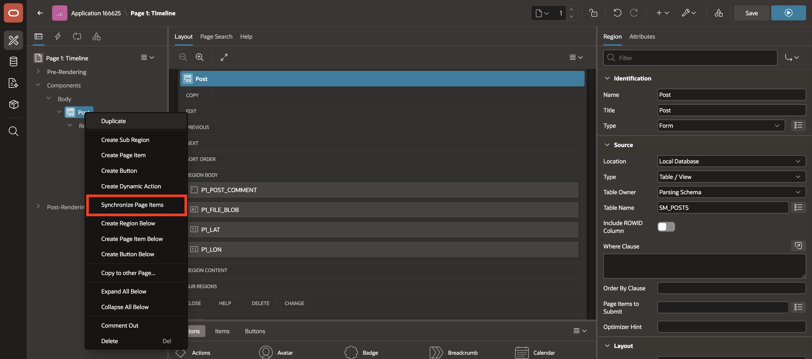

2. Select the **P1\_POST\_COMMENT** item and update the following:

    - Under Identification:

        - Type: **Text Field**

        - Label: **Post**

    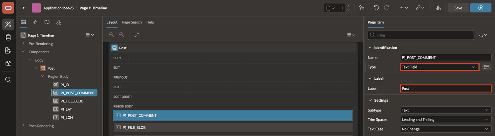

3. Click **Save and Run** and see the results of our changes so far!

    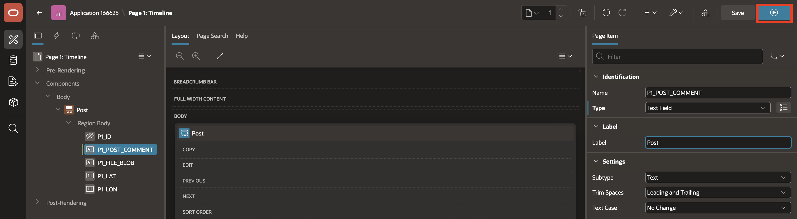

    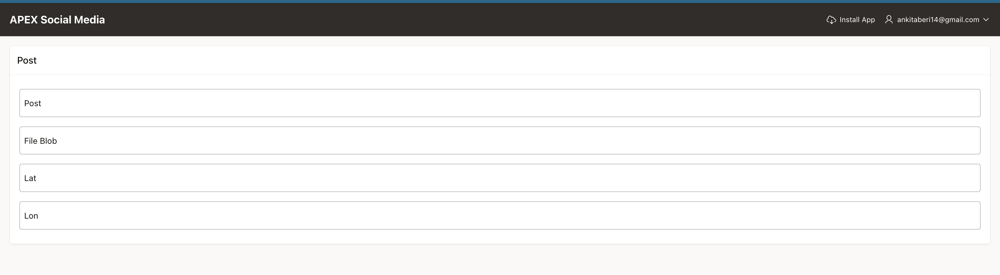

4. Next, hide the **Lat** and **Lon** page items. In Page Designer, select both **P1\_LAT** and **P1\_LON**

    - Identification > Type: **Hidden**

    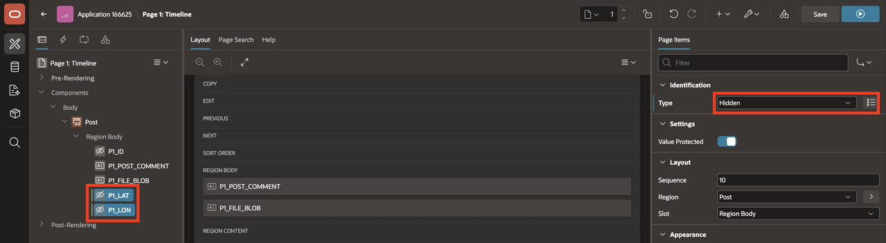

    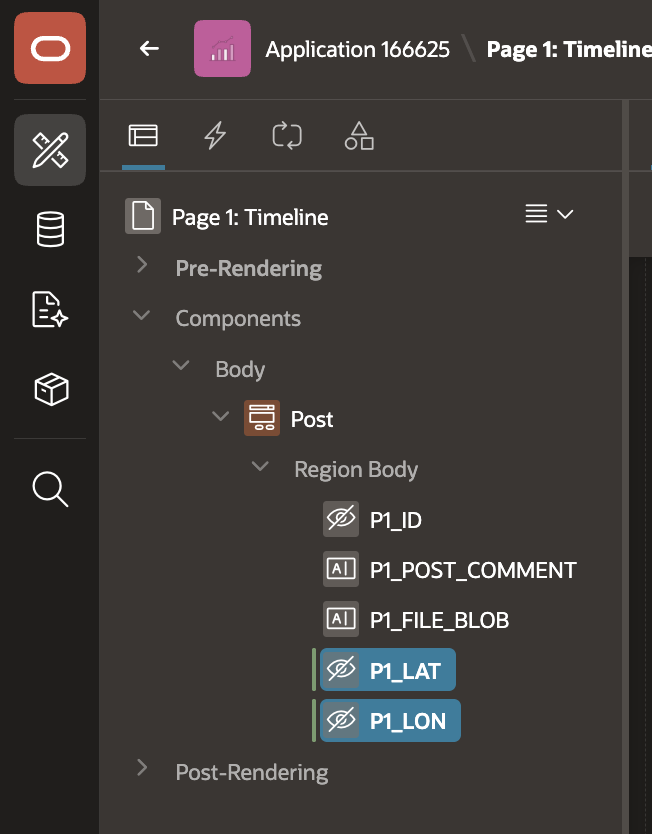

5. Next, update the **P1\_FILE\_BLOB** page item:

    - Identification >  Type: **File Upload**

    - Label > Label: **Photo**

    - Under Display:

        - Display As: **Block Dropzone**

        - Dropzone Title: **Share a photo..**

    - Under Storage:

        - Type: **BLOB column specified in Item Source attribute**

        - MIME Type Column: **FILE\_MIME**

        - Filename Column: **FILE\_NAME**

        - File Types: **image/***

        - Maximum File Size: **10000**

    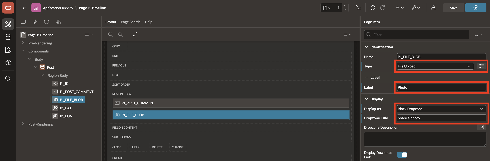

    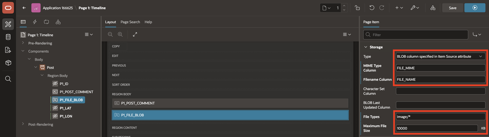

6. Click **Save and Run** and review the updated UI.

    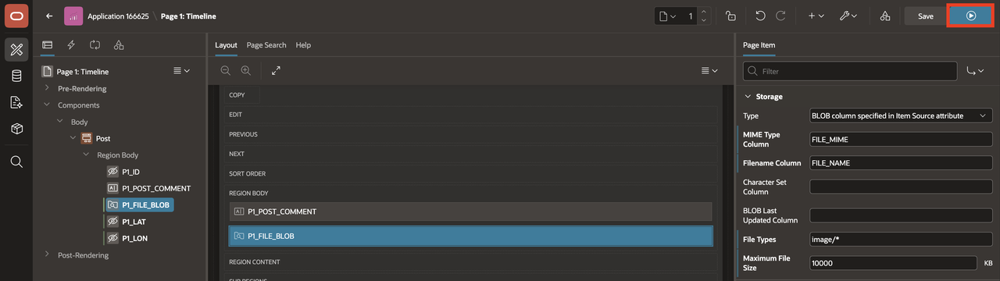

    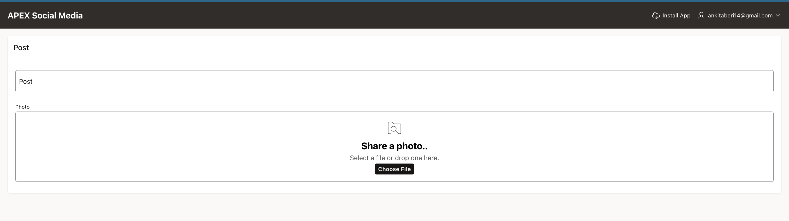

## Task 3: Rearrange and Customize Components

Initially, the form should not be visible to the user. To achieve this, we will update the region settings to position it in a way that keeps it hidden when the page loads. Next, we will make a few adjustments and add a button that will display the form as a modal when clicked.

1. First, let's improve the user experience by rearranging the form fields.

    Move the **P1\_POST\_COMMENT** item below the **P1\_FILE\_BLOB** item so that users select a photo first and then add a comment.

    Simply drag **P1\_POST\_COMMENT** under **P1\_FILE\_BLOB** in the Page Designer.

    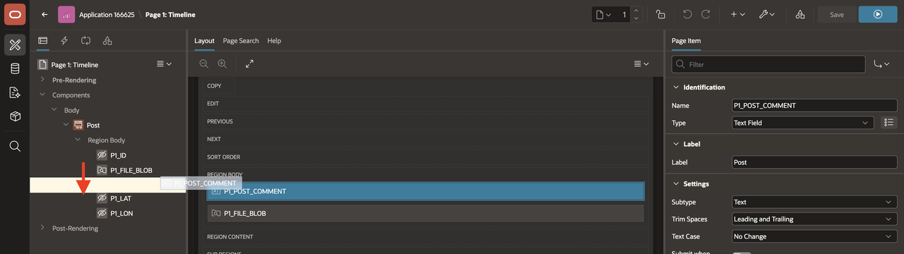

2. In the left pane, click **Post** region and enter/select the following in the property editor:

    - Layout > Slot: **Dialogs, Drawers and Popups**.

    - Under Appearance:

        - Template: **Inline Dialog**

        - Click **Template Options** and select the following:

            - Under Common:

                - Auto Height: **Check**

                - Size: **None**

            - Under Advanced:

                - Heading Level: **H1**

                Click **OK**.

    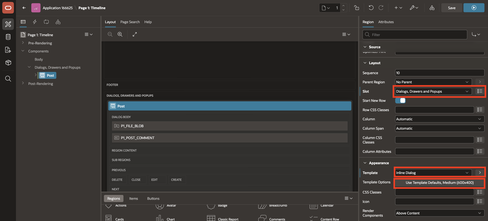

    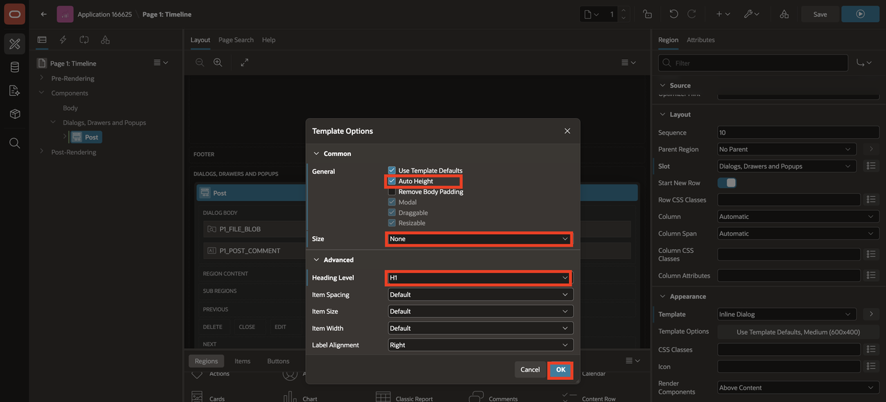

3. Now **Save and Run** the app.

    You may not see anything at first, and which is expected. Since we changed the form region to an inline dialog, it stays hidden when the page loads. To make it visible, we need to create a button that will open it.

    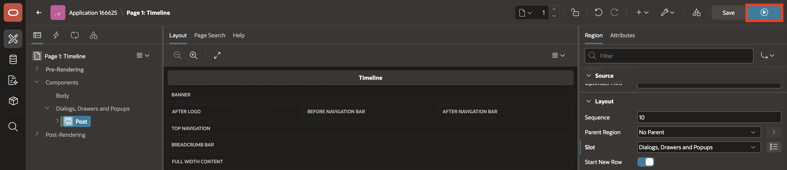

    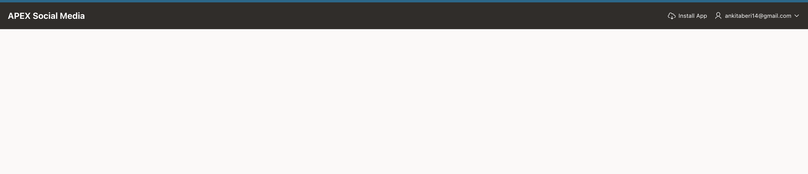

## Task 4: Create a Button to Open the Post Dialog with a Dynamic Action

1. In the left pane, right-click **Components** and select **Create Button**.

    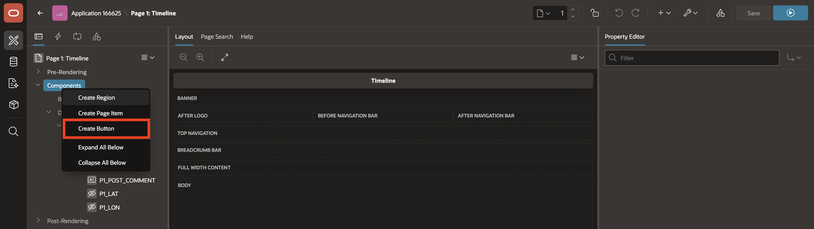

2. In the Property Editor, enter/select the following:

    - Identification > Name: **ADD\_POST**

    - Layout > Slot:  **After Logo**

    - Under Appearance:

        - Button Template: **Text with Icon**

        - Hot: Toggle **On**

        - CSS Classes: **new-post-button**

        - Appearance > Icon: **fa-plus**

    - Behavior > Action: **Trigger Action**

        The button configuration should resemble the following.

    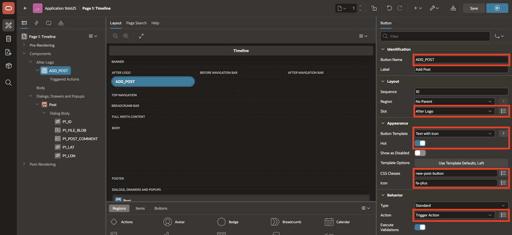

3. Under **Triggered Actions**, select Execute Server-side action. In the Property Editor, enter/select the following:

    - Under Identification:

        - Name: **Open Post Dialog**

        - Action: **Open Region**

    - Under Affected Elements:

        - Selection Type: **Region**

        - Region: **Post**

    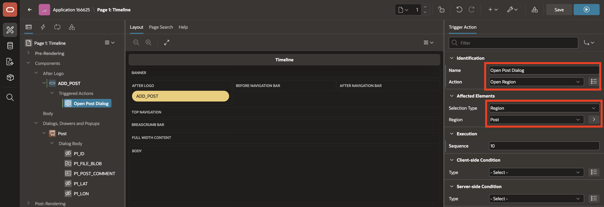

4. This completes most of the Form region configuration. Click **Save and Run**!

    You will now see the **+Add Post** button and nothing else, until you click it, and then the in-line dialog opens with the Post **form**.

    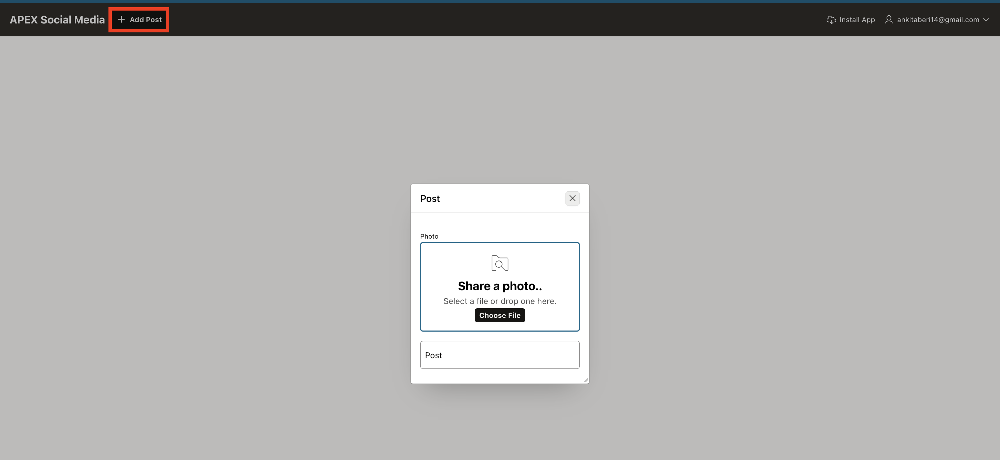

## Task 5: Create a Save Button

Next, create a button that allows users to save their posts.

1. In the left pane, right-click **Dialogs, Drawers and Popups > Post** region, and click **Create Button**

    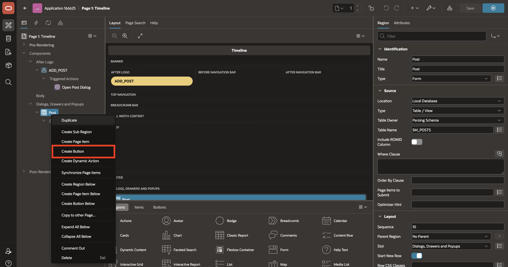

2. In the Property Editor, enter/select the following:

    - Identification > Button Name: **Save**

    - Layout > Slot: **Next**

    - Under Appearance:

        - Hot: Toggle **ON**

        - Template options: Click **Use Template Defaults**

    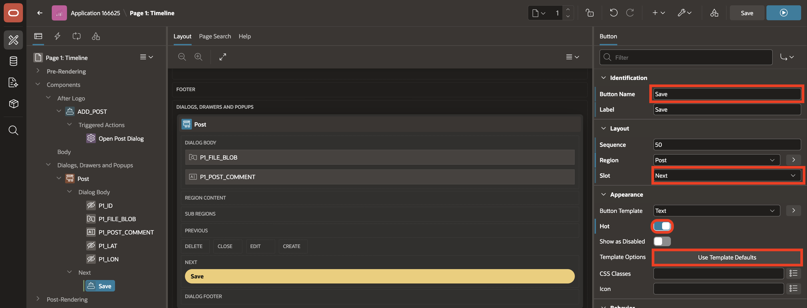

3. In the Template Options dialog box, enter/select the following and click **OK**.

    - Common > Size: **Large**

    - Advanced > Width: **Stretch**

    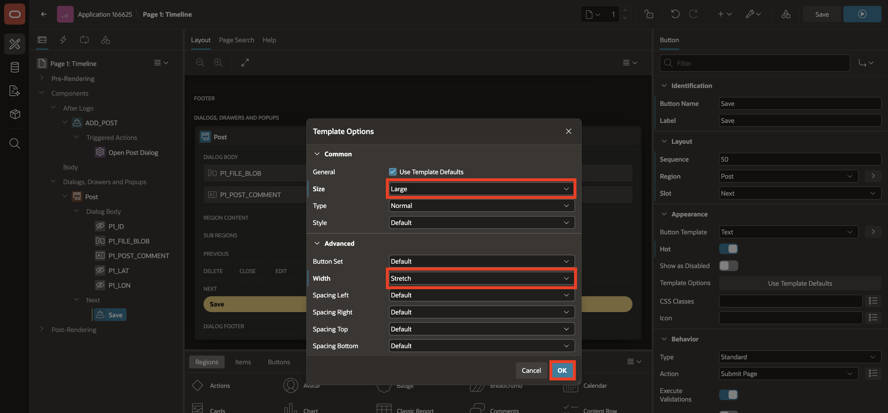

4. Navigate back to Property Editor and enter/select the following:

    - Appearance > CSS Classes: **post-button**

    - Under Behavior:

        - Action: **Trigger Action**

        - Database Action: **SQL INSERT action**

    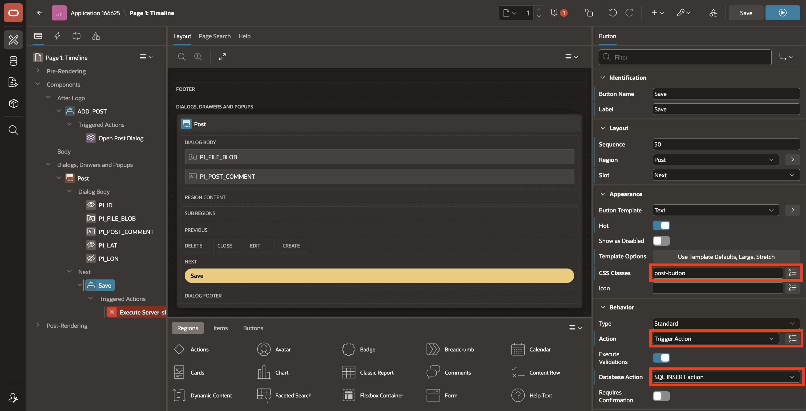

5. To enable the form to be able to save the new post data, we need another Trigger Action and then a page process that does the work.

6. In the left pane, right-click **SAVE** button and choose **Create Trigger Action**.

    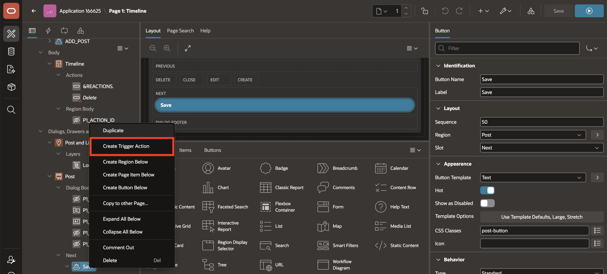

7. In the property editor, enter/select the following

    - Under Identification:

        - Name: **Submit post**

        - Action: **Submit Page**

    - Settings > Request/Button name: **Save**

8. To prevent users from posting blank rows, enter/select the following

    - Under Client-side Condition:

        - Type: **Javascript expression**

        - Javascript Expression: Copy and paste the following code

            ```
             <copy>
             apex.item('P1_FILE_BLOB').value.length>0 ||
             apex.item('P1_POST_COMMENT').value.length>0
             </copy>
            ```

    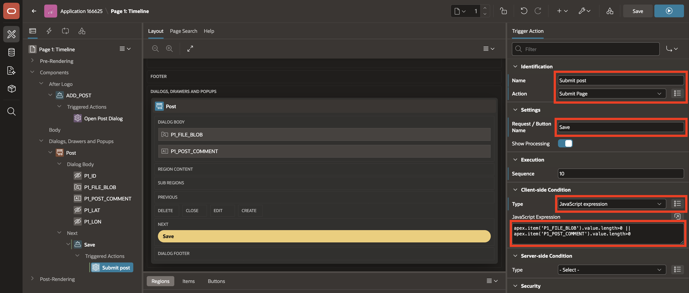

## Task 6: Configure the Submit Process to Insert a New Record into the Table

When a user clicks the Post button, we need to configure our page with a process for the Form:

1. In the left pane, click the **Processing** tab (this is also known as the Server-Side Processing section), and then select the **Processing** entry in the list (which is another tree structure that will grow as additional server-side processes are added as you add more server-side processes):

2. Right-click **Processing** and choose **Create Process**.

    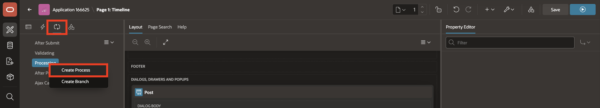

3. In the property editor, enter/select the following:

    - Under Identification:

        - Name: **Insert Post**

        - Type: **Form - Automatic Row Processing(DML)**

        - Form Region: **Post**

    - Success Message > Success Message: **Posted!**

    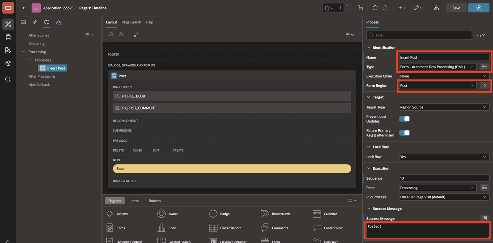

    The form will now insert records into the **SM\_POSTS** table, but we won't be able to see them on the page until we complete the next lab.

4. However, you can **save and run** the app and select an image file (or take a picture on mobile), add a comment, and click the Post button to insert a record into the table.

    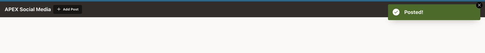

## Summary

In this lab, you created and configured a Form region for the Social Media App using Oracle APEX. You customized form components, added buttons and dynamic actions, and configured server-side processing to insert new posts into the SM_POSTS table.

You may now **proceed to the next lab**

## Acknowledgements

- **Author** - Jayson Hanes, Principal Product Manager; Apoorva Srinivas, Senior Product Manager; Ankita Beri, Senior Product Manager

- **Last Updated By/Date** - Ankita Beri, Senior Product Manager, March 2025
