# Build the Page Regions

## Introduction

In this lab, you will create regions that represent APEX features and serve as content containers for the page. These regions will include page items and buttons nested within them.

The first region will be a **FORM** region, and the second will be a **CARDS** region. The  **FORM** region will present a UI that enables users to choose an image file from their device (or take a picture on mobile) and enter an associated comment for the post.

The **CARDS** region will display photos or images in a grid arrangement as they get posted into the **SM\_POSTS** table via the **FORM** region. This region will also act as a foundation for additional features, such as displaying post comments, reaction counts, and buttons for reacting/liking a post or deleting one's own posts.

Estimated Time: 15 minutes

Watch the video below for a quick walk-through of the lab.
[Create an APEX App](videohub:1_myqq59w2)

### Objectives

In this lab, you will:

- Create and Configure a Form Region
- Customize components on the page
- Create Buttons for actions such as Post and Save

### Prerequisites

- All previous labs 1-4 are executed.
- If you are starting the workshop from Lab 5, ensure that you have executed the **Alternate Time Saver** task in Lab 4.

## Task 1: Add a Form Region

1. On Application home page, navigate to **Page 1 - Timeline**.

    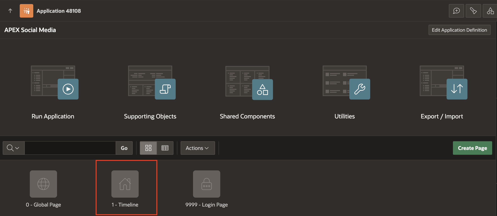

2. In the Rendering tree, right click on **Body**, and select **Create Region**.

    

3. In the Property Editor, enter/select the following:

    - Under Indentification:

        - Name: **Post**

        - Title: **Post**

        - Type:  **Form**

    - Source > Table Name: **SM_POSTS**

    

    You will see that APEX has populated the available columns from our table as "fields" in the form (visible on the left in the tree view and in the layout view).

4. **Save and Run** the app.

    

## Task 2: Clean up and configure the Form UI Page Components

1. Currently, the form displays input fields for the table columns, but it does not save any data yet and requires some adjustments. Some of the generated page items are not needed, while others need to be modified.

    To refine the form **select** each the below page items individually and press **Delete**. Alternatively, use Control + Click to select multiple items and delete them at once.

    - **P\_FILE\_MIME**

    - **P1\_FILE\_NAME**

    - **P1\_CREATED**

    - **P1\_CREATED\_BY**

    - **P1\_UPDATED**

    - **P1\_UPDATED\_BY**

    

    After deletion, the Rendering tree of columns in the Post Form region will look like this:

    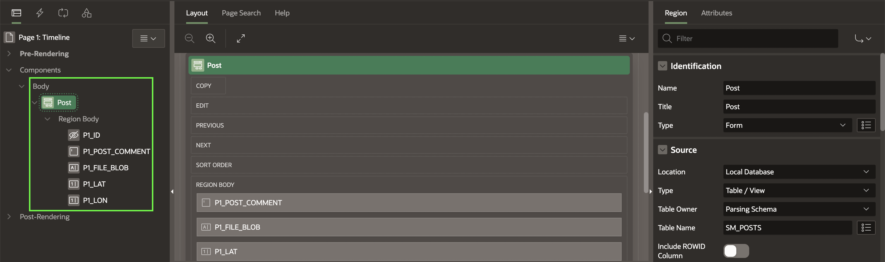

    **If you made a mistake** , you can easily re-sync all the Region Page items back and repeat the process. To do this, **right click** on the **Post** region and select **Synchronize Page Items**. Then, carefully delete the items that are not needed.

    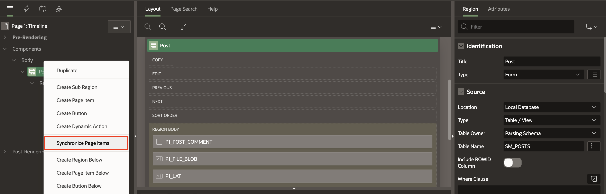

2. Select the **P1\_POST\_COMMENT** item and update the following:

    - Under Identificaiton:

        - Type: **Text Field**
        - Label: **Post**

   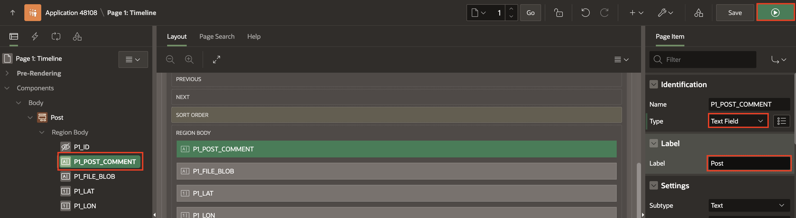

3. **Save** and **run** the app again and see the results of our changes so far!

    

4. Next, hide the **Lat** and **Lon** items. In Page Designer, select both **P1\_LAT** and **P1\_LON**

    - Under Indentification > set type to **Hidden**.

    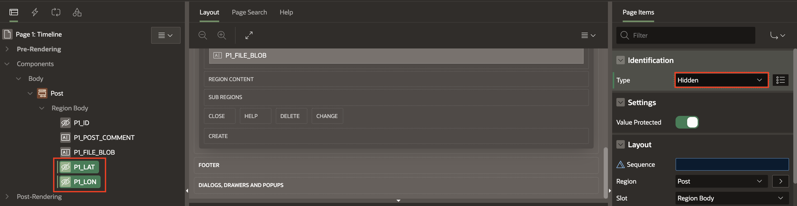

    To keep things organized, drag **P1\_LAT** and **P1\_LON** under the already hidden P1_ID page item while they are still multi selected.

    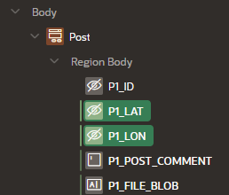

5. Next, configure the **P1\_FILE\_BLOB** page item:

    - Identification >  Type: **File Upload**

    - Label > Label: **Photo**

    - Under Display:

        - Display As: **Block Dropzone**

        - Dropzone Title: **Share a photo..**

    - Under Storage:
        - Type: **BLOB column specified in Item Source attribute**

        - MIME Type Column: **FILE\_MIME**

        - Filename Column: **FILE\_NAME**

        - File Types: **image/***

        - Maximum File Size: **10000**

    

    

6. Click **Save and Run** and see how it looks.

    

## Task 3: Rearrange and Customize Components

At the beginning, the form should not be visible to the user. To achieve this, we will update the region settings to position it in a way that keeps it hidden when the page loads. Next, we will make a few adjustments and add a button that will display the form as a modal when clicked.

1. First, let's improve the user experience by rearranging the form fields. Move the **P1\_POST\_COMMENT** item below the **P1\_FILE\_BLOB** item so that users select a photo first and then add a comment. Simply drag **P1\_POST\_COMMENT** under **P1\_FILE\_BLOB** in the Page Designer.

    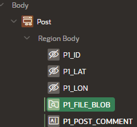

2. In the Rendering Tree, click on **Post** region and enter/select the following in the property editor:

    - Layout > Slot: **Dialogs, Drawers and Popups**.

    - Appearance:
        - Template: **Inline Dialog**

        - Click **Template Options** and select the following:

            - Under Common:

                - Auto Height: **Check**

                - Size: **None**

            - Under Advanced:

                - Heading Level: **H1**

                Click **OK**.

    

3. Now **save** and run the app.

    You may not see anything at first, and that's expected. Since we changed the form region to an inline dialog, it stays hidden when the page loads. To make it visible, we need to create a button that will open it.

    

## Task 4: Create a Button to Open the Post Dialog with a Dynamic Action

1. In the Rendering Tree, right click on **Components** and select **Create Button**.

    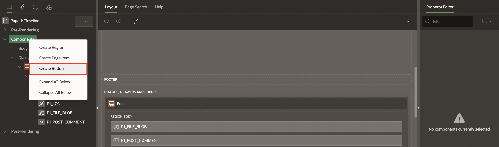

2. In the Property Editor, enter/select the following:

    - Identification > Name: **ADD\_POST**

    - Layout > Slot:  **After Logo**

    - Under Appearance:

        - Button Template: **Text with Icon**

        - CSS Classes: **new-post-button**

        - Appearance > Icon: **fa-plus**

    - Behavior > Action: **Defined by Dynamic Action**

        The button configuration should look like this:

    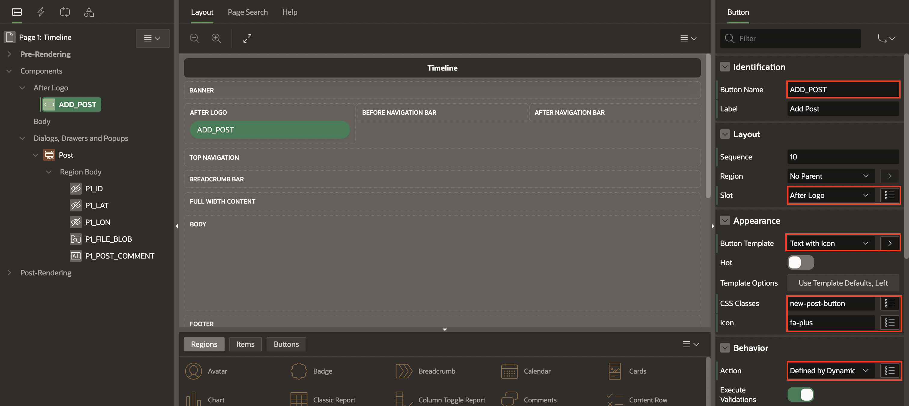

3. To make the Post region (inline dialog) appear when this button is clicked, we need to create a **Dynamic Action**. In the rendering tree, right click on the button and select **Create Dynamic Action**.

    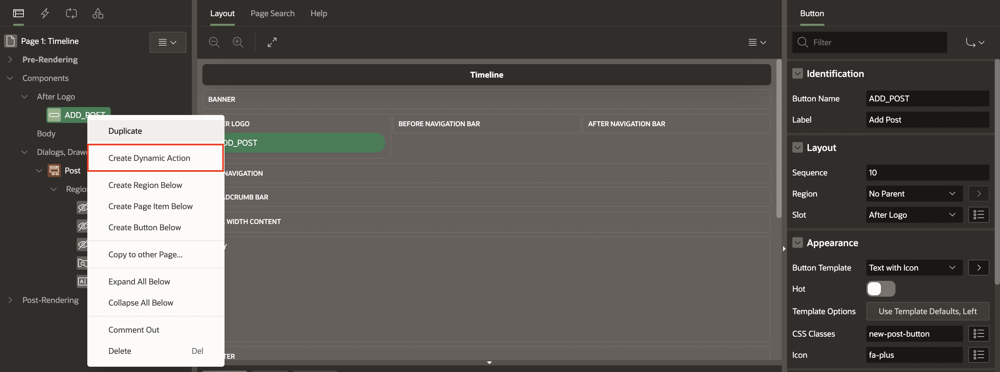

4. You now see a couple of sub-entries under the button, one is green and titled **New** (this is the Dynamic Action, aka DA) and another beneath that one, in red, titled **Show** -- which is actually a default TRUE action (in the event that we defined a condition to be evaluated on the DA, which we didn't do here)-- we just need to configure a few more attributes.

    

5. Follow the next steps to configure the attributes:

    - Select the first entry > **New**, and enter the following in the Property Editor:

        - Identification > Name: **Open Post Dialog**

    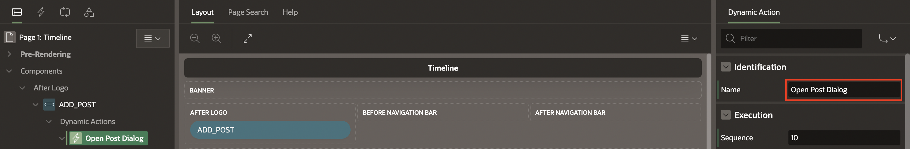

    - Select the **Show** entry under True Actions and select the following in the Property Editor:

        - Identification > Action: **Open Region**

        - Under Affected Elements:

            - Selection Type: **Region**

            - Region: **Post**

    

    That almost completes the **Form** region. Click **Save and Run**! You will now see the **+Add Post** button and nothing else, until you click it, and then the in-line dialog opens with the Post **form**.

    

## Task 5: Create a Save Button

1. We now need a button for the user to *actually SAVE the post* they make. To do this, in the Rendering tree, right click on the **Dialogs, Drawers and Popups > Post** region in the tree, and click **Create Button**

    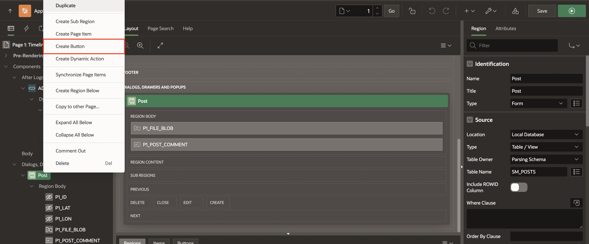

2. Configure the button as follows:

    - Button Name: **Save**

    - Layout > Slot: **Next**

    - Under Appearance:

        - Hot: **ON**

        - Template options:

            - Size: **Large**

            - Width: **Stretch**

        - CSS Classes: **post-button**

    - Under Behavior:
        - Action: **Defined by Dynamic Action**

        - Database Action: **SQL INSERT action**

        The attributes should look this:

        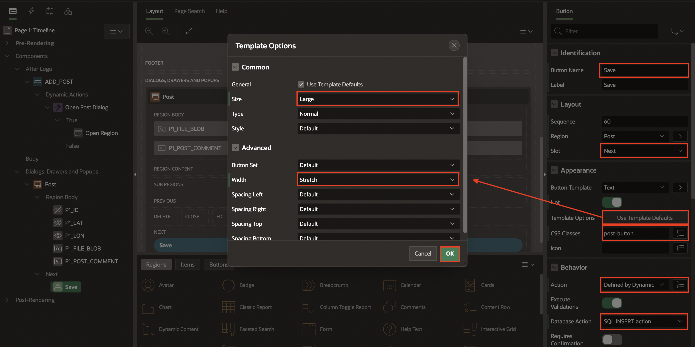

3. To enable the form to be able to save the new post data, we need another Dynamic Action and then a page process that does the work.

    In the Rendering Tree, right click on the **SAVE** button and choose **Create Dynamic Action**.

    

4. In the property editor, enter/select the following

    - Identification > Name: **Submit post**

5. To prevent users from posting blank rows, enter/select the following

    - Under Client-side Condition

        - Type: **Javascript expression**

        - Javascript expression: Copy and paste the following code

            ```
             <copy>
             apex.item('P1_FILE_BLOB').value.length>0 ||
             apex.item('P1_POST_COMMENT').value.length>0
             </copy>
            ```

    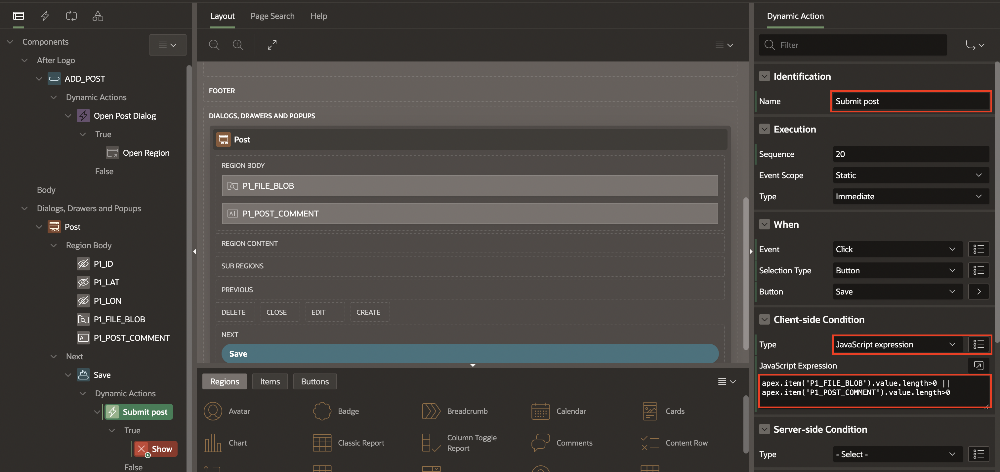

6. Click on the **True action** (beneath the Submit post tree entry) which is initially set to **Show,** and enter/select the following:

    - Identification > Action: **Submit Page**

    - Settings > Request/Button name: **Save**

    

## Task 6: Configure the Submit Process to Insert a New Record into the Table

In response to a user clicking the Post button, we need to configure our
page with a process for the Form:

1. In the Rendering Tree, click the **Processing** tab (this is also known as the Server-Side Processing section), and then select the **Processing** entry in the list (which is actually another tree and will grow in length as you add more server-side processes):

2. Right-click on the **Processing** entry and choose **Create Process**.

    

3. In the property editor, enter/select the following:

    - Under Identification:

        - Name: **Insert Post**

        - Type: **Form - Automatic Row Processing(DML)**

        - Form Region: **Post**

    - Success Message > Success Message: **Posted!**

    

    The form will now insert records into the **SM\_POSTS** table, but we won't be able to see them on the page until we complete the next lab.

4. However, you can **save and run** the app and select an image file (or take a picture on mobile), add a comment and click the Post button to have a record inserted anyway.

    

You may now **proceed to the next lab**

## Acknowledgements

- **Author** - Jayson Hanes, Principal Product Manager; Apoorva Srinivas, Senior Product Manager;
- **Last Updated By/Date** - Sahaana Manavalan, Senior Product Manager, March 2025
