# Build the Page Regions

## Introduction

In this lab, you create regions that will represent APEX features as well as serve as page content containers: Regions with page items and buttons nested inside of them.

The first region will be a **FORM** region and the second will be a **CARDS** region. The idea is that the **FORM** region will present a UI that will enable users to choose an image file from their device (or take a picture on mobile) and enter an associated comment for the post.

The **CARDS** region will show photos or images in a grid arrangement as they get posted into the **SM\_POSTS** table by way of the **FORM** region. The cards region will serve as our scaffold for other features such as displaying the post comment, reaction counts, as well as buttons for reacting/liking a post and enabling a user to delete their own posts.

Estimated Time: 15 minutes

Watch the video below for a quick walk-through of the lab.
[Create an APEX App](videohub:1_myqq59w2)

### Objectives

In this lab, you will:
- Create and Configure a Form Region
- Customize components on the page
- Create Buttons for actions such as Post and Save

### Prerequisites

  - All previous labs 1-4 are executed.
  - If you are starting the workshop from Lab 5, ensure that you have executed the **Alternate Time Saver** task in Lab 4.

## Task 1: Add a Form Region

1. On Application home page, Navigate to Page **1-Timeline**.

    

2. In the Rendering tree, Right-click on **Body**, and then choose **Create Region**.

    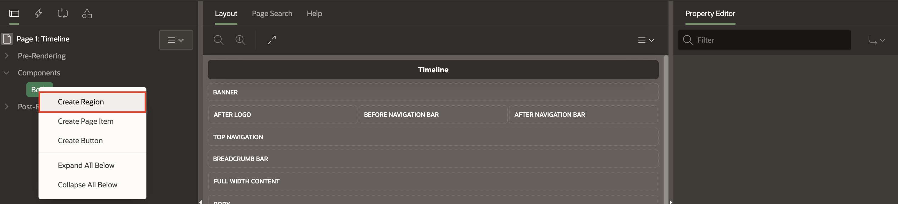

3. You see a New region in the Rendering Tree, and at
the same time it will be shown in the **Layout** section (in the
middle). In the Property Editor, you will see a **Region** tab and parameters. Enter/select the following:

    - Name: **Post**

    - Title: **Post**

    - Type:  **Form**

  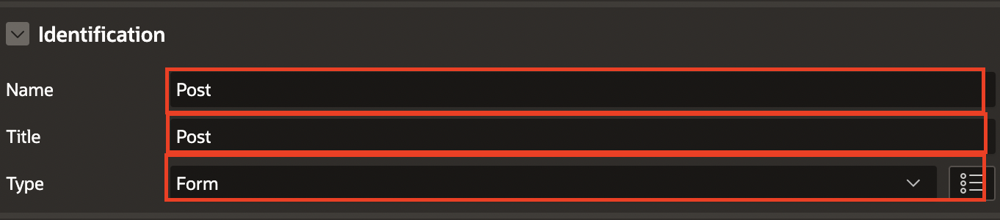

4. The **Form Region** will be tied to the **SM\_POSTS** table that we created from the script. Therefore, in the **Source** section, specify the **Table Name** as **SM_POSTS**.

    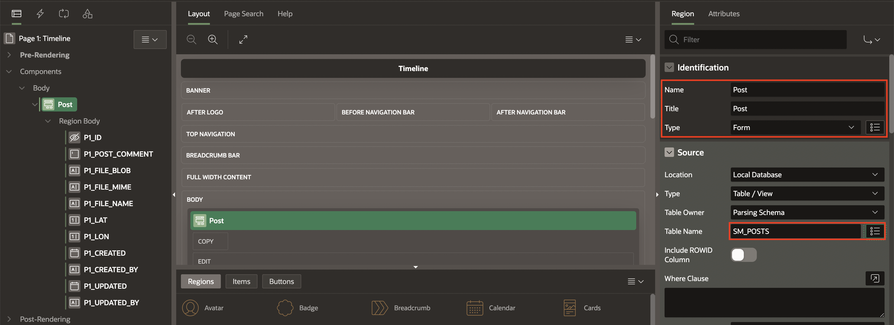

    You will see that APEX has populated the available columns from our table as "fields" in the form (visible on the left in the tree view and in the layout view).

5. Save and Run the app and sign-in to see what it looks like!

    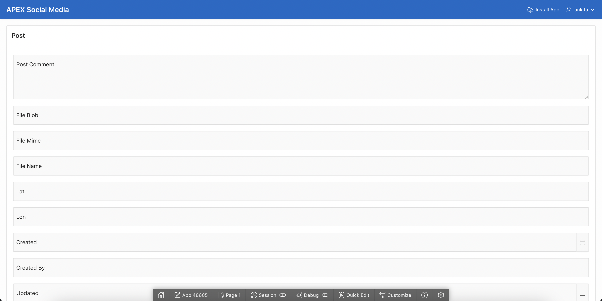

## Task 2: Clean up and configure the Form UI Page Components

1. We now have a form that labels the columns as input fields that supports
keyboard entry, but it doesn't save anything yet and needs some tweaking.

    These columns resulted in page items being placed on the page inside that form region. The form doesn't need some of them, and a couple of them need to have their type changed.

    Click on each of these listed page items one at a time, and press the delete key to remove them. Alternatively, you can control+click each and then delete them all in one motion.

    - **P\_FILE\_MIME**

    - **P1\_FILE\_NAME**

    - **P1\_CREATED\_BY**

    - **P1\_CREATED**

    - **P1\_UPDATED\_BY**

    - **P1\_UPDATED**

    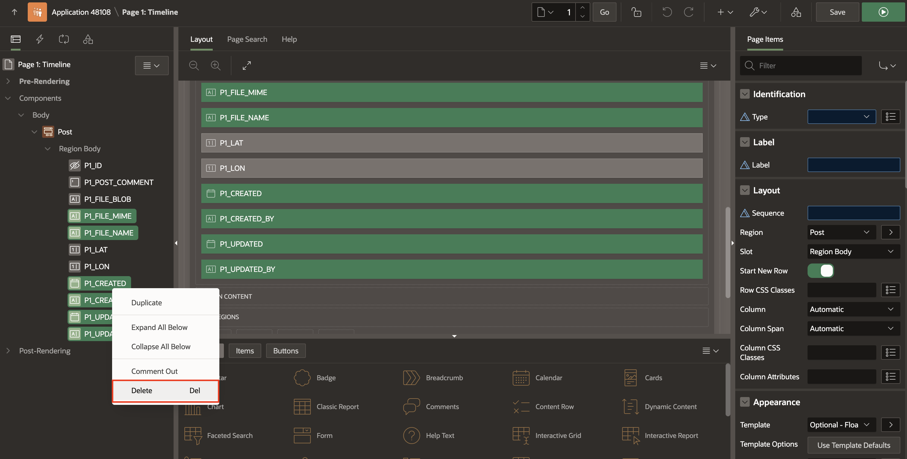

    The tree of columns in that Post Form region will look like this:

    

    **If you made a mistake** , you can easily re-sync all the Region Page items back and repeat the process. If you need to do this, *right click* on the **Post** tree entry, and choose Synchronize Page Items, and then carefully delete those that we don't want.

    

2. Next, we want to change some parameters of the remaining page items on the form. For the **P1\_POST\_COMMENT** item, update the following:

    - Type: **Text Field**

    - Label: **Post**

   

3. Run the app again and see the results of our changes so far!

    

4. Moving on, the **Lat** and **Lon** items don't need to be seen, so we'll hide them next. In Page Designer, multi-select both **P1\_LAT** and **P1\_LON** and change the type to **Hidden**.

    

    For the sake of keeping things organized, let's move them under the *P1\_ID* page item that was already hidden (they should still be multi-selected so you can just drag them up).

    

5. Next, we want to configure the **P1\_FILE\_BLOB** page item:

    - Under Identification:

        - Type: **File Upload**

        - Label: **Photo**

    - Under Display:

        - Display As: **Block Dropzone**

        - Dropzone Title: **Share a photo..**

    - Under Storage:
        -  Type: **BLOB column specified in Item Source attribute**

        - MIME Type Column: **FILE\_MIME**

        - Filename Column: **FILE\_NAME**

        - File Types: **image/***

        - Maximum File Size: **10000**

  

  

    Ok, that was a bunch of changes!

6. Click **Save and Run** and see how it looks.

    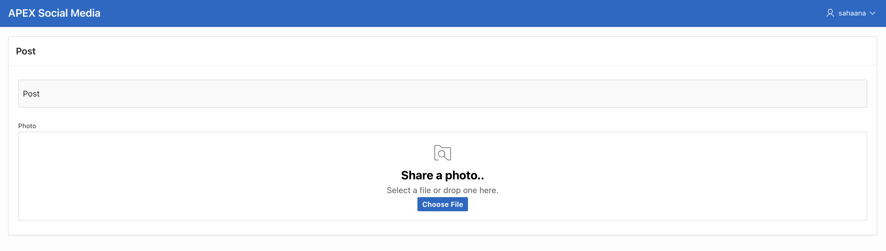

## Task 3: Rearrange and Customize Few Components

Initially, the form should not be visible to the user. We are going to change from settings on the region
itself, so that it is in a different page position where it'll be hidden from view when the page is loaded. We will then adjust some other settings, and then create a button that will be used to make this form visible to the user as a modal form.

1. First, we want to move the **P1\_POST\_COMMENT** page item under the **P1\_FILE\_BLOB** item to improve the UX such that the user will expect to specify the photo first, and then add a comment. To do this, simply drag the **P1\_POST\_COMMENT** item to underneath the **P1\_FILE\_BLOB** item:

    

2. Next, click on **Post** in the rendering tree, so that we have that **Form** region selected. In the property editor, enter/select the following:

    - Layout > Slot: **Dialogs, Drawers and Popups**.

    - Appearance > Template: **Inline Dialog**

    -  Next, click on the **Template Options** button so that we can customize some options.

    -  Then, set the options to match the following:

        - Check **Auto Height**

        - Set **Size** to **None**

        - Set **Heading Level** to **H1**

        Click **OK**.

   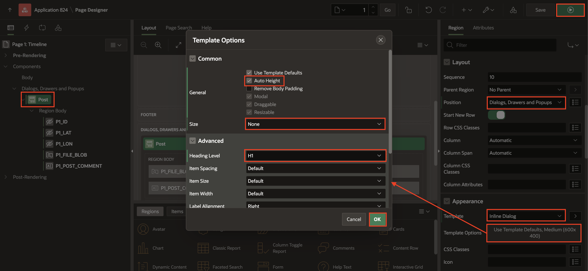

  That should complete what we need to configure for the Post form region itself.

3. Let's save and run the app.

    *You'll quickly notice that there isn't much to see* - but that's okay!
    Now that we've changed the form region to be an inline dialog, it will be hidden on page load. Inline Dialogs need to be opened by a button click (or custom javascript is an option, too), so we need to create a button!

    

## Task 4: Create a Button to Open the Post Dialog with a Dynamic Action

1. Right-click on **Components** in the **Rendering Tree**, and choose **Create Button**.

    

2. Set the **Button Name** to **ADD\_POST** and press enter. You will see the Label is automatically set to '**Add Post**'.

    Configure the following other attributes on this button as follows:

    - Layout > Slot:  **After Logo**

    - Appearance > Button Template: **Text with Icon**

    - Appearance > CSS Classes: **new-post-button**

    - Appearance > Icon: **fa-plus**

    - Behavior > Action: **Defined by Dynamic Action**

    The button configuration should look like this:

  

3. To make this button open the Post region (which is an inline dialog), we simply need to create an on-click **Dynamic Action**. To do this, right-click on the button in the rendering tree, and choose **Create Dynamic Action**.

    

4. You now see a couple of sub-entries under the button, one is green and titled **New** (this is the Dynamic Action, aka DA) and another beneath that one, in red, titled **Show** -- which is actually a default TRUE action (in the event that we defined a condition to be evaluated on the DA, which we didn't do here)-- we just need to configure a few more attributes.

    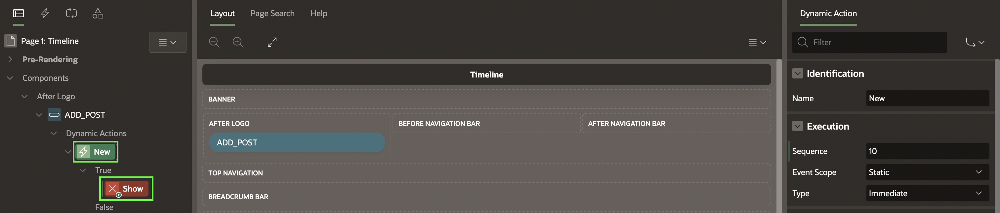

5. Follow the next steps to configure the attributes:

    -  With the first new entry selected, **New**, update it's name to **Open Post Dialog**

   

    -  Select the other entry, that is under True so that we can configure it, currently titled as* **Show,** and change the **Identification > Action** to be **Open Region**

    -  Then set the **Affected Elements > Selection Type** to be **Region**, and the **Region** to **Post**.

   

    That almost completes the **Form** region. Click **Save and Run**! You will now see the **+Add Post** button and nothing else, until you click it, and then the in-line dialog opens with the Post **form**.

    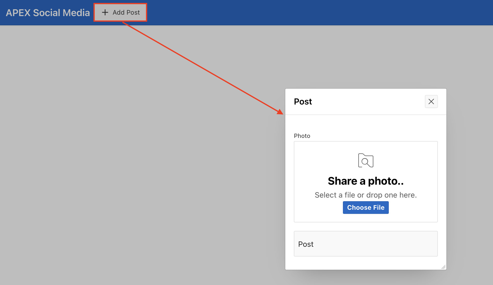


## Task 5: Create a Save Button

1. We now need a button for the user to *actually SAVE the post* they make. To do this, right click on the **Body > Post** region in the tree, and click **Create Button**

    

2. Configure the button as follows:

    - Button Name: **Save**

    - Layout > Slot: **Next**

    - Appearance > Hot: **ON**

    - Template options:

        - Size: **Large**

        - Width: **Stretch**

    -  CSS Classes: **post-button**

    -  Behavior > Action: **Defined by Dynamic Action**

    -  Database Action: **SQL INSERT action**

    The attributes should look this:

  

3. To enable the form to be able to save the new post data, we need another Dynamic Action and then a page process that does the work.

  Right-click on the **SAVE** button and choose **Create Dynamic Action**.

    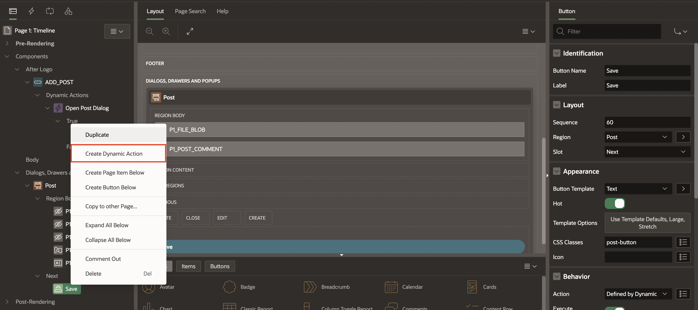

4.  Set the **Name** to **Submit post**.

### OPTIONAL STEPS (5 and 6)

5.  To prevent users from posting blank rows, under **Client-side Condition**, we need to set type as **Javascript expression**.

6.  Paste this javascript into the Javascript Expression box:

    ```
    <copy>
    apex.item('P1_FILE_BLOB').value.length>0 ||
    apex.item('P1_POST_COMMENT').value.length>0
    </copy>
    ```

    

7. Click on the **True action** (beneath the Submit post tree entry) which is initially set to **Show,** and set the following attributes:

    - Identification > Action: **Submit Page**

    - Settings > Request/Button name: **Save**

  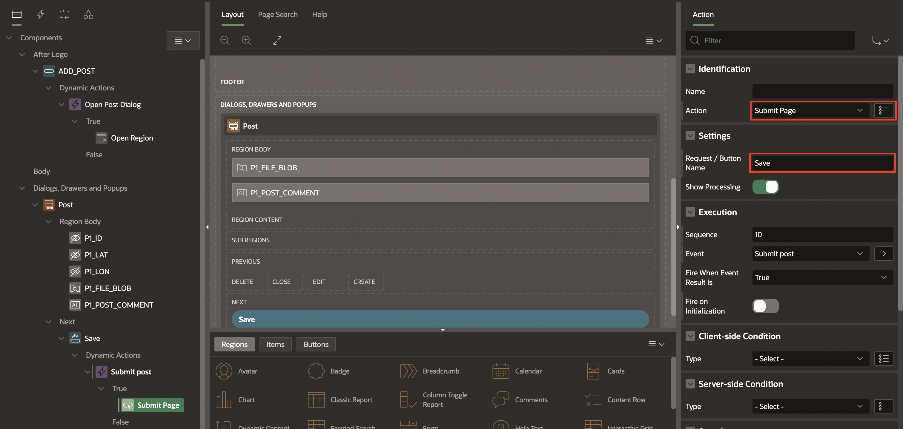

## Task 6: Configure the Submit Process to Insert a New Record into the Table

In response to a user clicking the Post button, we need to configure our
page with a process for the Form:

1. Click the **Processing** tab (this is also known as the Server-Side Processing section), and then select the **Processing** entry in the list (which is actually another tree and will grow in length as you add more server-side processes):


2.  Right-click on the **Processing** entry and choose **Create Process**.

    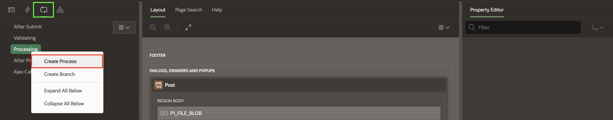

3. In the property editor, enter/select the following:

    - Under Identification:

        - Name: **Insert Post**

        - Type: **Form - Automatic Row Processing(DML)**

        - Form Region: **Post**

    - Success Message > Success Message: **Posted!**

  

    The form will now insert records into the **SM\_POSTS** table, but we won't be able to see them on the page until we complete the next lab.

4. However, you can run the app and select an image file (or take a picture on mobile), add a comment and click the Post button to have a record inserted anyway.

    

You may now **proceed to the next lab**

## Acknowledgements

 - **Author** - Jayson Hanes, Principal Product Manager; Apoorva Srinivas, Senior Product Manager;
 - **Last Updated By/Date** - Ankita Beri, Product Manager, June 2024
