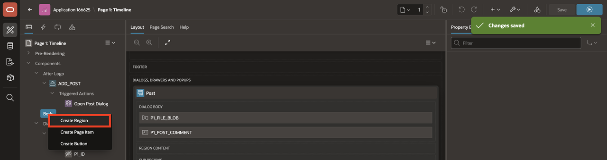
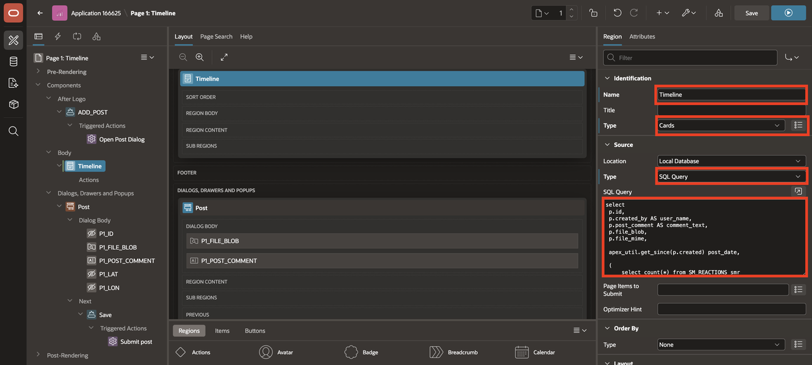
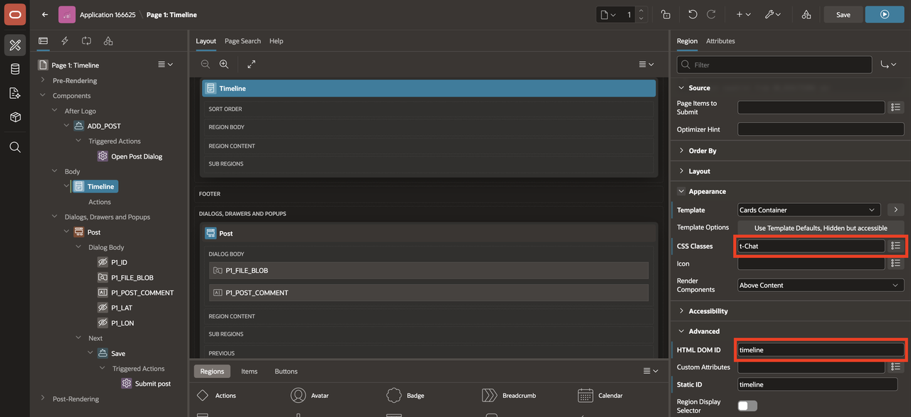
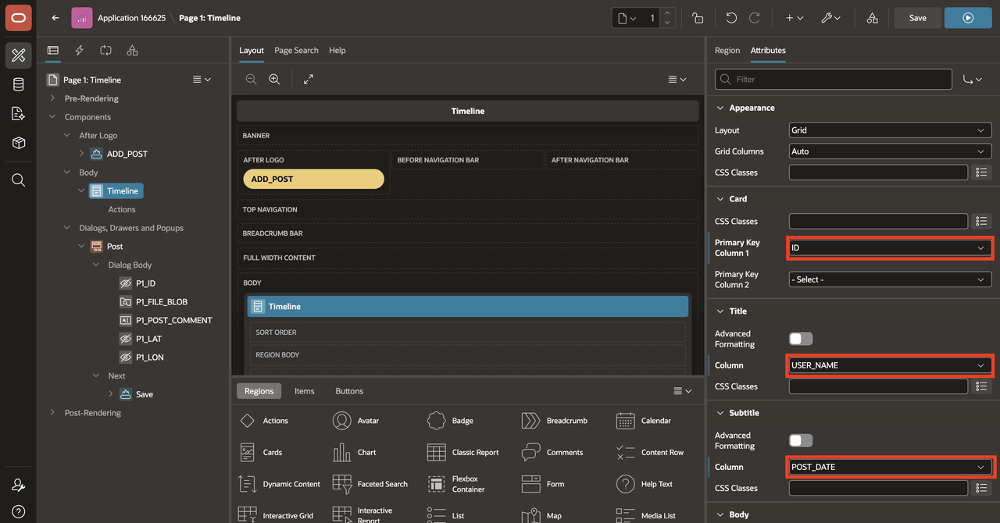
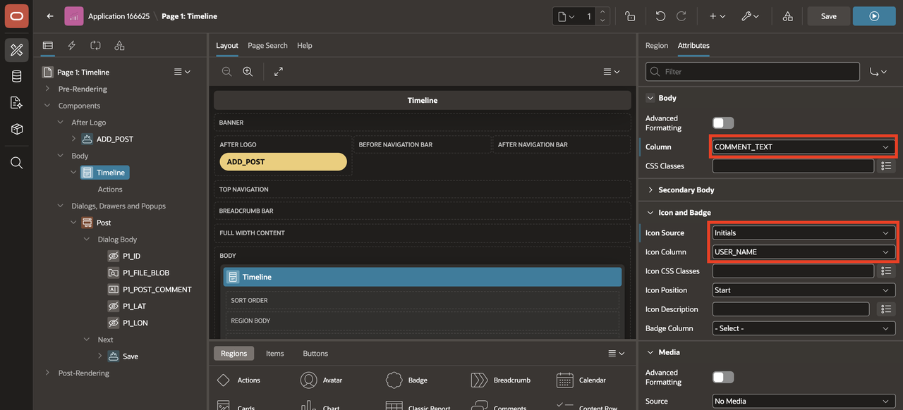
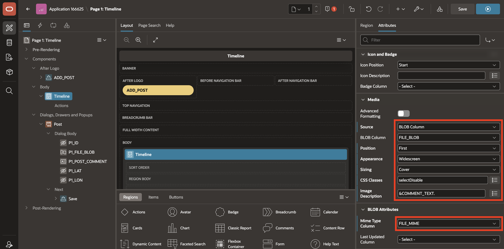
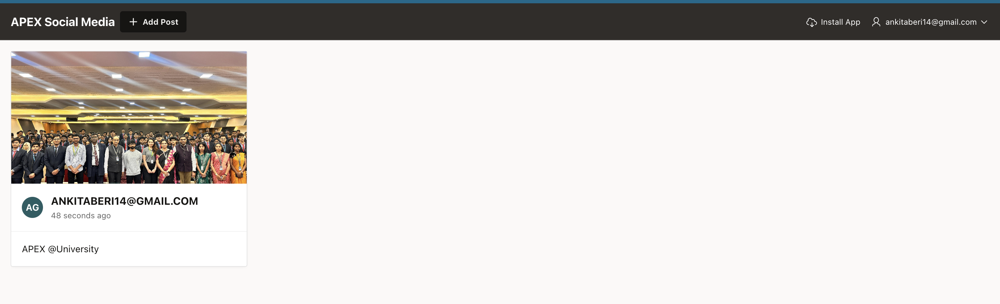

# Build the Cards Region

## Introduction

In this lab, you will create and configure a Cards region to display posts in the Social Media App. You will use a SQL query as the data source, configure card attributes, and customize how post details and images are displayed on the page.

<!-- Watch the video below for a quick walk-through of the lab.
[Create an APEX App](videohub:1_cmdi0d57) -->

### Objectives

In this lab, you will:

- Create a Cards region to display posts.

- Configure the Cards region attributes.

- Display images and post details using card components.

### Prerequisites

- Completion of workshop through Lab 5

Estimated Time: 10 minutes

## Task 1: Create a Cards Region

1. In the left pane, right-click **Body**, and select **Create Region**.

    

2. In the Property Editor, enter/select the following

    - Under Identification:

         - Name: **Timeline**

         - Type: **Cards**

    - Under Source:

        - Type: **SQL Query**

        - SQL Query: Copy and paste the following code into the Code Editor:

          ```
           <copy>
            select
            p.id,
            p.created_by AS user_name,
            p.post_comment AS comment_text,
            p.file_blob,
            p.file_mime,

            apex_util.get_since(p.created) post_date,

            (
                select count(*) from SM_REACTIONS smr
                where smr.post_id=p.id
            ) as REACTIONS,

            (
                select 'user-has-liked' from SM_REACTIONS smr
                where smr.post_id=p.id and created_by=:APP_USER
            ) USER_REACTION_CSS

            from SM_POSTS p

            order by p.created desc
           </copy>
          ```

    - Appearance > CSS Classes box: **t-Chat**

    - Advanced > HTML DOM ID: **timeline**

    

    

3. **Save** the app.

    Next, configure which query result columns will be used in different parts of the Cards region.

## Task 2: Configure the Attributes of the Cards Region

1. Select the **Timeline** region. In the Property Editor, select **Attributes** tab and enter/select the following:

    - Card > Primary Key Column 1: **ID**

    - Title > Column: **USER_NAME**

    - Subtitle > Column: **POST_DATE**

    - Body > Column: **COMMENT_TEXT**

    - Under Icon and Badge:

        - Icon Source: **Initials**

        - Icon Column: **USER_NAME**

    

    

2. Finally, scroll down to the **Media** section, and enter/set the following attributes:

    - Under Media:

        - Source: **BLOB column**

        - BLOB Column: **FILE_BLOB**

        - Position: **First**

        - Appearance: **Widescreen**

        - Sizing: **Cover**

        - CSS Classes: **selectDisable**

        - Image Description: **&COMMENT_TEXT.** (including the period!)

    - BLOB Attributes > Mime Type Column: **FILE_MIME**

    

3. The Cards region is now fully configured. Click **Save and Run**.

    If you made a post earlier, you should now see your uploaded image and comment text.

    

## Summary

In this lab, you created and configured a Cards region to display posts from the SM_POSTS table. You also configured card attributes, media settings, and SQL query mappings to display user information, images, and post comments in the Social Media App.

You may now **proceed to the next lab**

## Acknowledgements

- **Author** - Jayson Hanes, Principal Product Manager; Apoorva Srinivas, Senior Product Manager;

- **Last Updated By/Date** - Ankita Beri, Senior Product Manager, May 2026
