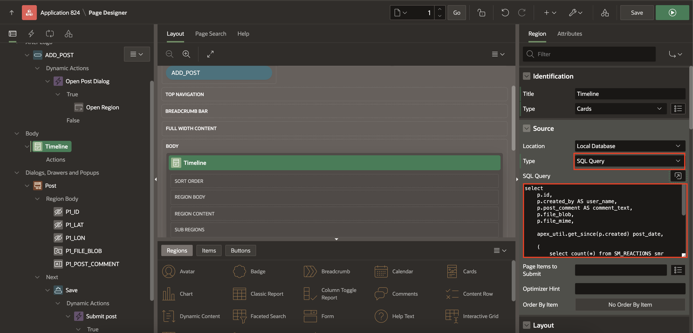

# Building the Cards Region

## Introduction

In this lab, you learn to create the CARDS region that can query the data
the way we need it, and configure the region attributes to suit our
goals.

## **Task 1**: Create a Cards Region

1. Navigate to the Rendering Tree and right-click on **Body**, and
choose **Create Region**.   

    

2. Update the following attributes in the Property Editor:

    - Under Identification:
         - For Title, enter **Timeline**
         - For Type, select **Cards**

    

    - Under Source, for Type select **SQL Query**.

3.  Clear the **SQL Query** that was automatically put into the SQL
    Query box. The attributes should look like the following:

    

4.  Copy and paste the following **SQL** statement into that box and
    *tab out* of it

    ```
    <copy>
        select
        p.id,
        p.created_by AS user_name,
        p.post_comment AS comment_text,
        p.file_blob,
        p.file_mime,
        
        apex_util.get_since(p.created) post_date,

        (
            select count(*) from SM_REACTIONS smr 
            where smr.post_id=p.id
        ) as REACTIONS,

        (
            select 'user-has-liked' from SM_REACTIONS smr 
            where smr.post_id=p.id and created_by=:APP_USER
        ) USER_REACTION_CSS

        from SM_POSTS p 

        order by p.created desc
    </copy>
    ```

    And this is the final configuration for the **Region** tab:

    

5. Scroll down on the list of Region attributes to the **Appearance**
section:

    - In the Appearance > CSS Classes box, put **t-Chat**

    - Then *scroll down* to the **Advanced** section and specify
    **timeline** as the **Static ID**

    We're not quite done with this region yet -- we have to configure
which columns from the query results will be used on which parts of the
CARDS themselves.

## **Task 2**: Configure the Attributes of the Cards Region

1. In the Property Editor, select the **Attributes** tab, and make
the following changes:

    - Card > Primary Key Column 1: **ID**

    - Title > Column: **USER_NAME**

    - Subtitle > Column: **POST_DATE**

    

    - Body > Column: **COMMENT_TEXT**

    - Icon and Badge > Icon Source: **Initials**

    - Icon Column: **USER_NAME**

    

    And finally (for this Region), scroll down to the Media section, and set
these attributes:

    - Source: **BLOB column**

    - BLOB Column: **FILE_BLOB**

    - Position: **First**

    - Appearance: **Widescreen**

    - Sizing: **Cover**

    - CSS Classes: enter **selectDisable**

    - Copy and paste **&COMMENT_TEXT.** (including the period!)
    into the **Image Description** box

    - BLOB Attributes > Mime Type Column: **FILE_MIME**

    These attributes should look like this:

    

2. And this completes the region. Click **Save and Run**.

    If you made a post earlier you should now see your image and your
comment text:

    


## **Acknowledgements**

 - **Author** - Jayson Hanes, Principal Product Manager; Apoorva Srinivas, Senior Product Manager; 
 - **Last Updated By/Date** - Apoorva Srinivas, Senior Product Manager, March 2023