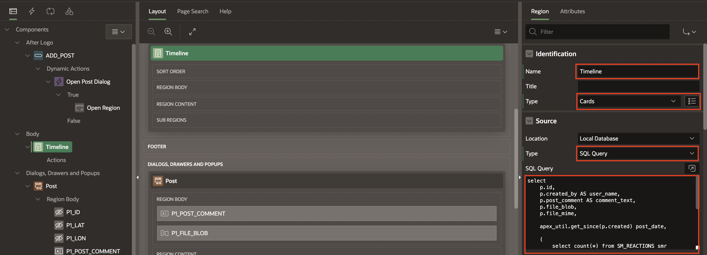
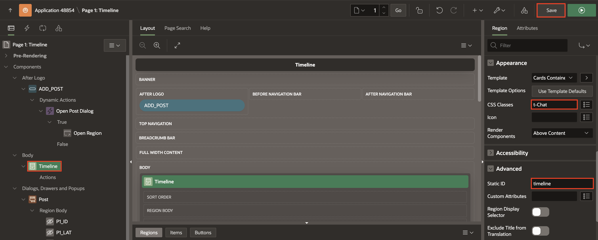
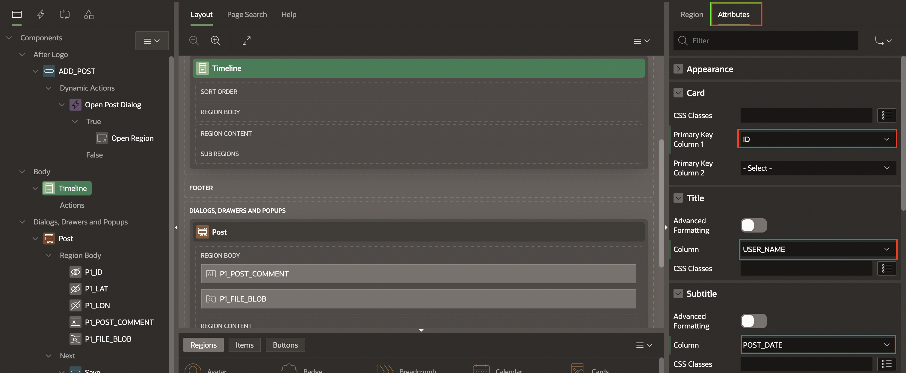

# Build the Cards Region

## Introduction

In this lab, you will learn to create the CARDS region to display the posts and configure the region attributes.

Estimated Time: 10 minutes

Watch the video below for a quick walk-through of the lab.
[Create an APEX App](videohub:1_cmdi0d57)

### Objectives

In this lab, you will:

- Create the Cards region to display the posts
- Configure the attributes of the Cards region to match our design

### Prerequisites

- Completion of workshop through Lab 5

## Task 1: Create a Cards Region

1. In the Rendering Tree, right click **Body**, and select **Create Region**.

    

2. In the Property Editor, enter/select the following

    - Under Identification:

         - Name: **Timeline**

         - Type: **Cards**

    - Under Source:

        - Type: **SQL Query**

        - SQL Query: Copy and Paste the below code in the Code Editor:

          ```
           <copy>
            select
            p.id,
            p.created_by AS user_name,
            p.post_comment AS comment_text,
            p.file_blob,
            p.file_mime,

            apex_util.get_since(p.created) post_date,

            (
                select count(*) from SM_REACTIONS smr
                where smr.post_id=p.id
            ) as REACTIONS,

            (
                select 'user-has-liked' from SM_REACTIONS smr
                where smr.post_id=p.id and created_by=:APP_USER
            ) USER_REACTION_CSS

            from SM_POSTS p

            order by p.created desc
           </copy>
          ```
        Click **OK**

    

    

    - Appearance > CSS Classes box: **t-Chat**

    - Advanced > Static ID: **timeline**

    **Save** the app.

    

    Next, we need to configure which columns from the query results will be used in different parts of the CARDS region.

## Task 2: Configure the Attributes of the Cards Region

1. In the Property Editor under the Timeline region, enter/select the following in the **Attributes** tab:

    - Card > Primary Key Column 1: **ID**

    - Title > Column: **USER_NAME**

    - Subtitle > Column: **POST_DATE**

    

    - Body > Column: **COMMENT_TEXT**

    - Under Icon and Badge:

        - Icon Source: **Initials**

        - Icon Column: **USER_NAME**

    

    And finally (for this Region), scroll down to the Media section, and enter/set the following attributes:

    - Under Media:

        - Source: **BLOB column**

        - BLOB Column: **FILE_BLOB**

        - Position: **First**

        - Appearance: **Widescreen**

        - Sizing: **Cover**

        - CSS Classes: **selectDisable**

        - Image Description: **&COMMENT_TEXT.** (including the period!)

    - BLOB Attributes > Mime Type Column: **FILE_MIME**

    

2. Now, the region is completely configured. Click **Save and Run**.

     If you made a post earlier, you should now see your image and your comment text!

    

You may now **proceed to the next lab**

## Acknowledgements

- **Author** - Jayson Hanes, Principal Product Manager; Apoorva Srinivas, Senior Product Manager;
- **Last Updated By/Date** - Sahaana Manavalan, Senior Product Manager, March 2025
