# Create Action Buttons

## Introduction

In this lab, you will enhance the Cards region by adding interactive action buttons that allow users to react to posts or delete their own posts. You will configure card actions, add JavaScript to the page, and create a hidden page item to support client-side interactions.

<!-- Watch the video below for a quick walk-through of the lab.
[Create an APEX App](videohub:1_53khevkr) -->

### Objectives

In this lab, you will:

- Create a Like button for the user to react to a post.

- Create a Delete button to delete a post.

### Prerequisites

- Completion of workshop through Lab 6

Estimated Time: 5 minutes

## Task 1: Create a Like Button

The **Like** button will show a heart icon along with the total number of likes. Users can click the button to add their like to the post. If a user has already liked a post, clicking the button again removes the like.

1. In the left pane, select the **Timeline** Cards region, right-click **Actions**, and select **Create Action**.

    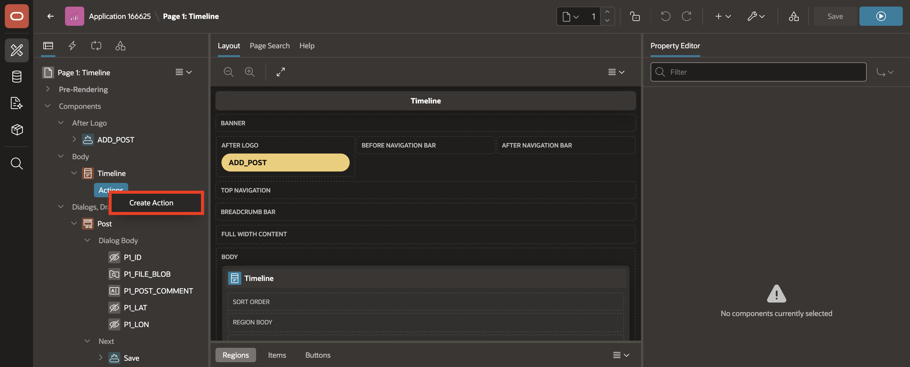

2. You will see a new sub-entry item titled **Button**. Select it to view its properties in the Property Editor.

3. In the Property Editor, enter/select the following:

    - Identification > Label: **&REACTIONS.** (including the period).

        This is called APEX string substitution syntax, and it will render the count of reactions as the Label for this button, on each post.

        *Note: The REACTIONS column is defined in the query for this CARDS Region.*

    - Under Behavior:

        - Type: **Redirect to URL**.

            We need the LIKE button to have a URL that can be linked to Javascript later, so that the database operation can be performed.

        - Target URL: **#action$like?id=&ID.** (including the period)

    - Under Appearance:

        - Display Type: **Text with Icon**

        - Icon: **fa-heart &USER\_REACTION\_CSS.** (including the period). The **USER\_REACTION\_CSS** column is defined in the query for this CARDS region

        - CSS Classes : **js-heart-button**

4. Click **Save**.

    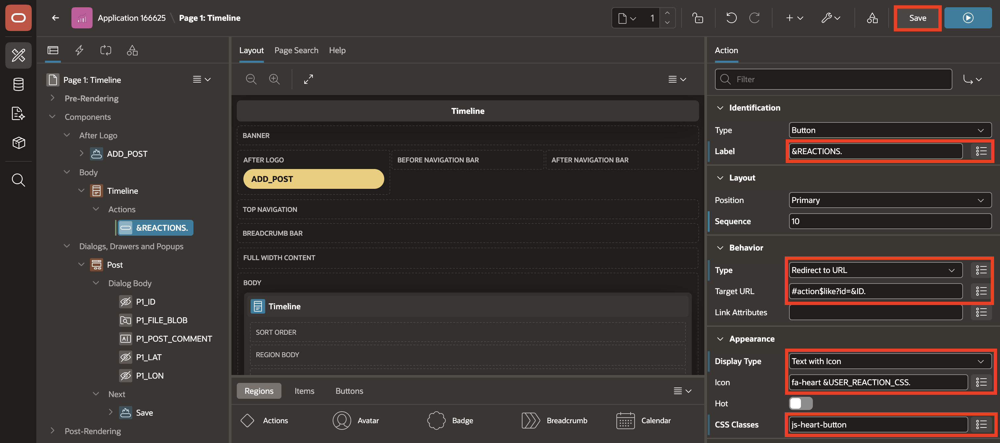

    If you run the app now, the button will cause a JavaScript error because the required JavaScript has not been added yet. We will fix this after creating the DELETE button.

## Task 2: Create a Delete Button

Similar to the previous task, we will create another button for deleting posts. This button will have a condition to ensure that it is only displayed for posts belonging to the logged-in user.

1. In the left pane, select **Timeline** region, right-click **Actions**, and select **Create Action**.

    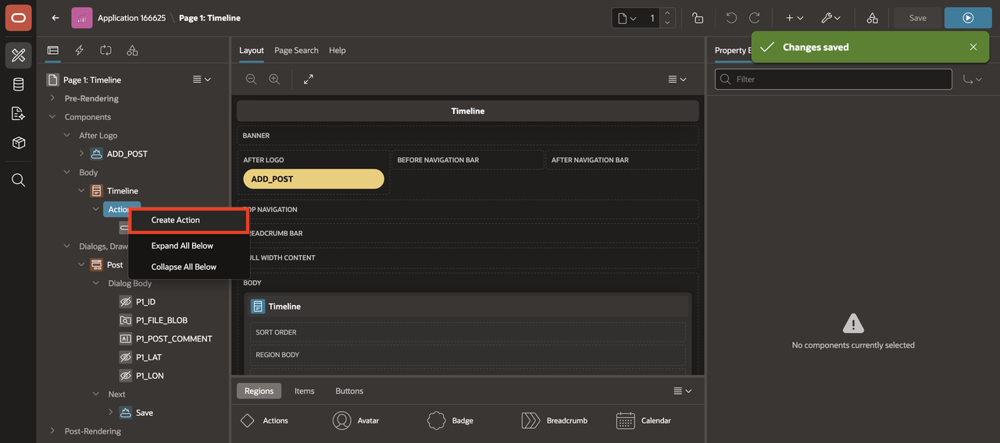

2. In the Property Editor, update the following attributes:

    - Action > Label: **Delete**

    - Layout > Position: **Secondary** (This ensures that the button is displayed on the right side of the card.)

    - Under Behavior:

        - Type: **Redirect to URL**

        - Target URL: **#action$delete?id=&ID.**

    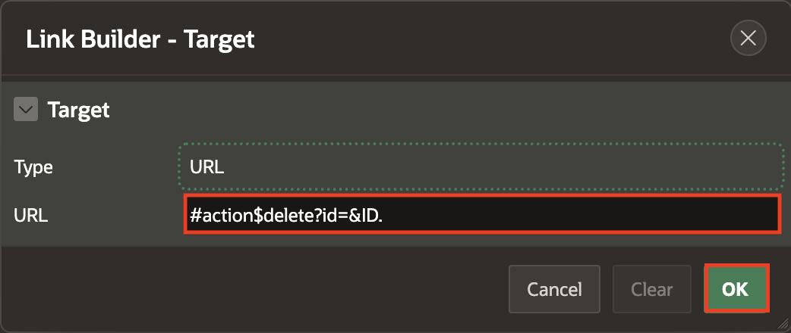

    - Under Appearance:

        - Display Type: **Icon**

        - Icon: **fa-trash-o**

    - Under Server-side Condition:

        - Type: **Expression**

        - PL/SQL expression: **trim(:user\_name)=trim(:APP\_USER)**

        This Server-side condition controls whether this button is displayed for a card. The expression will compare the query column value returned to the currently signed-in APEX user. The colon-prefixed "variable" syntax is called the "Bind Variable Syntax" in PL/SQL. If the expression evaluates to true for a row (or card), then APEX will render the **Button**, otherwise the button is not visible.

    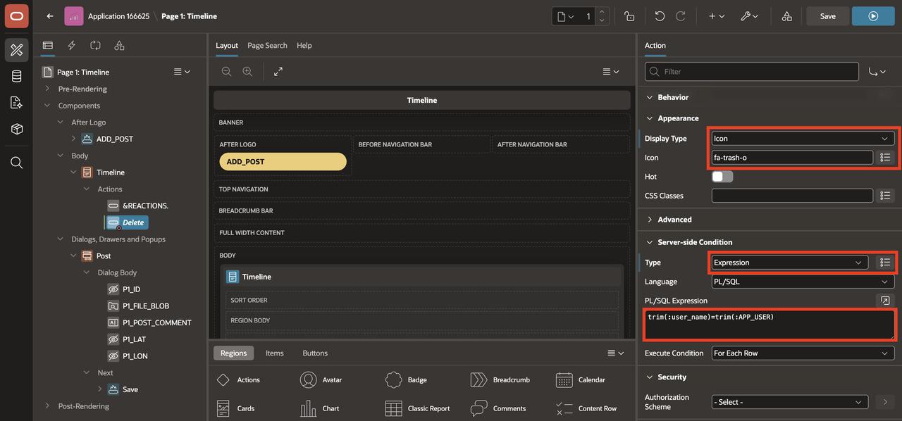

3. Click **Save**.

## Task 3: Add Javascript to the Page for the Card Buttons

In this task, we will provide the APEX page with the custom Javascript that will be invoked by the "URL" from the card button target links to the Dynamic Actions that we will create in Lab 8.

1. In the left pane, select **Page 1: Timeline** and review the attributes for the **Page 1:Timeline** in the Property editor on the right.

2. Under the Javascript section, For: **Execute when Page Loads**, enter the following Javascript code:

    ```
     <copy>
        apex.actions.add([{
        name: "like",
        action: (event, element, args) => {
            apex.items.P1_ACTION_ID.value = args.id;
            apex.event.trigger(document, 'action-like');
            }
        }, {
        name: "delete",
        action: (event, element, args) => {
            apex.items.P1_ACTION_ID.value = args.id;
            apex.event.trigger(document, 'action-delete');
            }
        }]);
     </copy>
    ```

    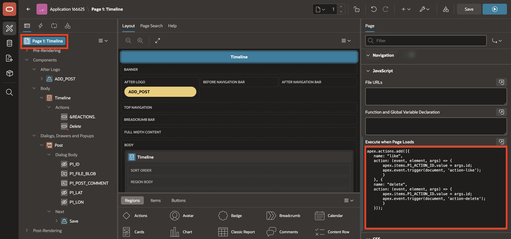

    Open the Code Editor to see the entire script.

    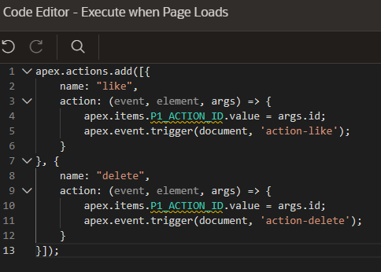

    Notice that the code references a Page Item, **P1\_ACTION\_ID** with a warning underline, which we have not created yet.

    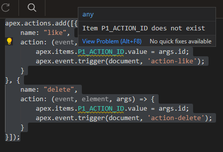

    We need the **P1\_ACTION\_ID** page item to be present on the page so that JavaScript can store the specific CARD ID when a user clicks either the **Like** or **Delete** button. This ID will then be used to execute the corresponding operation through the URL link targets.

    This follows a design pattern where a single APEX JavaScript API call (on page load) includes an array of multiple code blocks as parameters. Each JavaScript block will then trigger custom events that will later be handled by Dynamic Actions.

3. To create and configure the **P1\_ACTION\_ID** Page Item, in the left pane right-click **Timeline** cards region and select **Create Page Item**.

    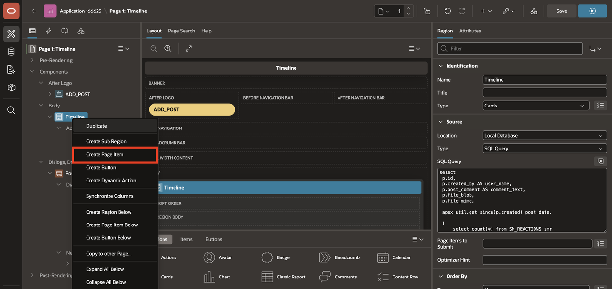

4. In the Property Editor, enter/select the following:

     - Under Identification:

          - Name: **P1\_ACTION\_ID**

            *Note: By default, APEX prefixes the page item name with P, the **Page Number**, followed by an underscore (**_**), and **NEW**; in this case, as **P1\_NEW**.*

          - Type: **Hidden**

     - Settings > Value Protected: **Toggle Off**

    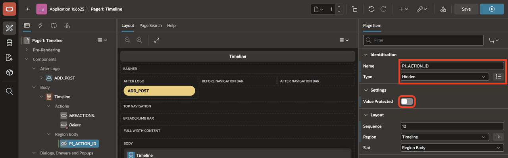

5. Now, in the left pane, navigate back to **Page 1: Timeline** and open the Code Editor to review the JavaScript we previously copied and pasted. The editor should look clean, with no errors or warnings.

    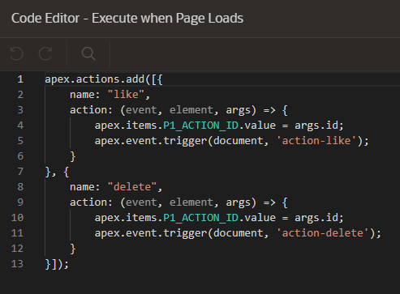

6. **Save and Run** the page to review the current state of the application. Functionally, we're almost there!

    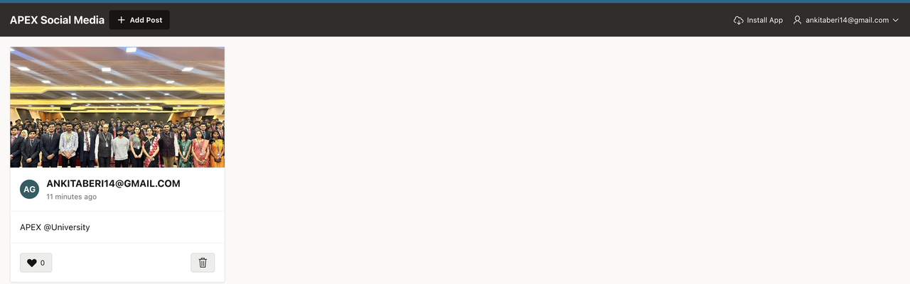

## Summary

In this lab, you added Like and Delete action buttons to the Cards region and configured their behavior using JavaScript and APEX actions. You also created a hidden page item to store selected card IDs and support client-side interactions for future dynamic actions.

You may now **proceed to the next lab**

## Acknowledgements

- **Author** - Jayson Hanes, Principal Product Manager; Apoorva Srinivas, Senior Product Manager;

- **Last Updated By/Date** - Ankita Beri, Senior Product Manager, May 2026
