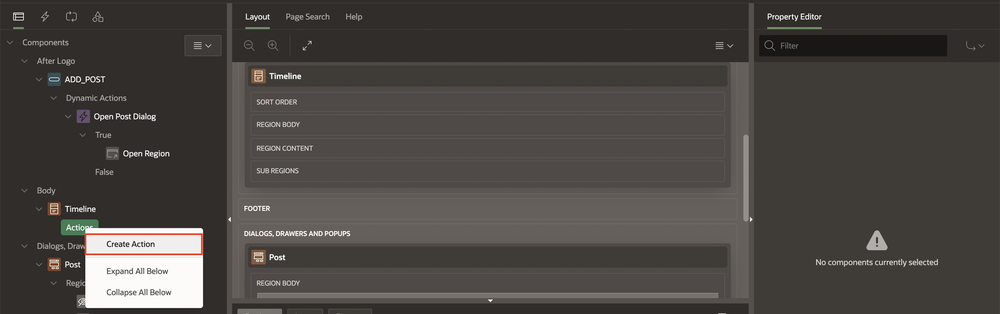
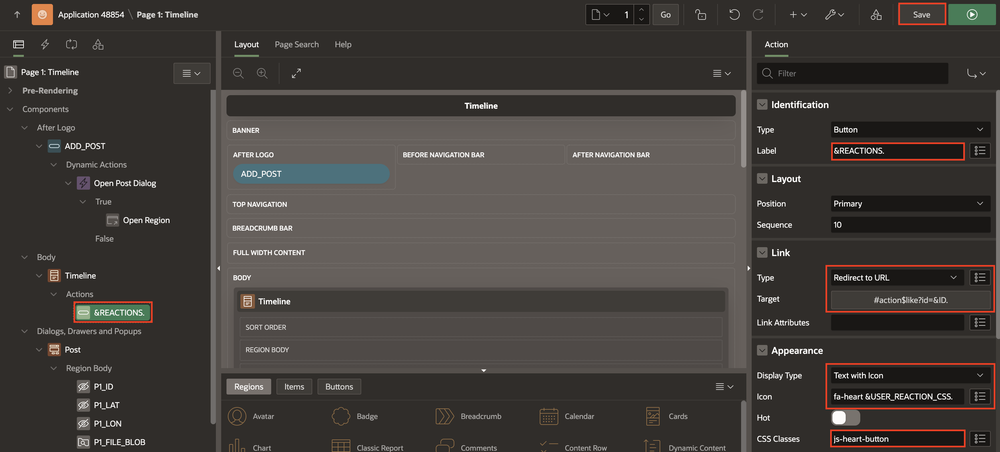
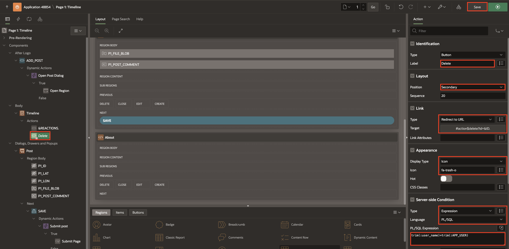
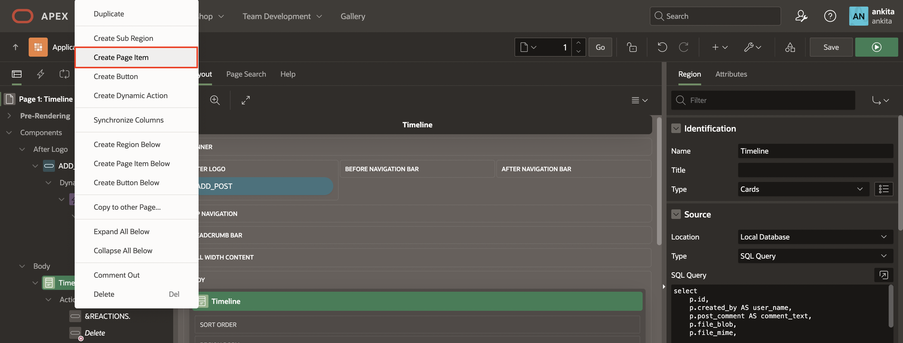
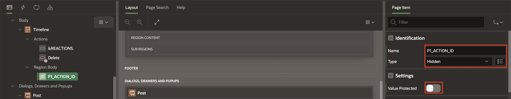

# Create Action Buttons

## Introduction

In this lab, you will customize the CARDS region by adding a reaction button and a delete button, allowing users to like or delete a post.

Estimated Time: 5 minutes

Watch the video below for a quick walk-through of the lab.
[Create an APEX App](videohub:1_53khevkr)

### Objectives

In this lab, you will:

- Create a Like button for the user to react to a post
- Create a Delete button to delete a post

### Prerequisites

- Completion of workshop through Lab 6

## Task 1: Create a Like Button

The **Like** button will show a heart icon along with the total number of likes. Users can click the button to add their like to the post. If they have already liked it, clicking again will remove their like.

1. In the Rendering Tree under the **Timeline** Cards Region, right click on **Actions** and select **Create Action**

    

2. You will see a new sub-entry item titled **Button** and you can select it to see the properties on the right.

3. In the Property Editor, enter/select the following:

    - Identification > Label: **&REACTIONS.** (including the period).

        This is called APEX string substitution syntax, and it will render the count of reactions as the Label for this button, on each post.

        *Note: The REACTIONS column is defined in the query for this CARDS Region.*

    - Under Link:
        - Type: **Redirect to URL**.

            We need the LIKE button to have a URL that can be linked to javascript later, so that the database operation can be performed.

        - Target > URL: **#action$like?id=&ID.** (including the period)

            Click **OK**.

    

    - Under Appearance:

        - Display Type: **Text with Icon**

        - Icon: **fa-heart &USER\_REACTION\_CSS.** (including the period). The **USER\_REACTION\_CSS** column is defined in the query for this CARDS region

        - CSS Classes : **js-heart-button**

    Click **Save**.

    

    If you run the app now, the button will cause a JavaScript error because the necessary code hasn’t been added yet. We will fix this after creating the DELETE button.

## Task 2: Create a Delete Button

Similar to the previous task, we will create another button for deleting posts. This button will have a condition to ensure that it is only displayed for posts belonging to the logged-in user.

1. In the Rendering tree under **Timeline**, right click on Actions, and select **Create Action**.

2. In the Property Editor, update the following attributes:

    - Action > Label: **Delete**

    - Layout > Position: **Secondary** (This ensures that the button is displayed on the right side of the card)

    - Under Link:
        - Type: **Redirect to URL**

        - Target > URL: **#action$delete?id=&ID.**

        Click **OK**.

    

    - Under Appearance:

        - Display Type: **Icon**

        - Icon: **fa-trash-o**

    - Under Server-side condition:

        - Type: **Expression**

        - PL/SQL expression: **trim(:user\_name)=trim(:APP\_USER)**

        This Server-side condition controls whether or not this **button** shows for a card. The expression will compare the query column value returned to the currently signed-in APEX user. The colon-prefixed "variable" syntax is called the "Bind Variable Syntax" in PL/SQL. If it evaluates to true (for each row or Card) then APEX will render the **Button**, otherwise the button is not visible.

    Click **Save**.

    

## Task 3: Add Javascript to the Page for the Card Buttons

In this task, we will provide the APEX page with the custom javascript that will be invoked by the "URL" from the Card button target link, to the Dynamic actions that we will create in Lab 8.

1. In the Rendering Tree, select the **Page 1: Timeline** entry and review the attributes for the **Page 1:Timeline** in the Property editor on the right.

2. Under the Javascript section, For: **Execute when Page Loads**, enter the following javascript code:

    ```
     <copy>
        apex.actions.add([{
        name: "like",
        action: (event, element, args) => {
            apex.items.P1_ACTION_ID.value = args.id;
            apex.event.trigger(document, 'action-like');
            }
        }, {
        name: "delete",
        action: (event, element, args) => {
            apex.items.P1_ACTION_ID.value = args.id;
            apex.event.trigger(document, 'action-delete');
            }
        }]);
     </copy>
    ```

    

    Open the Code Editor to see the entire script.

    

    Notice that the code references a Page Item, **P1\_ACTION\_ID** with a squiggly underline, which we have not created yet.

    

    We need the **P1\_ACTION\_ID** page item to be present on the page so that JavaScript can store the specific CARD ID when a user clicks either the **Like** or **Delete** button. This ID will then be used to execute the corresponding operation through the URL link targets.

    This follows a design pattern where a single APEX JavaScript API call (on page load) includes an array of multiple code blocks as parameters. Each JavaScript block will then trigger a custom event, which we will configure our Dynamic Actions to respond to in the next task.

3. To create and configure **P1\_ACTION\_ID** Page Item, in the Rendering Tree right click **Timeline** Cards Region and select **Create Page Item**.

    

4. In the Property Editor:

     - Under Identification:
          - Name: **P1\_ACTION\_ID**

            *Note: APEX will set **Page Item** > **Name** by default with the prefix of **P**, the **Page Number**, followed by an underscore (**_**), and **NEW**; in this case, as **P1\_NEW**.*

          - Type: **Hidden**

     - Settings > Value Protected: **Toggle Off**

    

5. Now in the Rending tree, navigate back to **Page 1: Timeline** and open the Code Editor to review the JavaScript we previously copied and pasted. The editor should look clean, with no errors or concerns!

    

6. **Save and Run** the page to see how the app is shaping up. Functionally, we're almost there!

    

You may now **proceed to the next lab**

## Acknowledgements

- **Author** - Jayson Hanes, Principal Product Manager; Apoorva Srinivas, Senior Product Manager;
- **Last Updated By/Date** - Sahaana Manavalan, Senior Product Manager, March 2025
