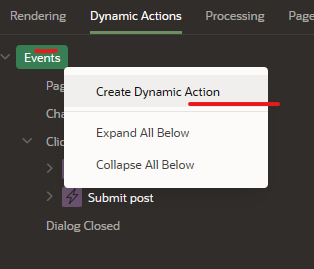
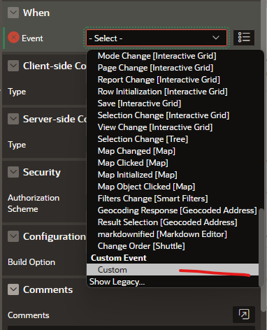
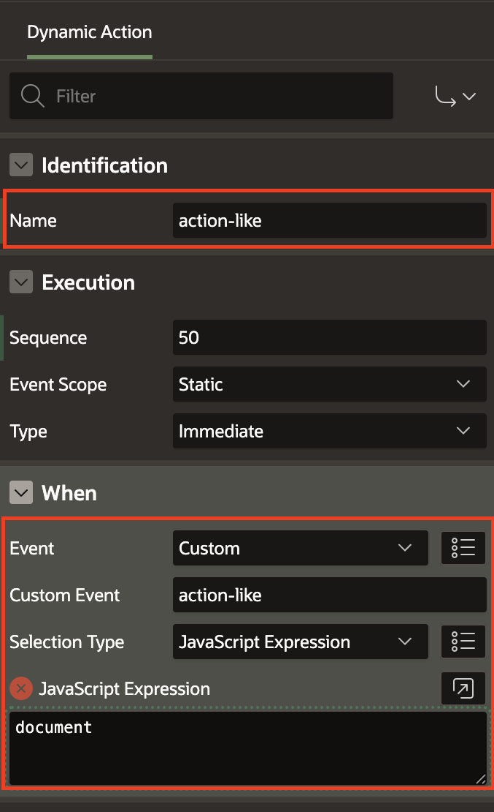
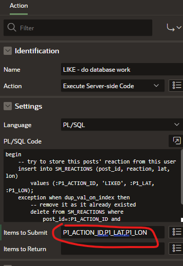
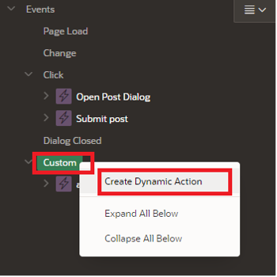
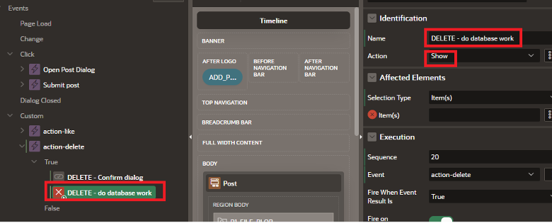
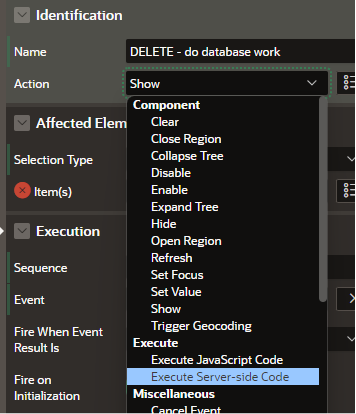
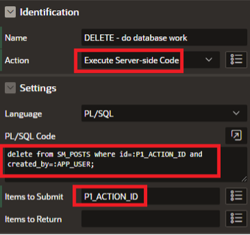
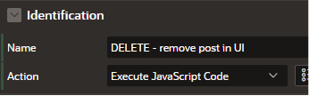
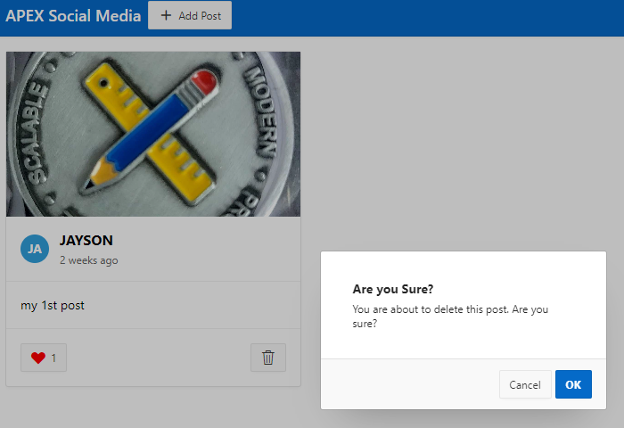

# Add Dynamic Actions

## Introduction

Up until now the Like and Delete buttons are available on the Cards (conditionally for the Delete button!). However, clicking these buttons doesn't currently have any visible effect. Behind the scenes, the URL Link targets are actually calling the javascript on the page, and are setting the **P1\_ACTION\_ID**, but we need to create a Dynamic Action with a Custom Event for *each* to complete the circuit. This design pattern greatly simplifies the amount of Javascript required to make the magic happen.

Estimated Time: 5 minutes

## **Task 1** : Create a Dynamic Action with a Custom **action-like** Event

1. From the Rendering pane, navigate to the **Dynamic Actions** tab.

    

    The dynamic Actions tab is displayed:

    


2.  Right-click the **Events** entry and choose **Create Dynamic Action**.

    

3.  A **New** Dynamic Action has been created with a **True action** defaulted to **Show**. Let's change the Name to **action-like**.

    

4.  For **When > Event**, select **Custom**.

    

5.  Now, we can wire our Javascript up to this Dynamic Action by setting the **When > Custom Event** to **action-like** -- this is an important detail because our page Javascript identifies this Dynamic Action by this Custom Event name.

6.  Finally, we need to set the **When > Selection Type** to **JavaScript Expression**, and for **Javascript Expression** enter **document** in the box.

    

## **Task 2** : Creating the True Actions for the Like Button

We need to configure the True actions for the action-like Dynamic Action. We need to perform two actions: one for updating the UI on the client with either one more or one less like (JavaScript), and another to actually invoke the database work necessary to record the desired state for the user, for the corresponding post (PL/SQL).

1.  Edit the **True** Action **Identification > Name** to be
    something descriptive, ie **LIKE - update UI (adjust count + heart color)**

2.  Set **Action** to **Execute JavaScript Code**.

3.  Copy and paste this JavaScript code into the **Code** box:

    ```
    <copy>
        const button = $('[data-id="'+ apex.items.P1_ACTION_ID.value +'"] .js-heart-button'); // get the card

        const label = button.find('.a-CardView-buttonLabel'); // get the likes count section

        const icon = button.find('.a-CardView-buttonIcon'); // gets the element if its liked already

        let likeCount = label.text(); // get the like count

        if (icon.hasClass('user-has-liked')) {
            // user has liked this already, and they are unliking it now -- decrement
            label.text(--likeCount);

        } else {
            // user is liking the post -- increment
            label.text(++likeCount);
        }

        icon.toggleClass('user-has-liked'); // either add this class or remove it
    </copy>
    ```
    

4. Next, we need to add another True Action to do the database work and store the User reaction.

    Right-click on the True title within the action-like Dynamic Action we just created. Choose **Create TRUE action**.

    

5.  Click on the resulting default "Show" action, and set the Name to **LIKE -- do database work**

6.  Set the **Action** to **Execute Server-side Code**, and copy and paste the following PL/SQL code:

    ```
    <copy>
        begin
        -- try to store this posts' reaction from this user
        insert into SM_REACTIONS (post_id, reaction, lat, lon)
            values (:P1_ACTION_ID, 'LIKED', :P1_LAT, :P1_LON);
        exception when dup_val_on_index then
            -- remove it as it already existed
            delete from SM_REACTIONS where
                post_id=:P1_ACTION_ID and created_by=:APP_USER;
        end;
    </copy>
    ```

    This code will try to insert the reaction for this user, for this post into the *SM_REACTIONS* table. If it already exists as determined by the constraint we created when we built the table, then the record will be deleted. These 2 actions now efficiently handle a series of otherwise complex processes in concert: both on the Client-side and the Server-side.

    

7. We need to configure one last thing on this action. This code block needs to receive the Page Item values from our form. This is handled by providing a list of the **Page Items to Submit** to the Server.

  Paste this CSV list of Page Items into the box under the **PL/SQL Code** property.
    ```
    <copy>
        P1_ACTION_ID,P1_LAT,P1_LON
    </copy>
    ```

    

8. We should now be able to Like our own post! **Save and Run** to try it out. Click the Like and see the Heart turn Black (Once you define the css class in the next lab, the heart will turn to Red).

9.  You could also explore the table data manually by way of **SQL Workshop > SQL commands**, and running a simple query as follows:
    ```
    <copy>
    select * from sm_reactions
    </copy>
    ```

    

10. Clicking the Like again on your post will delete the record.

    

    As other users use your app (which we haven't configured any yet), each Reaction for each Post by every user will create a distinct record in this table.

## **Task 3**: Create a Dynamic Action with a custom action-delete event

**Note**: Task 3 and Task 4 can be considered optional – they only enable the user to delete their own post, and are very similar to the previous 2 tasks.

1. First, we want to be sure that we are looking at the **Dynamic Actions** tab. If not, select it so that we can add a new Dynamic action.

    

2. Right-click the **Custom** entry and choose **Create Dynamic Action**.

    

3. You will now see that a New Dynamic Action has been created with a **True** action defaulted to **Show**. The overview of this looks like the following for the next steps:

    

4. Update the following attributes in the Property Editor:
    - Change the Name to **action-delete**.
    - Note that **When -> Event** is already set to **Custom** because of how we created this from that event type in the tree. However, we need to set some other properties:
    - Set the **When -> Custom** Event to **action-delete** – this is once again an important detail because our page Javascript identifies this Dynamic Action by this Custom Event name.
    - Finally, we need to set the **When -> Selection Type** to **JavaScript Expression** with **document** in the box for the setting so that the **When** section looks as follows:

    


## **Task 4**: Create the Delete Button True Actions

We now need to configure the True actions for the action-delete Dynamic Action. There are actually 3 actions desired here: one for a confirmation, another to actually invoke the database work necessary to delete the desired post (PL/SQL) and the last one that updates the UI on the client by removing the deleted post (much simpler than was necessary for the action-like).

1. Navigate to the **True Action > Show** button and set the following properties:
    - Edit the **Name** to be something descriptive, ie **DELETE – Confirm dialog**.
    - Change the Action to **Confirm**.
    - Set the **Title** to **Are you Sure?**
    - Set the **Message** to **You are about to delete this post. Are you sure?**

    

2. Next, we need to add another True Action to do the database work and delete the post record from the table.	Right-click on the True title within the action-delete Dynamic Action we just created and select **Create TRUE action**.

    

3. Click on the resulting default **Show** action, and set the **Name** to be **DELETE – do database work**.

    

4. Set the **Action** to **Execute Server-side Code**.

    

5. And now copy and paste this PL/SQL (which is actually a DML statement, also known as Data Manipulation Language) into the **PL/SQL Code** field.

    ```
    <copy>
        delete from SM_POSTS where id=:P1_ACTION_ID and created_by=:APP_USER;
    </copy>
    ```

    This code will delete the post from the *SM\_REACTIONS* table based on the logged in user by way of **:APP\_USER** and matching the table record with ID equal to the value in **:P1\_ACTION\_ID** (as identified in the code via Oracle bind variable syntax (prefixed with a colon).
    This code block needs to receive that Page Item value for the P1\_ACTION\_ID value as defined by the button in the Cards report for each post that shows the delete button/icon.

6. This is handled by providing a list of the Page Items to Submit to the Server (in this case, just 1). Paste this Page Item name into **Items to Submit** field:

    ```
    <copy>
        P1_ACTION_ID
    </copy>
    ```

    

7. Finally, after the row is deleted, we want to remove the post from the Timeline UI.
    We need to create one last true action, as we did before by right-clicking on the True entry in the tree.

    

8. In the property Editor,
    - Set the **Name** for this action to be **DELETE – remove post in UI**
    - Set the **Action** to **Execute JavaScript Code**

    

9. Lastly, copy and paste the following code into the **Code** box:

    ```
    <copy>
        $('[data-id='+apex.items.P1_ACTION_ID.value+']').remove();
    </copy>
    ```
    

10. We should now be able to delete our own post. **Save and Run** to try it out!

    

11. Besides the post being removed from your screen, you can navigate to **SQL Workshop > Object Browser** and also confirm that there is no data left in the table (assuming that there was only the one post prior).

    

## **Acknowledgements**

 - **Author** - Jayson Hanes, Principal Product Manager; Apoorva Srinivas, Senior Product Manager;
 - **Last Updated By/Date** - Ankita Beri, Product Manager, March 2023
