# Add Dynamic Actions

## Introduction

In this lab, you will add dynamic actions to the Cards region so the Like and Delete buttons perform the expected actions. You will configure custom events, run client-side JavaScript, and execute server-side code to update the user interface and database.

<!-- Watch the video below for a quick walk-through of the lab.
[Create an APEX App](videohub:1_9eyiszwb)
 -->
### Objectives

In this lab, you will:

- Create Dynamic Actions for Like and Delete buttons.

- Associate the Like and Delete buttons with custom events.

### Prerequisites

- Completion of workshop through Lab 7

Estimated Time: 5 minutes

## Task 1 : Create a Dynamic Action with a Custom action-like Event

1. In the left pane, select the **Dynamic Actions** tab.

    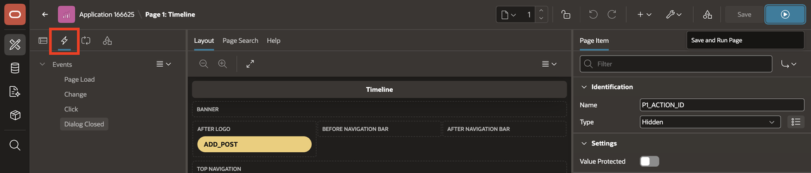

2. Right-click **Events** and select **Create Dynamic Action**.

    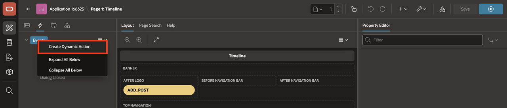

3. A **New** Dynamic Action has been created with a default **True action** set to **Show**.

    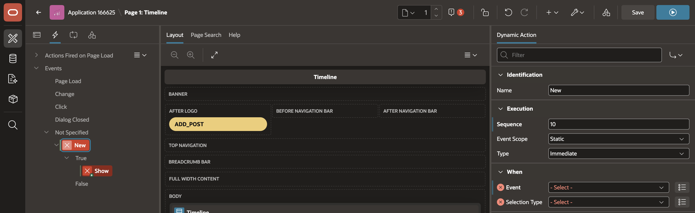

4. In the Property Editor, enter/select the following:

    - Identification > Name: **action-like**

    - Under When:

        - Event : **Custom**

        - Custom Event: **action-like**

        - Selection Type: **JavaScript Expression**

        - JavaScript Expression: **document**

        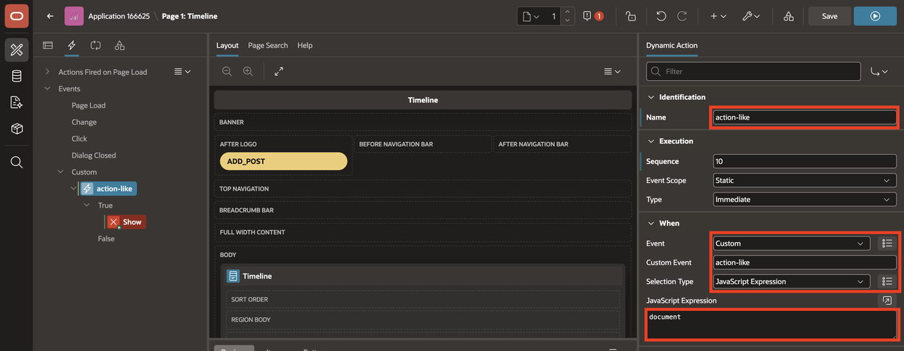

## Task 2: Creating the True Actions for the Like Button

To complete the action-like Dynamic Action, configure the True Actions to perform two tasks:

- Update the UI: modify the like count dynamically on the client side using JavaScript. This ensures immediate feedback to the user without requiring a full page reload.

- Invoke the Database Action: Use PL/SQL to update the like status in the database. This ensures that the like/unlike action is correctly recorded for the post.

1. In the True action, enter/select the following:

    - Under Identification:

        - Name: **LIKE - update UI (adjust count + heart color)**

        - Action > **Execute JavaScript Code**

    - Settings > Code: Copy and paste the following JavaScript code into the **Code** box:

        ```
        <copy>
            const button = $('[data-id="'+ apex.items.P1_ACTION_ID.value +'"] .js-heart-button'); // get the card

            const label = button.find('.a-CardView-buttonLabel'); // get the likes count section

            const icon = button.find('.a-CardView-buttonIcon'); // gets the element if its liked already

            let likeCount = label.text(); // get the like count

            if (icon.hasClass('user-has-liked')) {
                // user has liked this already, and they are unliking it now -- decrement
                label.text(--likeCount);

            } else {
                // user is liking the post -- increment
                label.text(++likeCount);
            }

            icon.toggleClass('user-has-liked'); // either add this class or remove it
        </copy>
        ```

    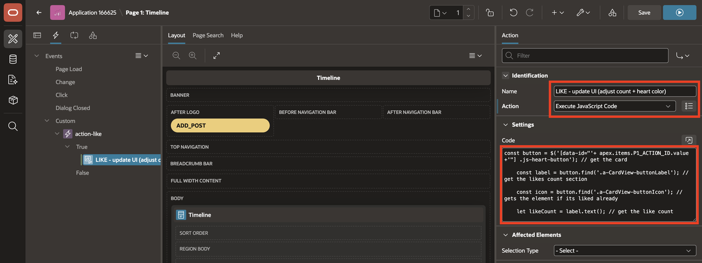

2. Next, we need to add another True Action to handle the database operation and store the user's reaction.

3. In the left pane for the action-like Dynamic Action, right-click **True** action and select **Create TRUE Action**.

    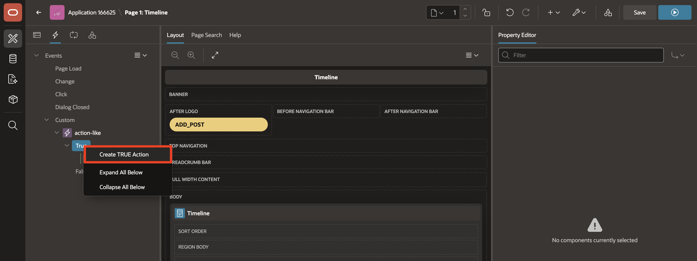

4. In the Property Editor on the resulting default "Show" action, enter/select the following:

    - Under Identification:

        - Name: **LIKE - do database work**

        - Action: **Execute Server-side Code**

    - Under Settings:

        - PL/SQL Code: Copy and paste the following

        ```
        <copy>
            begin
            -- try to store this posts' reaction from this user
            insert into SM_REACTIONS (post_id, reaction, lat, lon)
                values (:P1_ACTION_ID, 'LIKED', :P1_LAT, :P1_LON);
            exception when dup_val_on_index then
                -- remove it as it already existed
                delete from SM_REACTIONS where
                    post_id=:P1_ACTION_ID and created_by=:APP_USER;
            end;
        </copy>
        ```

        This code inserts the user’s reaction for the corresponding post into the SM_REACTIONS table. If a reaction already exists (as enforced by the constraint defined when creating the table), the record will be deleted instead.

        These two actions effectively handle both client-side and server-side processes, ensuring smooth and efficient like/unlike functionality.

    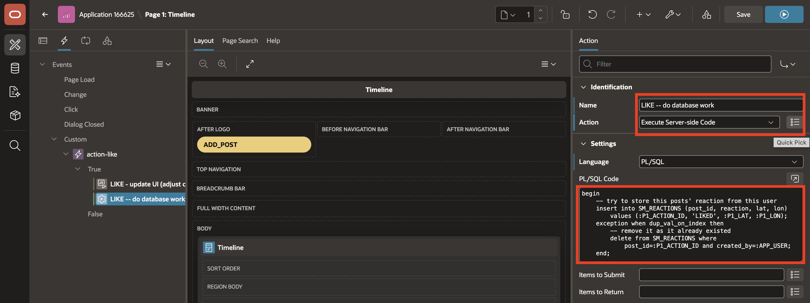

5. We need to configure one final step for this action. The code block must receive the necessary Page Item values from our form. To achieve this, we will specify the Page Items to Submit to the server.

    - Settings > Items to Submit : **P1\_ACTION_ID,P1\_LAT,P1\_LON**

    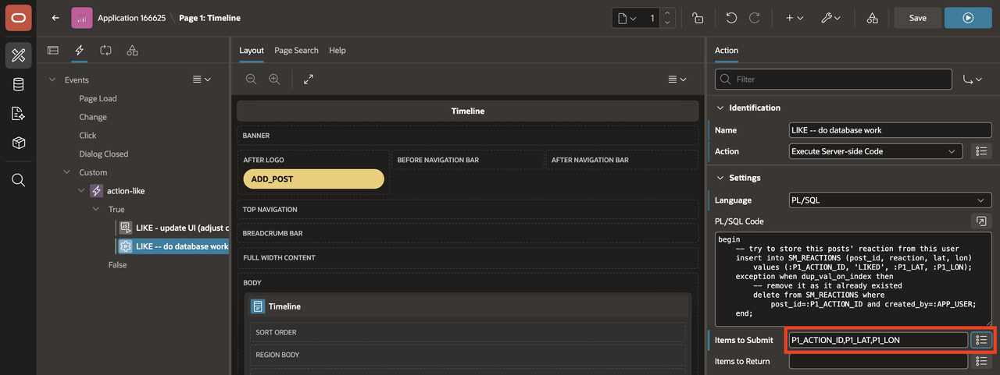

6. Now, we should be able to like our own post! **Save and Run** the app to test it. Click the Like button and see the heart turn black. (Once we define the CSS class in the next lab, the heart will turn red.)

    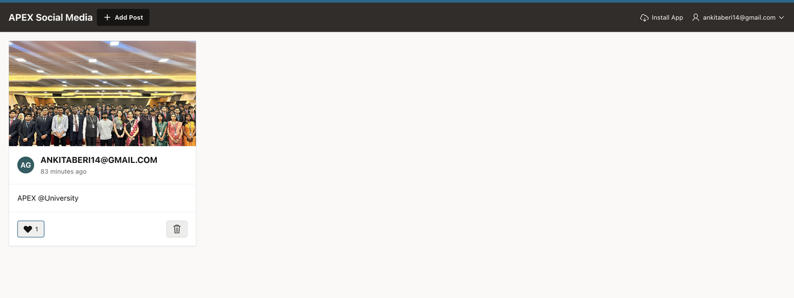

7. You could also explore the table data manually. From the left navigation menu, mouse over **SQL Workshop** icon and select **SQL commands**.

    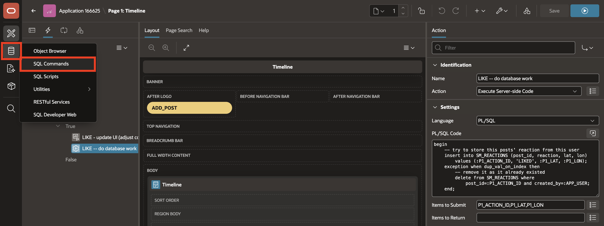

8. Copy and Paste the below query and click **Run**.

    ```
    <copy>
    select * from sm_reactions
    </copy>
    ```

    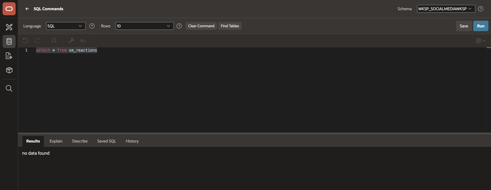

9. Clicking the Like again on your post will delete the record.

    As more users interact with your app (which we haven't configured yet), each reaction on a post will create a separate record in the SM_REACTIONS table.

## Task 3: Create a Dynamic Action with a Custom action-delete Event

 *Note: Task 3 and Task 4 can be considered optional – they enable the user to delete their own post, and are very similar to the previous 2 tasks.*

1. From the left navigation menu, click **App Builder** icon.

    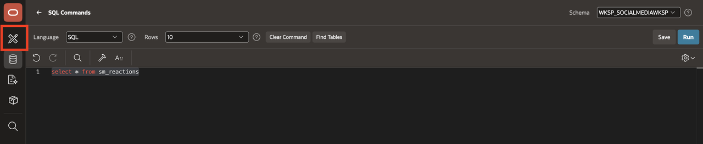

2. Select **APEX Social Media** application.

    

3. On the Application home page, select **Timeline** page.

    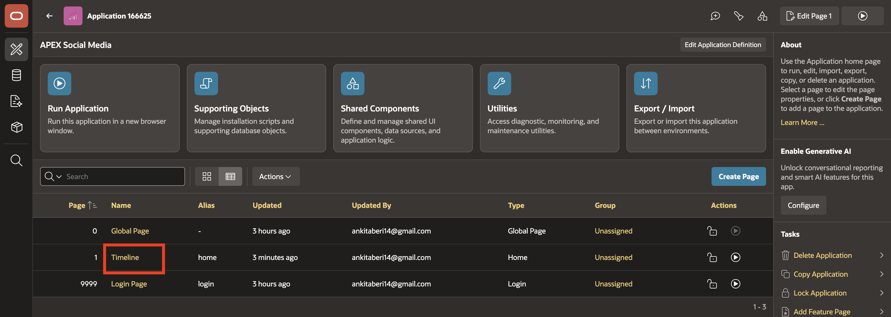

4. In the left pane, select **Dynamic Actions** tab. Right-click **Custom** and select **Create Dynamic Action**.

    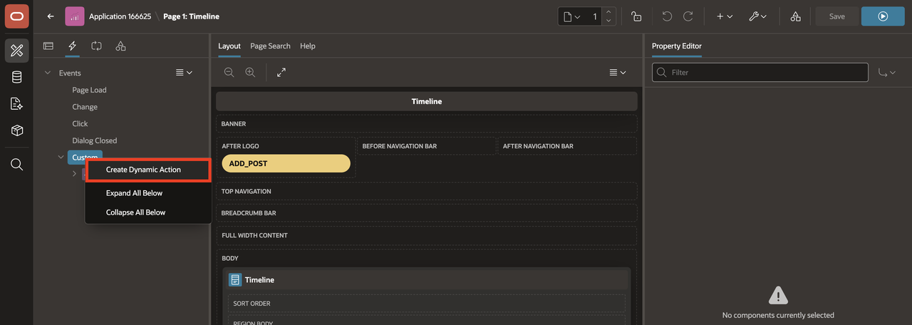

5. You will now see that a new Dynamic Action has been created with a **True** action defaulted to **Show**.

    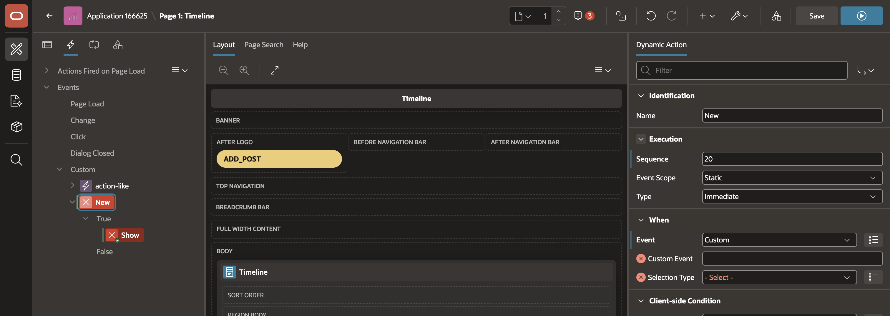

6. In the Property Editor, enter/select the following:

    - Identification > Name: **action-delete**

    - Under When:

        - Custom Event: **action-delete** (This is important because the JavaScript on the page identifies this Dynamic Action by the custom event name.)

        - Selection Type: **JavaScript Expression**

        - JavaScript Expression: **document**

    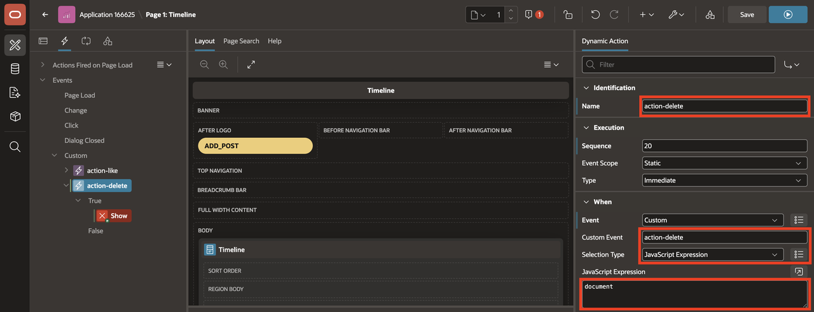

## Task 4: Create the Delete Button True Actions

We need to configure the True actions for the action-delete Dynamic Action.

There are three actions here:

- Confirm deletion

- Invoke the database work necessary to delete the desired post (PL/SQL)

- Update the UI on the client by removing the deleted post

1. Navigate to the **True Action > Show** button and set the following properties:

    - Under Identification:

        - Name: **DELETE – Confirm dialog**

        - Action: **Confirm**

    - Under Settings:

        - Title: **Are you sure?**

        - Message: **You are about to delete this post. Are you sure?**

    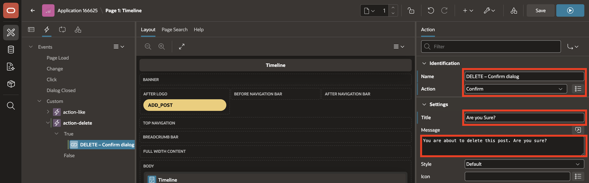

2. Next, we need to add another True Action to do the database work and delete the post record from the table. In the left pane, right-click **True** action within the action-delete Dynamic Action and select **Create TRUE Action**.

    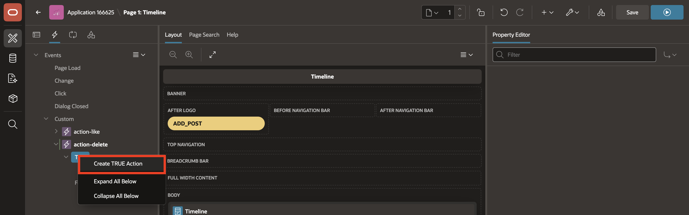

3. Click on the resulting default **Show** action, and in the property editor, enter/select the following:

    - Under Identification:

        - Name: **DELETE – do database work**

        - Action: **Execute Server-side Code**

    - Settings > PL/SQL Code: Copy and paste the following DML statement:

        ```
         <copy>
         delete from SM_REACTIONS where POST_ID = :P1_ACTION_ID and created_by=:APP_USER;
         delete from SM_POSTS where id=:P1_ACTION_ID and created_by=:APP_USER;
         </copy>
        ```

        This code will delete the post-related reaction from the SM_REACTIONS table based on the logged in user (**:APP\_USER**) and matching the table record with the value in **:P1\_ACTION\_ID** (as identified in the code via Oracle bind variable syntax).

4. The code block in the previous step needs to receive the Page Item value for the P1\_ACTION\_ID value as defined by the button in the Cards region for each post that shows the delete button or icon. This is handled by providing the Page Items to Submit to the Server.

    Select the following:

    - Settings > Items to Submit: **P1\_ACTION\_ID**

    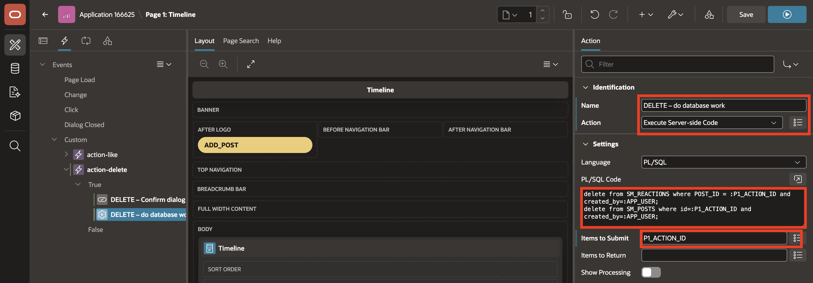

5. Finally, after the row is deleted, we want to remove the post from the Timeline UI.

    In the **action-delete** custom event, right-click **True** and select **Create TRUE Action**.

    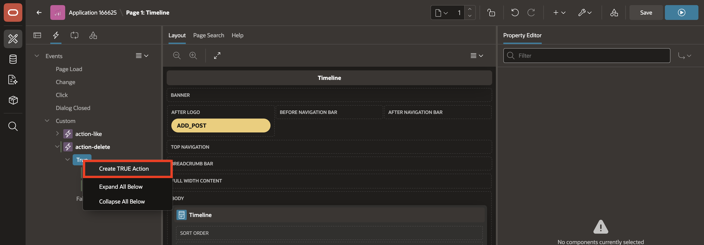

6. In the Property Editor, enter/select the following:

    - Under Identification:

        - Name: **DELETE – remove post in UI**

        - Action: **Execute JavaScript Code**

    - Settings > Code: Copy and paste the following

        ```
        <copy>
            $('[data-id='+apex.items.P1_ACTION_ID.value+']').remove();
        </copy>
        ```

    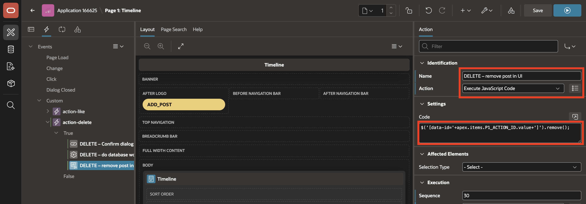

7. We should now be able to delete our own post. **Save and Run** to try it out!

    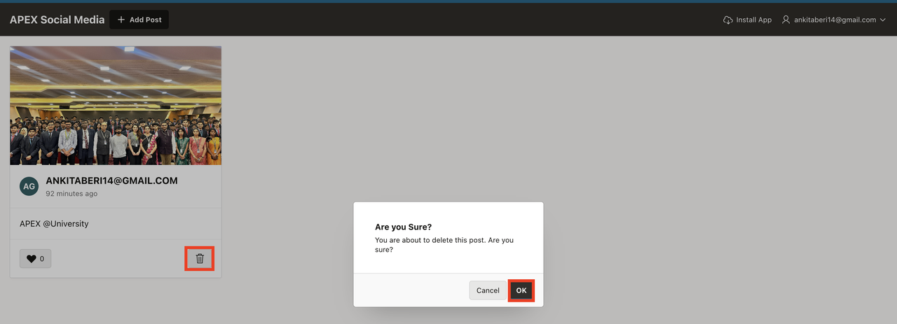

8. Besides the post being removed from your screen, you can navigate to **SQL Workshop > Object Browser** and also confirm that there is no data left in the table **SM_POSTS** (assuming that there was only the one post in the app).

    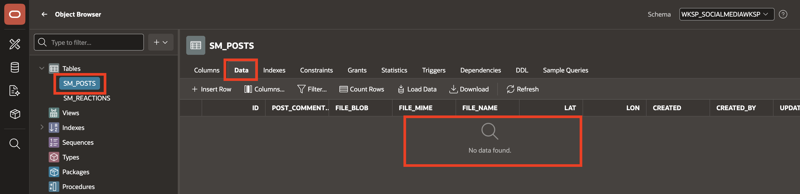

## Summary

In this lab, you created dynamic actions for the Like and Delete buttons in the Cards region. You also added JavaScript and server-side code to update reactions, delete posts, and refresh the user interface based on user actions.

You may now **proceed to the next lab**

## Acknowledgements

- **Author** - Jayson Hanes, Principal Product Manager; Apoorva Srinivas, Senior Product Manager;

- **Last Updated By/Date** - Ankita Beri, Senior Product Manager, May 2026
