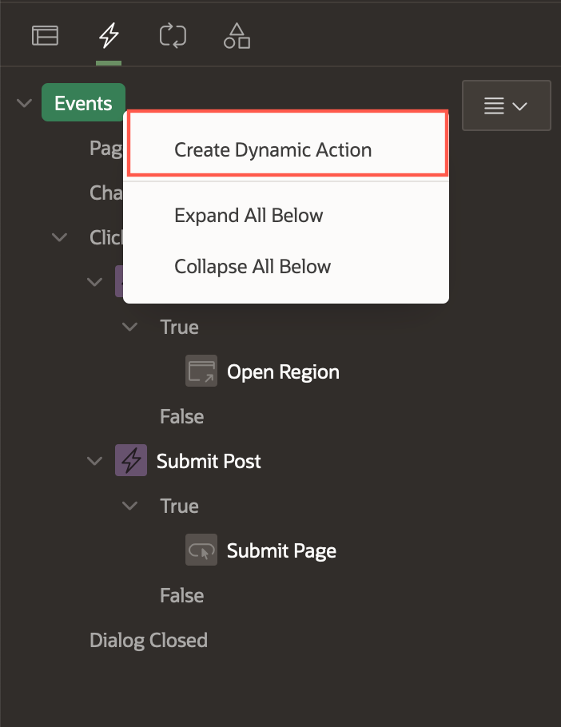
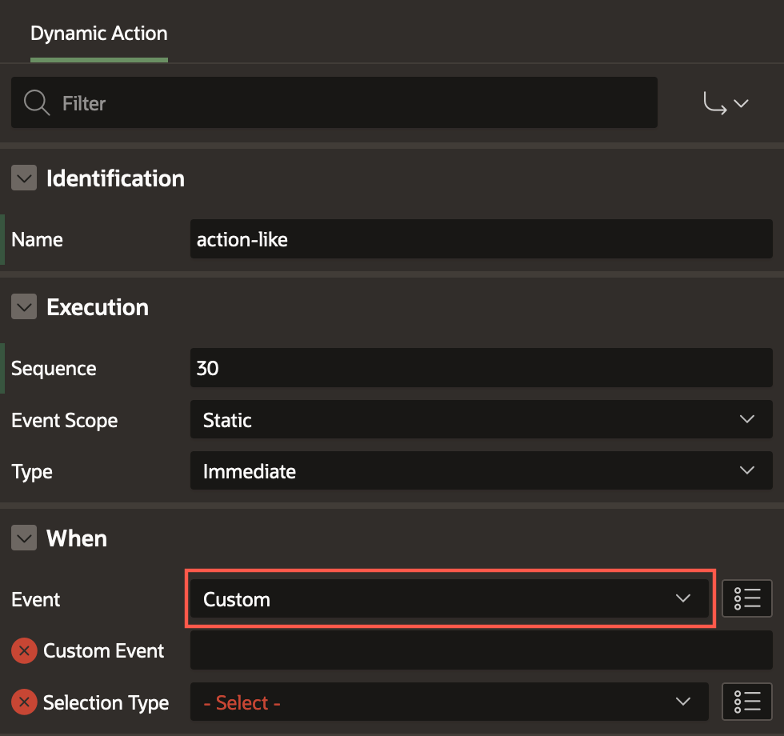
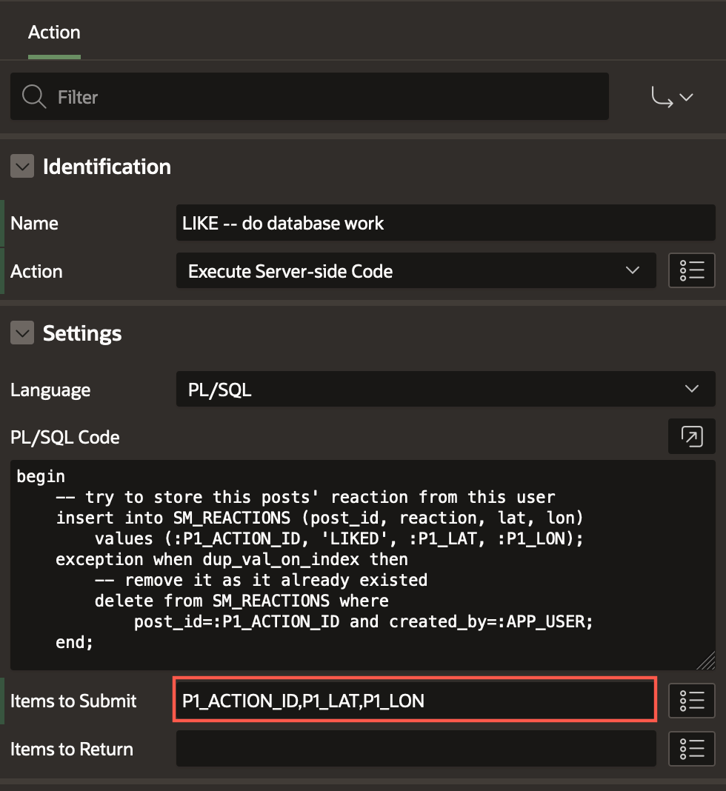

# Add a Reaction Button

## Introduction

Up until now the Like and Delete buttons are available on the Cards (conditionally for the
Delete button!). However, clicking these buttons doesn't currently have
any visible effect. Behind the scenes, the URL Link targets are actually
calling the javascript on the page, and are setting the
**P1_ACTION_ID**, but we need to create a Dynamic Action with a Custom
Event for *each* to complete the circuit. This design pattern greatly
simplifies the amount of Javascript required to make the magic happen.

## **Task 1** : Create a Dynamic Action with a Custom **action-like** Event

1. From the Rendering pane, navigate to the **Dynamic Actions** tab.

    

    The dynamic Actions tab is displayed:

    


2.  Right-click the **Events** entry and choose **Create Dynamic Action**.

        

3.  A **New** Dynamic Action has been created with a **True action** defaulted to **Show**. Let's change the Name to **action-like**.

        

3.  For **When > Event**, select **Custom**.

        

4.  Now, we can wire our Javascript up to this Dynamic Action by
    setting the **When > Custom Event** to **action-like**
    -- this is an important detail because our page Javascript identifies this Dynamic Action by
    this Custom Event name.

5.  Finally, we need to set the **When > Selection Type** to
    **JavaScript Expression**, and for **Javascript Expression** enter **document** in the box.

        

## **Task 2** : Creating the True Actions for the Like Button

We need to configure the True actions for the action-like Dynamic
Action. We need to perform two actions: one for updating the UI on
the client with either one more or one less like (JavaScript), and
another to actually invoke the database work necessary to record the
desired state for the user, for the corresponding post (PL/SQL).

1.  Edit the **True** **Action** **Identification > Name** to be
    something descriptive, ie **LIKE - update UI (adjust count + heart color)**

2.  Set **Action** to **Execute JavaScript**.

3.  Copy and paste this JavaScript code into the **Code** box:

    ```
    <copy>
        const button = $('[data-id="'+ apex.items.P1_ACTION_ID.value +'"] .js-heart-button'); // get the card

        const label = button.find('.a-CardView-buttonLabel'); // get the likes count section

        const icon = button.find('.a-CardView-buttonIcon'); // gets the element if its liked already

        let likeCount = label.text(); // get the like count

        if (icon.hasClass('user-has-liked')) { 
            // user has liked this already, and they are unliking it now -- decrement
            label.text(--likeCount); 

        } else { 
            // user is liking the post -- increment
            label.text(++likeCount);
        }

        icon.toggleClass('user-has-liked'); // either add this class or remove it
    </copy>
    ```

4. Next, we need to add another True Action to do the database work and
store the User reaction.

    Right-click on the True title within the action-like Dynamic Action
    we just created. Choose **Create TRUE action**.

    

5.  Click on the resulting default "Show" action, and set the Name to 
    **LIKE -- do database work**

6.  Set the **Action** to **Execute Server-side Code**, and copy and
    paste the following PL/SQL code:

    ```
    <copy>
        begin
        -- try to store this posts' reaction from this user
        insert into SM_REACTIONS (post_id, reaction, lat, lon) 
            values (:P1_ACTION_ID, 'LIKED', :P1_LAT, :P1_LON);
        exception when dup_val_on_index then
            -- remove it as it already existed
            delete from SM_REACTIONS where 
                post_id=:P1_ACTION_ID and created_by=:APP_USER;
        end;
    </copy>
    ```

    This code will try to insert the reaction for this user, for this post into the *SM_REACTIONS* table. If it already exists as determined by the constraint we created when we built the table, then the record will be deleted. These 2 actions now efficiently handle a series of otherwise complex processes in concert: both on the Client-side and the Server-side.
    
    

7. We need to configure one last thing on this action. This code block
needs to receive the Page Item values from our form.
    This is handled by providing a list of the **Page Items to Submit** to the Server.
    Paste this CSV list of Page Items into the box under the **PL/SQL Code** property.
    ```
    <copy>
        P1_ACTION_ID,P1_LAT,P1_LON
    </copy>
    ```

    

8. We should now be able to Like our own post! **Save and Run** to try it out. Click the Like and see the Heart turn red.

9.  You could also explore the table data manually by way of **SQL Workshop > SQL commands**, and running a simple query as follows:
    ```
    <copy>
    select * from sm_reactions
    </copy>
    ```

    

10. Clicking the Like again on your post will delete the record.

    

    As other users use your app (which we haven't configured any yet), each Reaction for each Post by every user will create a distinct record in this table.


## **Acknowledgements**

 - **Author** - Jayson Hanes, Principal Product Manager; Apoorva Srinivas, Senior Product Manager; 
 - **Last Updated By/Date** - Apoorva Srinivas, Senior Product Manager, March 2023