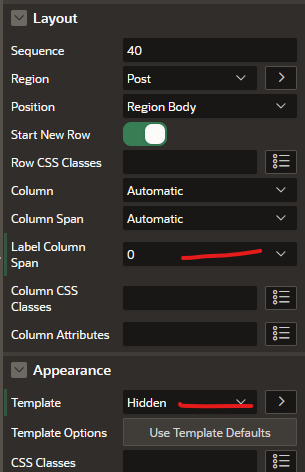
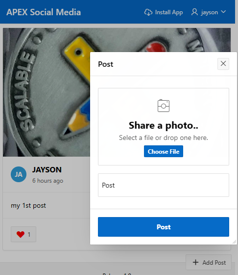

# Cleaning Up the App

## Introduction

In this lab, you will do the final touch up of the app to improve the aesthetics. You will learn how to customize the CSS

## Task 1 : Add CSS to the page

When we have liked a post we should see the Heart in RED. Also, if we
are using this app on a small screen (like a mobile device) it would be
better if the Add Post button was relocated to the bottom right of the
Screen. We can do this with 2 small blocks of Inline CSS on the page
level.

1.  Select **Page 1: Timeline** from the Rendering Tree and then in the Property Editor, proceed
    to scroll down to the **CSS > Inline**. 

2.  Copy and paste the following CSS into the **Inline** box:

    ```
    <copy>
        .user-has-liked {
    color: red;
    }

    @media (max-width: 640px) {
        .new-post-button {
            position: fixed;
            bottom: 24px;
            right: 24px;
            z-index: 1000;
    }
}


## **Task 2**: Clean up the File Browse Page Item

1.  Remove the Page Item **Label** from the **File Browse** Page Item by
    changing the **Appearance > Template** to **Hidden**, and setting
    the **Layout > Label Column Span** to 0.

2.  Improve its alignment by checking the **Template Options > General > Stretch Form Item** to ON.

3.  And finally, for CSS Classes enter **file-upload** and for icon select **fa-camera-retro**, as shown in the following screenshots:

    

    

4. Voila! We have arrived at a working and significantly functional low-code APEX
application.

    

    

    Send the URL to your mobile and try it out!

## **Acknowledgements**

 - **Author** - Jayson Hanes, Principal Product Manager; Apoorva Srinivas, Senior Product Manager; 
 - **Last Updated By/Date** - Apoorva Srinivas, Senior Product Manager, March 2023
