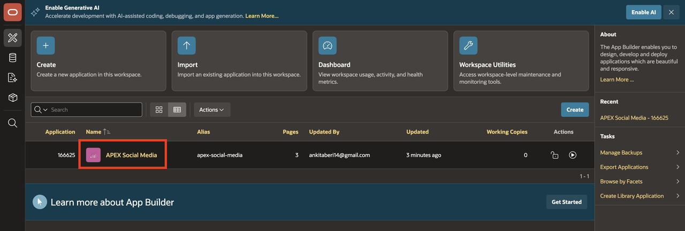
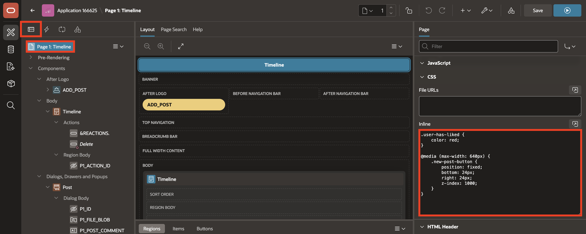
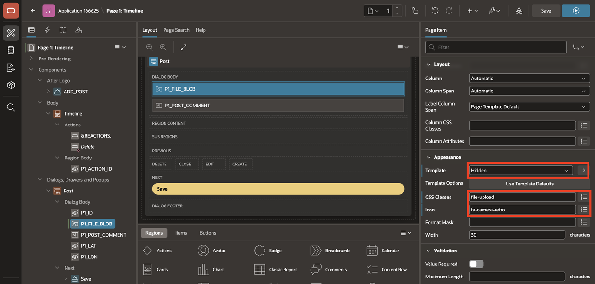
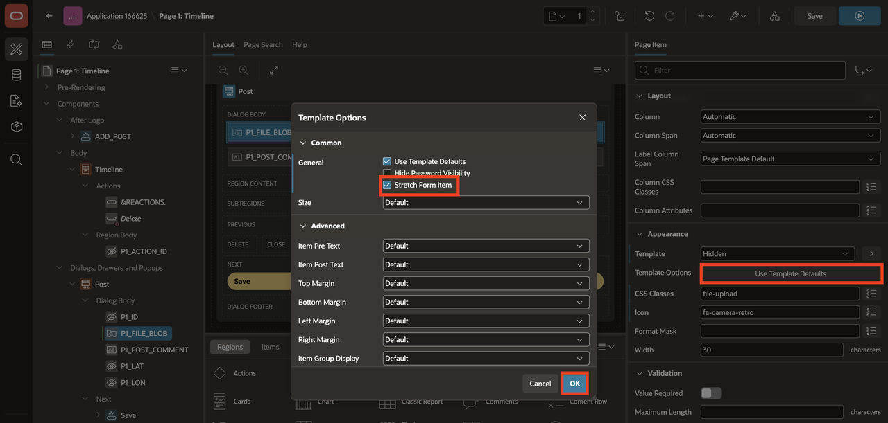
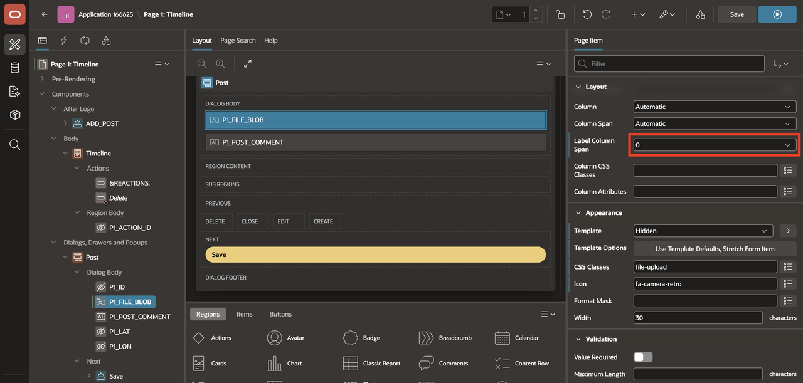
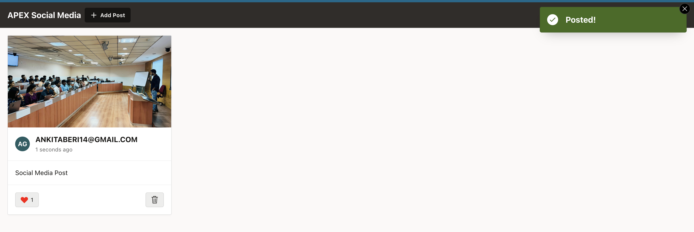

# Clean Up the App

## Introduction

In this lab, you will apply the final UI enhancements to improve the appearance and usability of the Social Media App. You will add custom CSS styling and further customize page items declaratively using Oracle APEX.

<!-- Watch the video below for a quick walk-through of the lab.
[Create an APEX App](videohub:1_gu1lhbr3) -->

### Objectives

In this lab, you will:

- Improve the application appearance using custom CSS.

- Enhance the appearance of a page item declaratively.

### Prerequisites

- Completion of workshop through Lab 8

Estimated Time: 5 minutes

## Task 1: Add CSS to the page

When a post is liked, the heart icon should turn red. Additionally, on smaller screens, relocating the Add Post button to the bottom right will enhance usability. Both enhancements can be achieved using small blocks of inline CSS at the page level.

1. From the left navigation menu, click the **App Builder** icon.

2. Select **APEX Social Media** application.

    

3. On the Application home page, select **Timeline** page.

    

4. In the left pane, select **Page 1: Timeline**, and in the Property Editor, enter the following:

    - Under CSS:

        - Inline: Copy and paste the following CSS into the **Inline** field:

            ```
            <copy>
            .user-has-liked {
                color: red;
            }

            @media (max-width: 640px) {
                .new-post-button {
                    position: fixed;
                    bottom: 24px;
                    right: 24px;
                    z-index: 1000;
                }
            }
            </copy>
            ```

    

## Task 2: Clean up the File Browse Page Item

1. In the left pane, select the **Post** region and click the **P1\_FILE\_BLOB** page item. In the Property Editor, enter/select the following:

    - Under Appearance:

        - Template: **Hidden**

        - CSS Classes: **file-upload**

        - Icon: **fa-camera-retro**

    

    - Template Options: Click **Use Template Defaults**

        - General: Check the **Stretch Form Item** option. (This improves the alignment.)

        Click **OK**.

    

    - Layout > Label Column Span : **0**

    

2. Congratulations! You now have a functional low-code APEX application. **Save and Run** the application.

    

    You can also open the application URL on your mobile device and try it out.

## Summary

In this lab, you enhanced the appearance and usability of the Social Media App by adding custom CSS and refining page item styling. You also optimized the application layout for smaller screens and completed the core functionality of the low-code APEX application.

You may now **proceed to the next lab**

## Acknowledgements

- **Author** - Jayson Hanes, Principal Product Manager; Apoorva Srinivas, Senior Product Manager;

- **Last Updated By/Date** - Ankita Beri, Senior Product Manager, May 2026
