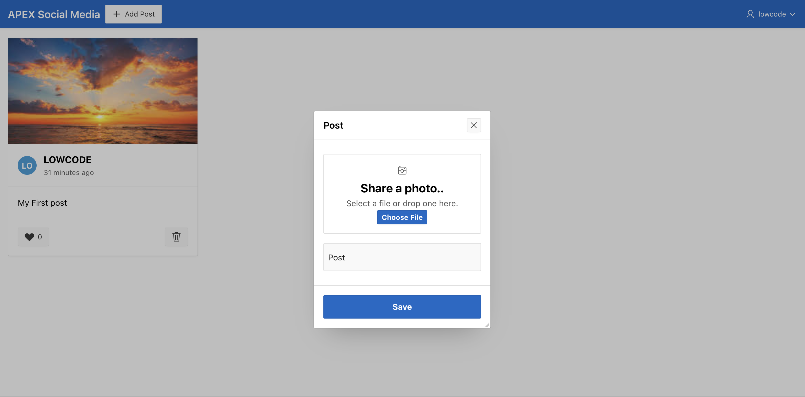

# Clean Up the App

## Introduction

In this lab, you will apply the final touches to enhance the app’s appearance. You will learn how to customize the CSS for a better user experience.

Estimated Time: 5 minutes

Watch the video below for a quick walk-through of the lab.
[Create an APEX App](videohub:1_gu1lhbr3)

### Objectives

In this lab, you will:

- Improve the aesthetics by using custom CSS
- Enhance the appearance of a page item declaratively

### Prerequisites

- Completion of workshop through Lab 8

## Task 1: Add CSS to the page

When a post is liked, the heart icon should turn red. Additionally, on smaller screens, relocating the Add Post button to the bottom right will enhance usability. We can achieve both with two small blocks of Inline CSS at the page level.

1. In the Rendering Tree, select **Page 1: Timeline** and enter the following in the Property Editor:

    - Under CSS:
        - Inline: Copy and paste the following CSS into the **Inline** box

            ```
            <copy>
            .user-has-liked {
                color: red;
            }

            @media (max-width: 640px) {
                .new-post-button {
                    position: fixed;
                    bottom: 24px;
                    right: 24px;
                    z-index: 1000;
                }
            }
            </copy>
            ```

    

## Task 2: Clean up the File Browse Page Item

1. In the Rendering Tree, select Post region and click the **P1\_FILE\_BLOB** page item. In the Property Editor, enter/select the following:

     - Under Appearance:

          - Template: **Hidden**

          - CSS Classes: **file-upload**

          - Icon: **fa-camera-retro**

        

          - Under **Template Options**:

            - General: check the **Stretch Form Item** option. (This improves the alignment.)

    

    - Layout > Label Column Span : **0**

    

2. Voila! We have arrived at a working and significantly functional low-code APEX application. **Save and Run** the application.

    

  You can also send the URL to your mobile and try it out!

  You may now **proceed to the next lab**

## Acknowledgements

- **Author** - Jayson Hanes, Principal Product Manager; Apoorva Srinivas, Senior Product Manager;
- **Last Updated By/Date** - Sahaana Manavalan, Senior Product Manager, March 2025
