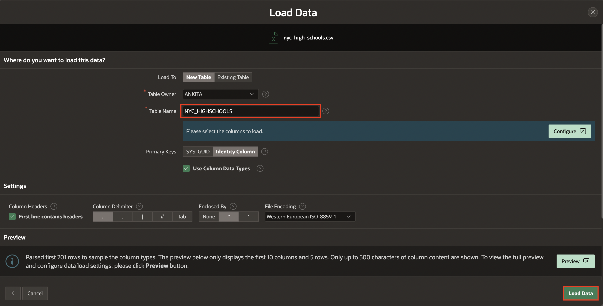
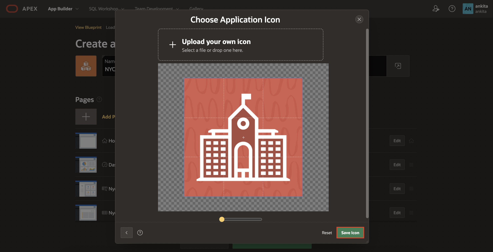
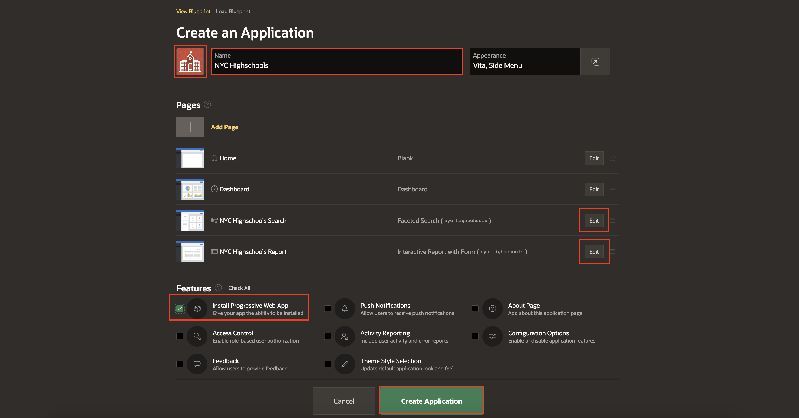
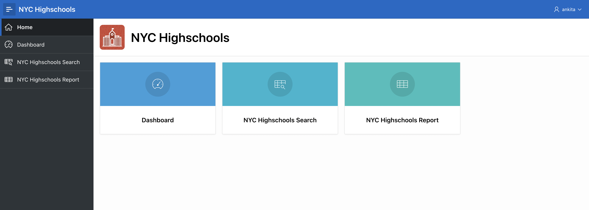

# Creating an App from a Spreadsheet

In this lab, you learn to create an APEX application using the data imported from a spreadsheet. You will learn to import a spreadsheet which consists of a list of High Schools in New York City. [Click here](files/nyc_high_schools.csv) to download the spreadsheet for this lab.

## Introduction
Now that you are logged into your workspace, you can start creating APEX applications. In this lab, you build a simple application based on a spreadsheet. Keep in mind that APEX is great for a variety of apps, from simple ones like this to large, sophisticated apps based on local database objects, REST enabled SQL objects, and even REST APIs.

While APEX developers spend the majority of their time in the **App Builder**, you should also investigate the following:
- **SQL Workshop**: where you can create and maintain database objects.
- **Team Development**: where you can track large APEX development projects.
- **Gallery**: which contains numerous productivity and sample apps that can be installed within minutes.

**Note:** The screenshots in this workshop are taken using Dark Mode in APEX 23.1.

Estimated Time: 5 minutes

Watch the video below for a quick walk-through of the lab.
[Create an App from a Spreadsheet](videohub:1_9jbxjzh8)

## **Task 1**: Loading the Highschool data  

1.  From your APEX workspace home page, click **App Builder**.
2.  Click **Create a New App**.

    

3.  Click **From a File**.

    

    When creating an application from a file, APEX allows you to upload CSV, XLSX, XML, or JSON files and then build apps based on their data. Alternatively, you can also copy and paste CSV data or load sample data.

4.  Within the Load Data wizard, click the **Choose File** option or drag and drop the [nyc\_high\_schools.csv](files/nyc_high_schools.csv) file on to the dialog window.

    

5.  Review the parsed data. Set Table Name to **NYC_HIGHSCHOOLS** and click **Load Data**. Note: You can configure what columns to load from the spreadsheet by clicking the **Configure** button.

    

    After clicking **Load Data**, you will see a spinner until the wizard finishes loading the data. Continue to Task 2 at that point.

## **Task 2**: Creating an application

The Data Load wizard has created a new table and populated that table with the records from the sample data. Now you can create an app based on this new table.

1.  In the Load Data dialog, verify that 427 rows have been loaded into the **NYC_HIGHSCHOOLS** table, then click **View Table**.

    

2. In the Object Browser, review the table structure.   
    In the Table toolbar, click  **More** and select **Create App**.

    

3. On the Create Application page, enter the Name as **NYC Highschools** and click the application icon.
   

4. In the Choose Application Icon wizard, upload your own icon by selecting or dragging and dropping an image. Download a sample icon from [here](files/nyc-highschools.png).
  

5. Once you select an image, the wizard allows you to crop or resize the image. Click **Save Icon**.
    

6. In the Create Application page, review the pages listed.
  Click the **Edit** button for **Nyc Highschools Search** and **Nyc Highschools Report** pages to review more details and update the names to the following:
    - NYC Highschools Search
    - NYC Highschools Report

 Click the checkbox for **Install Progressive Web App** for Features, and then click **Create Application**. You will learn about Progressive Web App in *Lab 4* of this workshop.

    

    When the wizard finishes creating the application, you will be redirected to the application's home page in the App Builder.

## **Task 3**: Running and exploring the new app

1.  Click **Run Application**. This will open the runtime application in a new browser tab, allowing you to see how end users will view the app.

    

2.  Enter your user credentials and click **Sign In**. Notice the custom application icon displayed at the top.

    *Note: Use the same Username and Password you used to sign into the APEX Workspace.*

    

3.  Explore the application a little.
    - Click **Dashboard** (in the home menu or the navigation menu) to view the charts created.
    - Click **NYC Highschools Search**, in the navigation menu, to play with the faceted search.
    - Click **NYC Highschools Report** to view an interactive report, then click the edit icon for a record to display the details in an editable "form" page.

  

## **Summary**

You now know how to create an application from a spreadsheet by dragging and dropping a file.

## **Acknowledgements**

 - **Author** -  Apoorva Srinivas, Senior Product Manager
 - **Contributors** - Salim Hlayel, Tom McGinn
 - **Last Updated By/Date** - Ankita Beri, Product Manager, April 2023
