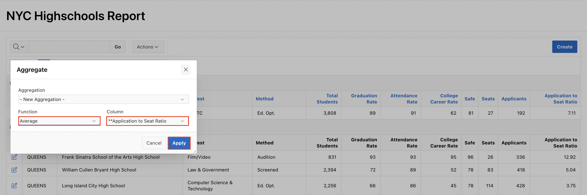
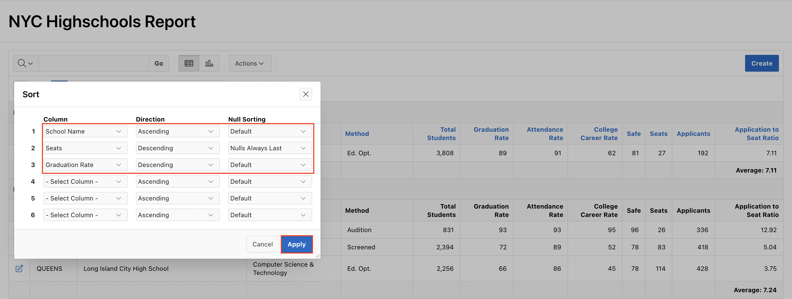
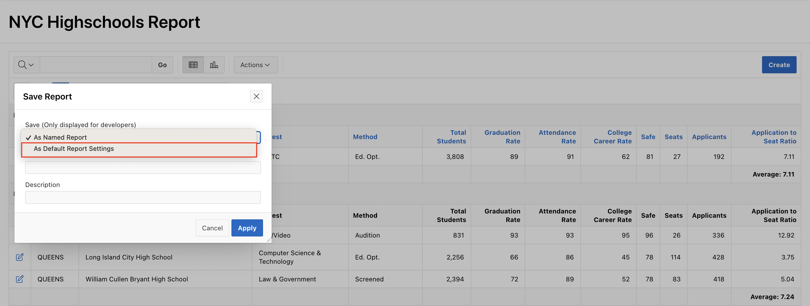
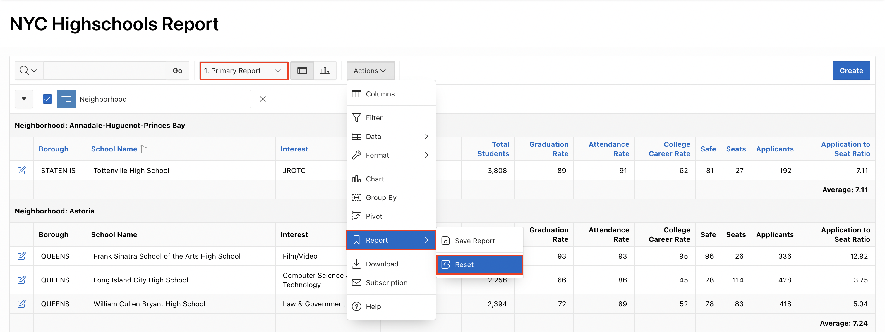
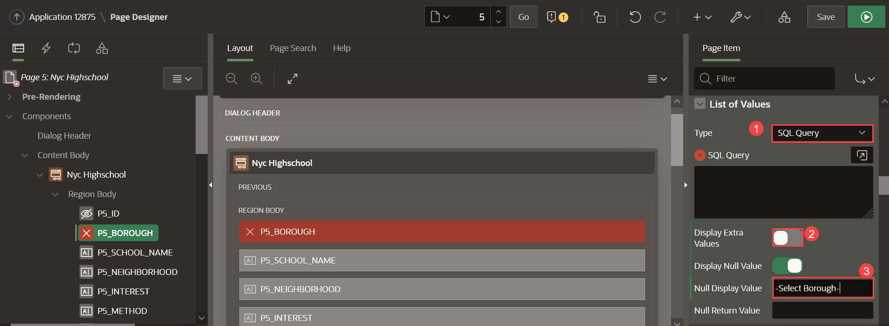

# Improving the Report and Form

## Introduction
In this lab, you will gain an insight into the abilities of Interactive Reports, and learn how to enhance a form page.

Estimated Time: 20 minutes

## Task 1: Enhancing the Interactive Report
The **Project Tasks Report** page utilizes an Interactive Report to display the records. Interactive Reports are exceedingly powerful, as they allow _*end users*_ to modify what data is displayed, and various display characteristics. For this report, you will add a column break, a computational column, an aggregate, a chart, then order the data and save the report for everyone to see.

*Note - All of the steps below, except for saving Alternative Reports, can be performed by end users. There are many additional capabilities available to end users which are not covered below.*

1. In the runtime environment, click **Project Tasks Report**.
2. Click the **Project** column heading, and then select **Control Break**.

    

3. You can add a computational column, where a new column is defined based on a computation against one more existing columns in the report. Columns are select within the computation using a letter associated with each column.

    At the top of the report, click **Actions**, select **Data**, and then select **Compute**.

    

4. On Compute, enter the following and click **Apply**.

    | Property | Value |
    | --- | --- |
    | Column Label | **Budget V Cost** |
    | Format Mask | **$5234.10** |
    | Computation Expression | **I - H** |

    

    This adds a new column **Budget V Cost** to your interactive report.

5. To add up the Budget versus Cost for each project, click **Actions**, select **Data**, and then select **Aggregate**.

    

6. On Aggregate, for Column select **Budget V Cost**, then click **Apply**.

    

7. Even though you can see the total budget versus cost for each project, it would be much easier to view the totals on a chart to get an overall picture of all of the projects.

    In the report click **Actions**, select **Chart**.

8. In the Chart dialog, select / enter the following and click **Apply**.

    | Property | Value |
    | --- | --- |
    | Label | **Project** |
    | Value | ****Budget V Cost** |
    | Function | **Sum** |
    | Sort | **Label-Ascending** |
    | Orientation | **Horizontal** |

    

    After you click **Apply**, the chart will be displayed. Hover over individual records to view the project and value. Toggle between the report view and chart view using the icons at the top of the report.

    

9. You want to ensure that all of the records are ordered by Start Date and then End Date, within each project.

    At the top of the report, click the **View Report** icon, click **Actions**, select **Data**, and then select **Sort**.

    

10. In the Sort dialog, select the following and click **Apply**.

    | Row | Property | Value |
    | --- | --- | --- |
    | 2 | Column | **Start Date** |
    | 3 | Column | **End Date** |
    | 3 | Null Sorting | **Null Always Last** |

    

11. Now that you have made all of these modifications to the Interactive Report it is important to save the report layout. End users have the ability to save either *Private Reports*, only they can view, or *Public Reports*, that other end users can also view. *{Note - As a developer you can remove the ability for _end users_ to save Public Reports by going to the report attributes in Page Designer.}*

    As a developer you also have the ability to save the report as the Primary (default) Report, or an Alternative Report. For this exercise you will save the report as a named Alternative Report.

    In the report, click **Actions**, select **Report**, and then select **Save Report**.

12. In the Save Report dialog, for Save(Only displayed for developers) select **As Default Report Settings**.

    *Note - End users can save Private and Public reports, however, only developers (who have run the app from the App Builder) can save the Primary and Alternative reports.*

    

    In the Save Default Report dialog, select **Alternative**, for Name enter **Budget Review**, and click **Apply**.

    

    A new select list will be displayed at the top of the report which lists all of the saved reports available to the user.

13. To go back to how the end user will see the report when they first access the report, at the top of the report, select **1. Primary Report**, and then click **Reset**.

    

## Task 2: Enhancing the Form
Form pages allow end users to readily update a single record of information. It is very common for these pages to be modal pages, whereby they display over the top of the original page, and the original page is greyed out and not accessible without first closing the modal page. Advantages of modal pages include that the same page can be called from numerous other pages, they include all of the processing, validations, and so forth within the page definition, and they are user friendly and make for a very straight forward user experience.

By default, the form pages generated by the Create Application Wizard are modal pages. The modal page for maintaining Project Tasks takes up significant real estate. This could easily be improved by placing the dates on the same line, and the cost and budget on the same line. Lastly, the status allows any values to be entered, so you should restrict data entry by adding a list of allowed statuses.

1. In the Runtime environment, on the Project Tasks Report page, click the edit icon for any record.

    

    The modal form page for the selected record will be displayed.

2. In the Developer Toolbar, at the bottom of the screen, click **Edit Page 5**.

    *Note - If you have difficulties navigating using the Developer Toolbar, manually navigate to the browser tab for the APEX App Builder. If you are on the application home page, navigate to the page by clicking _5 - Project Tasks_. If already on another page in Page Designer, use the page selector in the toolbar to navigate to page 5.*

3. Items can readily be moved using drag-and-drop within Layout. If required you can also drag _new_ components (regions, items, and buttons) from the Gallery, below Layout, into the Layout.

    In Page Designer, with Page 5 loaded, within Layout (middle pane), click **P5\_END\_DATE** and continue to hold the mouse down. Drag the item up and to the right, until it is directly after **P5\_START\_DATE**, and a dark yellow box is displayed. Release the mouse to drop the item in the new location.

    

4. As an alternative to using drag-and-drop you can also reposition items using attributes in the Property Editor.

    In Page Designer, within Layout (or the Rendering tree in the left pane), select **P5\_BUDGET**. In the Property Editor (right pane), deselect Layout > Start New Row.

    

    *Note - As soon as you deselect Start New Row the item will move to be on the same line as the item above, within Layout.*

5. To limit the data entry for an item one of the simplest techniques is to convert a text item, which allows any data to be entered, into a select list.

    In Page Designer, within the Rendering tree (left pane), select **P5\_STATUS**. In the Property Editor (right pane), select the following.

    | Group | Attribute | Value |
    | --- | --- | --- |
    | Identification | Type | **Select List** |
    | List of Values | Type | **SQL Query** |
    | | Display Extra Values | Deselect |
    | | Null Display Value | Enter **- Select Status -** |

    
    

    For List of Values > SQL Query enter the following code

    ```
    <copy>select distinct status d, status r
    from project_tasks
    order by 1</copy>
    ```

    

6. It is important to save your changes before testing.

    In Page Designer, within the toolbar (at the top), click **Save**.

    

    *Note - If you press Save and Run in the toolbar a message will be displayed, rather than the page being run. This is expected behavior, as modal pages can not be run directly from Page Designer.*

    

7. Navigate back to the runtime environment and refresh the browser, or click **Cancel** on the modal page to return to the **Project Tasks Report** page.

8. On the Project Tasks Report page, click the edit icon for any record.

    Review the improved layout and click on **Status** to see the list of available statuses.

    

## **Summary**

You now know how _end-users_ can define custom reports using Interactive Reports, and you can easily improve form pages.

## **Acknowledgements**

 - **Author/Contributors** -  Salim Hlayel, Principal Product Manager
 - **Last Updated By/Date** - Salim Hlayel, Principal Product Manager, November 2020

