# Add a Map Region and Install PWA

## Introduction

In this lab, you learn to add a map region to the search page in order to visually enhance the page. The search page includes facets on the left which can readily be used to limit the data shown in the map on the right. Once the final application is built, you learn to download and use the application as a Progressive Web App (PWA).

Estimated Time: 10 minutes

Watch the video below for a quick walk-through of the lab.
[Add a Map Region and Install PWA](videohub:1_18wjf2xx)

### Objectives

In this lab, you will:

- Create a Copy of an Existing page.

- Add and Enhance a map region.

- Install Progressive Web App.

### Prerequisites

- Completion of workshop through Lab 3

## Task 1: Create a Copy of an Existing Page

In order to implement the map, we will copy the existing **NYC Highschools Search** page and modify the new page to include the Map region.

1. From the runtime application, go to the search page by clicking **NYC Highschools Search**. Assuming that you ran this app from the APEX App Builder, a Developer Toolbar is displayed at the bottom of the screen. *Note - End users who log directly into the app will not see this toolbar.*

    In the Developer Toolbar, click **Page 3**.

    

    Alternatively, you can also navigate back to the APEX App Builder tab in your browser manually by selecting the appropriate browser tab or window. Once in the App Builder click **3 - NYC Highschools Search**.

    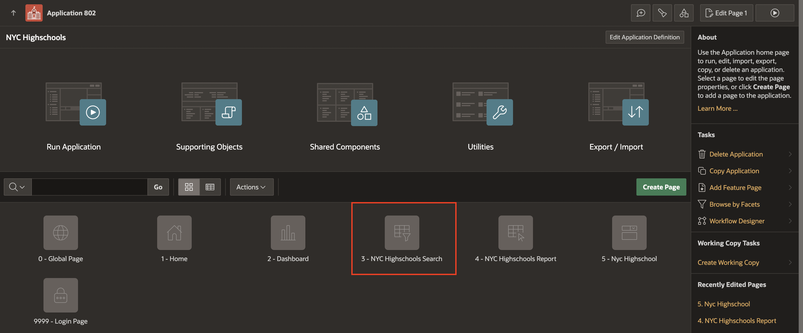

2. To create a page similar to the existing page, click the + icon next to the redo button at the top right corner. Select **Copy Page**.

    

3. For Page to Copy, enter/select the following:

    - New Page Name: **NYC Highschools Map**

    - Breadcrumb: **Breadcrumb**

    Click **Next**.

    

4. For Navigation Preferences, select **Create a new navigation menu entry** and click **Next**. This creates a new entry in the left side navigation menu of your application.

    

5. Under New Value, you can enter new names for the items and buttons. Accept the default names and click **Copy**.

    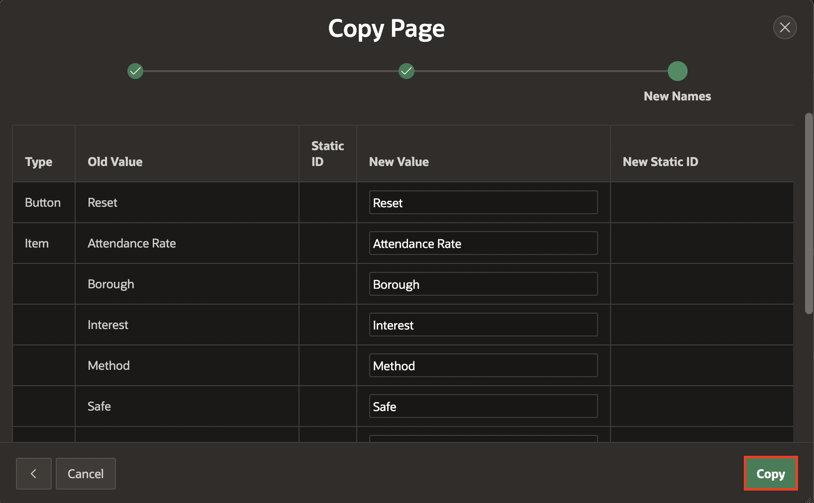

    A new page called **NYC Highschools Map** is created as Page 6.

## Task 2: Add a Map Region

1. The newly created Page 6, **NYC Highschools Map** opens in the Page Designer. In the Rendering pane, navigate to Body and select the **Nyc Highschools** region. In the Property Editor, change the type to **Map**.

    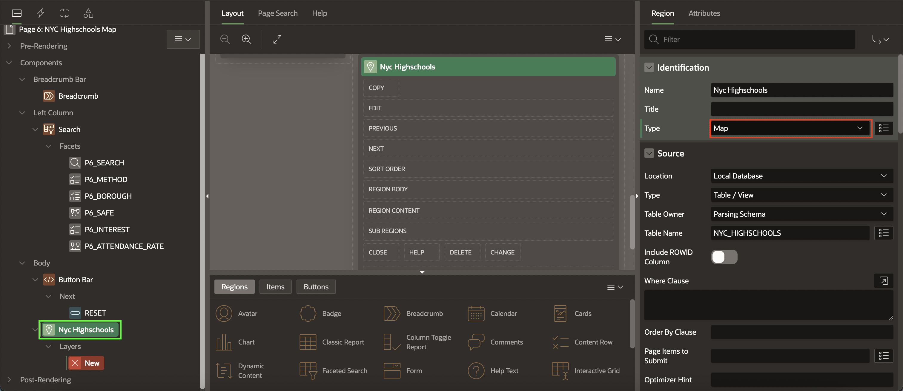

2. To customize a map region, you need to add layers. Under Layers, select **New**. In the property editor, enter/select the following:

    - Name: **Schools**

    - Source > Location: **Region Source**. This indicates that the layer fetches the data from it's parent region (Nyc Highschools) whose source is the local database table *NYC_HIGHSCHOOLS*.

3. In order to display the points on the map, you need to provide the coordinates. In the Property Editor, go to the **Column Mapping** group. Enter the following values:

    |Property  | Value  |
    |--------------|----------------|
    |Geometry Column Data Type       |Longitude/Latitude         |
    |Longitude Column         |Longitude        |
    |Latitude Column         |Latitude        |

    

4. Click **Save**. Later, select **Application \<n\>** at the top to navigate to the application home page.

    

5. Let us set an icon for the newly created **NYC Highschools Map**. Select **Shared Components**.

    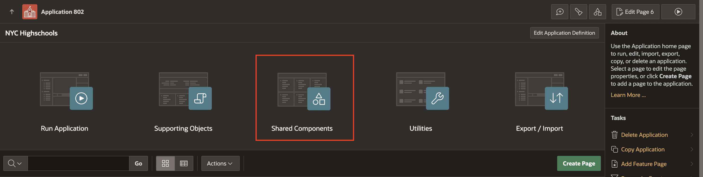

6. Under Navigation and Search, select **Navigation Menu**. Under Lists, select **Navigation Menu**.

    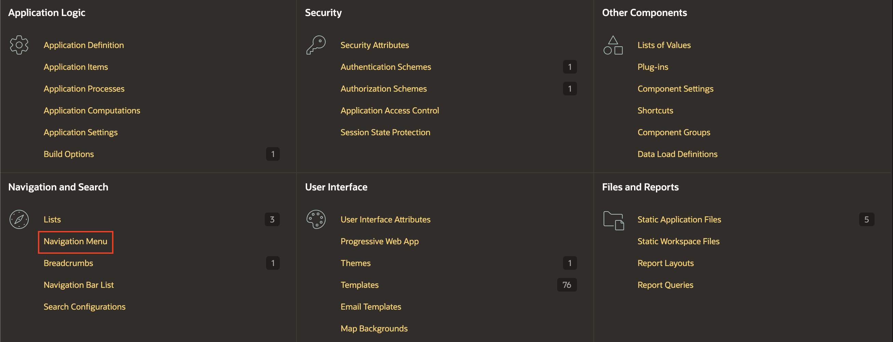

    

7. Click the edit icon next to **NYC Highschools Map** list entry.

    

8. In the edit page, for Image/Class enter **fa-map-marker** and click **Apply Changes**.

    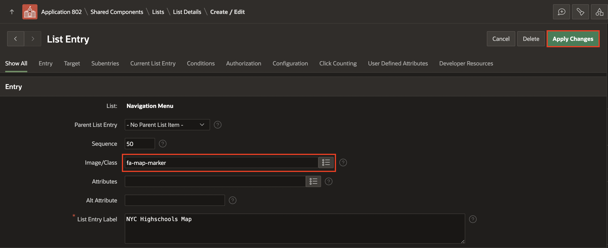

9. Click **Run Page**. The **NYC Highschools Map** is displayed with a faceted search on the left and a map region on the right. Filter the values using faceted search and observe how the map changes accordingly.

    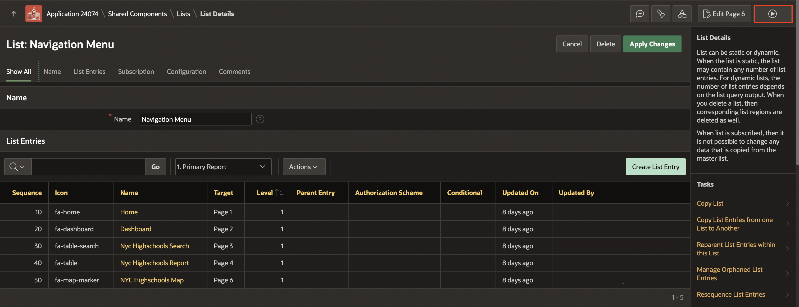

    

## Task 3: Enhance the Map Region

APEX allows customization of the map in a declarative way. In this step, you will enhance the map by adding tooltip and custom pin colors on the map.

1. From the **NYC Highschools Map** page in the application, click **Page 6** in the developer toolbar to edit the page.
    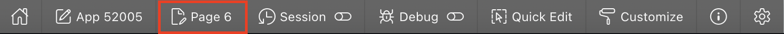

2. In the **Rendering** tab, navigate to **Nyc Highschools**. Under **Layers**, select **Schools**.

3. In the Property Editor, enter/select the following:

    - Tooltip > Advanced Formatting: **Toggle On**.

    - **HTML Expression**: Enter the following HTML snippet:

      ```
      <copy>
      <strong>&SCHOOL_NAME.</strong><br>
      Borough: &BOROUGH.<br>
      </copy>
      ```

    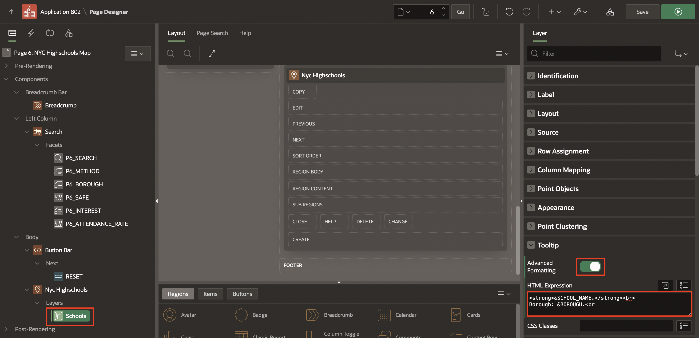

4. Click **Save and Run Page**. The NYC Highschools Map is displayed. Hover over a pin in the map to display the custom tooltip. The tooltip displays the Highschool name and the Borough name.

    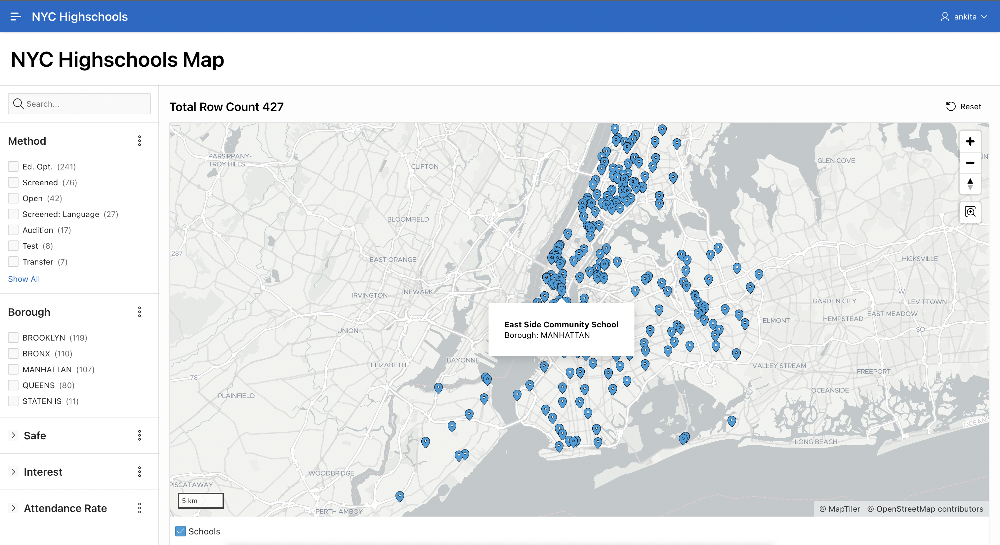

5. Now, you will customize the map by adding a condition such that the value of the *GRADUATION_RATE* will determine the pin color. To do so, click **Page 6** in the developer toolbar to edit the page.

    

6. In the Rendering tab, navigate to **Nyc Highschools** region. In the Property Editor, under Source, select **Local Database** for Location and **SQL Query** for Type. Click on the Code Editor button next to SQL Query.

   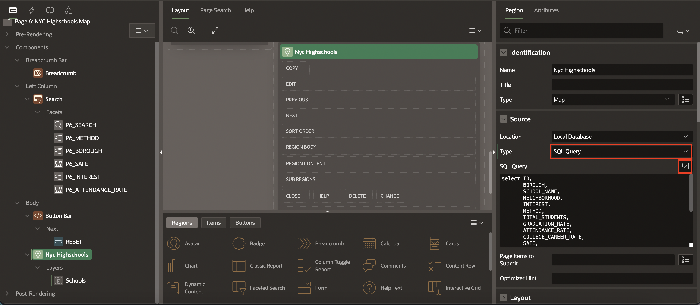

7. In the Code Editor, modify the SQL query to add a CASE statement to determine the color based on the value of *GRADUATION_RATE*. Replace the query with the following query:

      ```
      <copy>
      select ID,
             BOROUGH,
             SCHOOL_NAME,
             NEIGHBORHOOD,
             INTEREST,
             METHOD,
             TOTAL_STUDENTS,
             GRADUATION_RATE,
             ATTENDANCE_RATE,
             COLLEGE_CAREER_RATE,
             SAFE,
             SEATS,
             APPLICANTS,
             DBN,
             LATITUDE,
             LONGITUDE,
             LANGUAGE_CLASSES,
             ADVANCED_PLACEMENT_COURSES,
             SCHOOL_SPORTS,
             CASE WHEN GRADUATION_RATE BETWEEN 0 and 50 then 'red'
             WHEN GRADUATION_RATE BETWEEN 50 and 75 then 'yellow'
             WHEN GRADUATION_RATE BETWEEN 75 and 100 then 'green' END as PIN_COLOR
        from NYC_HIGHSCHOOLS
        </copy>
      ```

    Click **OK**.

    

8. Select **Schools** layer in the Rendering pane. In the Property Editor, do the following:

    - Identification > Name: **Schools - Red**

    - Under Row Assignment:

        - Column: **PIN_COLOR**

        - Value for this Layer **red**

    - Appearance > Fill Color: **&PIN_COLOR.**

    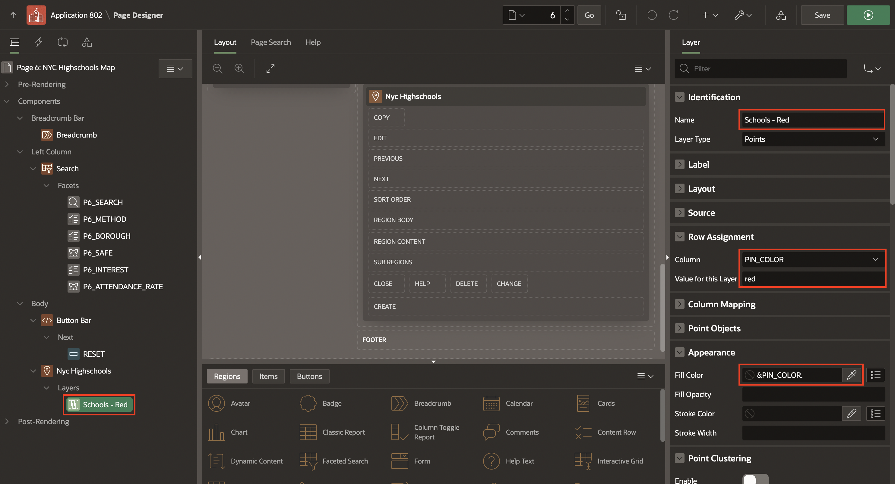

9. In the Rendering Pane, right-click on **Schools - Red** and select **Duplicate**. In the Property Editor, do the following:

    - Identification > Name: **Schools - Green**

    - Row Assignment > Value for this Layer: **green**

    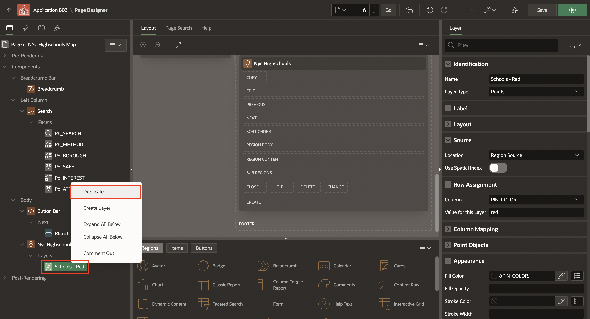

    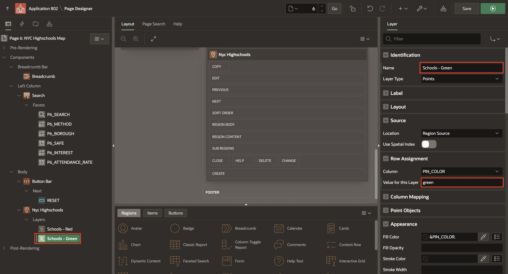

10. In the Rendering Pane, right-click on **Schools - Green** and select **Duplicate**. In the Property Editor, do the following:

    - Identification > Name: **Schools - Yellow**

    - Row Assignment > Value for this Layer: **yellow**

    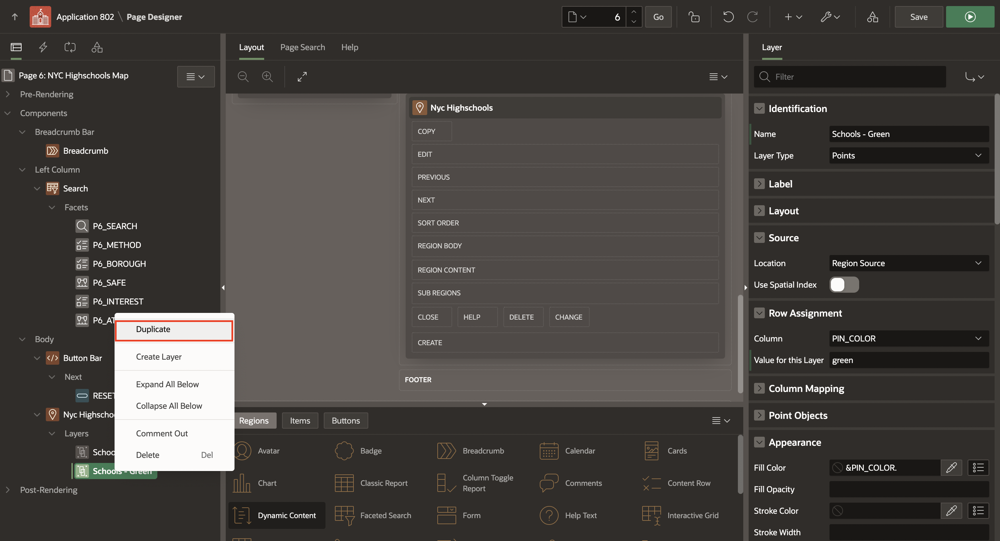

    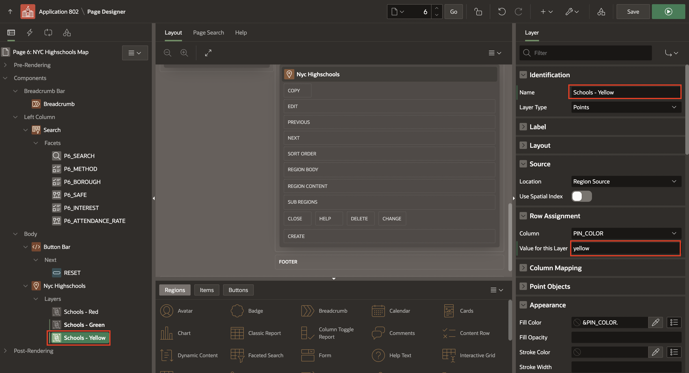

11. Click **Save and Run** page. The **NYC Highschools Map** displays different colors for the pins.

    - The schools with a Graduation rate between 0-50 are displayed in **red**.

    - The schools with a Graduation rate between 50-75 are displayed in **yellow**.

    - The schools with a Graduation rate between 75-100 are displayed in **green**.

    

## Task 4: Install a Progressive Web App (PWA)

**Progressive Web Applications (PWA)** are designed to be fast, responsive, installable to a home screen, reliable (online or offline), and engaging (providing support for push notifications).

Recall that you created a Progressive Web App by running the Create Application Wizard and enabling the Install Progressive Web App feature in Lab 1 of this workshop. In this step, you will learn to install and use a PWA.

>*Note*:
  - To enable Progressive Web App, an Oracle APEX application must be served over a secured HTTPS environment, or localhost. If using an unsecured environment, PWA features will not be rendered.

  - PWA is available in Google Chrome, Microsoft Edge and Safari browsers. Firefox does not support PWA.

1. To install a PWA, go to your application and click **Install App** on the navigation bar.

    

2. A popup dialog appears in your browser asking you whether you want to install the app. Click **Install**.

    

3. After a few seconds, the application icon is created on your desktop/home screen. Double-click the application icon.

    

4. The application is now open as a PWA without the need for a browser. This provides a customizable offline page when users are offline and cannot request the network. It optimizes page loading speed on the mobile device. It also improves the page load rendering time.

    

## Summary

You now know how to embed a maps in your application and to install a Progressive Web App (PWA).

## Learn More - *Useful Links*

- [App Builder User's Guide](https://docs.oracle.com/en/database/oracle/application-express/21.2/htmdb/index.html)
- [APEX Collateral](https://apex.oracle.com)
- [Tutorials](https://apex.oracle.com/en/learn/tutorials)
- [Community](https://apex.oracle.com/community)
- [External Site + Slack](http://apex.world)

## Acknowledgements

- **Author** -  Apoorva Srinivas, Senior Product Manager
- **Last Updated By/Date** - Ankita Beri, Product Manager, January 2025
