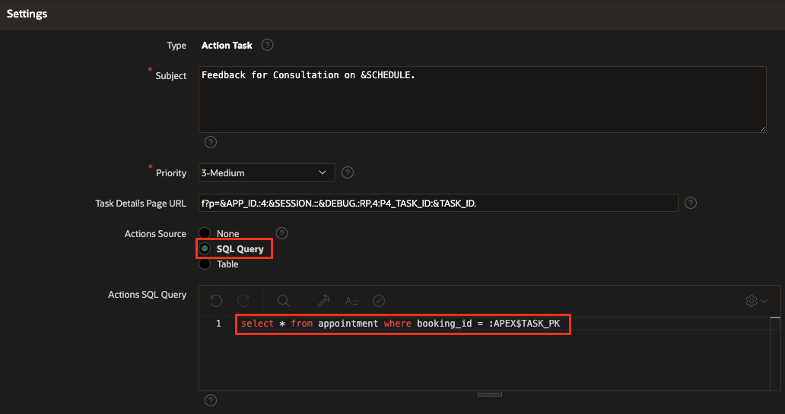
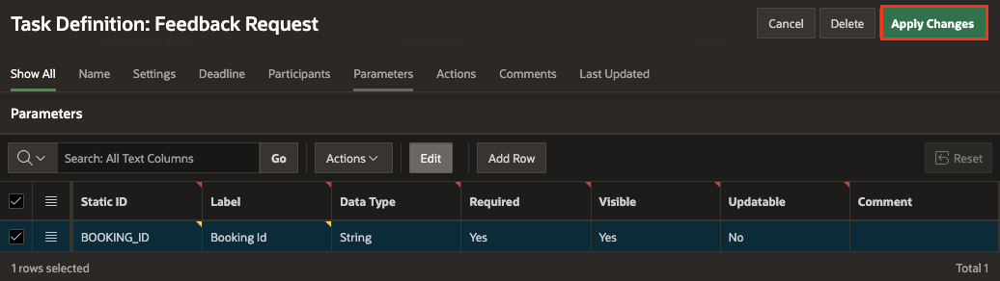

# Add Human Tasks to Workflow

## Introduction

In this hands-on lab, we will explore the process of creating Human Tasks using the Approvals Component in Oracle APEX. Human Tasks are essential steps in our Doctor Appointment Workflow, requiring manual approval, rejection, or completion by either the Doctor or Patient. Specifically, we will focus on tasks such as **Send Appointment Request To Doctor**, **Raise Invoice Request For Patient**, and **Raise Feedback Request For Patient**.

These steps therefore correspond to Human Task Activities. Before using them in the workflow, we use the Approvals Component to create the task definitions as follows.

## Objectives

In this lab, you will learn how to create Human Tasks to
- Sending Appointment Request To Doctor
- Raise Invoice Request For Patient
- Raise Feedback Request For Patient


## Task 1. Creating Task Definition for Appointment Request

1. Navigate to **Shared Components**.

   

2. Under **Workflows and Automations**, select **Task Definitions**.

   

3. click **Create**.

  


4. In the Create Task Definition Wizard, enter the following details and Click **Create**.
    - For **Name**, enter **Appointment Request**.
    - For **Subject**, enter **Appointment for &PATIENT_NAME. on &APPOINTMENT_DATE.**
    - Set **Priority** to **3-Medium**.

    

3. In the Edit Task Definition page, notice that the Task Details Page Number is empty. Click on the **Create Task Details** Page button to generate the details page for this task. You get a popup dialog asking if the next available page number should be used. Click **OK**. You will find that the Task Details Page Number is replaced by the Task Details Page URL containing the link to the generated Details Page.

    
    

  You will find that the Task Details Page Number is replaced by the Task Details Page URL containing the link to the generated Details Page.

4. In the Task Definitions Page, Click **Appointment Request** and then configure the Action Source by selecting **SQL Query** and providing the following SQL statement. This step ties our task to the system of records, in this case, the doctor records.

    ```
    <copy>
    select * from doctor where dno = :APEX$TASK_PK
    </copy>
    ```

    
    

  *Note: APEX$TASK_PK is a substitution string holding the primary key value of the system of records (in this case, the employee number of the Doctor)*.

5. Navigate to Participants Section, and add Task Participants with Participant Type as **Potential Owner** and Value Type as **Expression**. In the Value field, enter **:DNAME** (where **DNAME** refers to the DNAME column in the DOCTOR Table).

  

6. Under Task Parameters, Add the below Parameters by clicking **Add Row** and then click **Apply Changes** to save the Task Definition.

    | Parameter Name     |
    |--------------------|
    | APPOINTMENT_DATE   |
    | PATIENT_DESC       |
    | PATIENT_NAME       |

  


Similarly, now create the task definitions for the Invoice Request and Feedback Request Tasks to be raised for the patient.

## Task 2. Creating Task Definitions for Invoice Request

1. Navigate to **Shared Components**, Under **Workflows and Automations**, select **Task Definitions**. Then click **Create**.

    

2. In the Create Task Definition Wizard, enter the following details and Click **Create**.
    - For **Name**, enter **Appointment Request**.
    - For **Type**, select **Actions Task**.
    - For **Subject**, enter **Invoice for &PATIENT_USERNAME. for consultation on &SCHEDULE.**
    - Set **Priority** to **3-Medium**.

    

3. In the Edit Task Definition page, notice that the Task Details Page Number is empty. Click on the **Create Task Details** Page button to generate the details page for this task. You get a popup dialog asking if the next available page number should be used. Click **OK**. You will find that the Task Details Page Number is replaced by the Task Details Page URL containing the link to the generated Details Page.

    
    

  You will find that the Task Details Page Number is replaced by the Task Details Page URL containing the link to the generated Details Page.

4. In the Task Definitions Page, Click **Invoice Request** and then configure the Action Source by selecting **SQL Query** and providing the following SQL statement. This step ties our task to the system of records, in this case, the doctor records.

    ```
    <copy>
    select * from appointment where BOOKING_ID = :APEX$TASK_PK
    </copy>
    ```

    
    

  *Note: APEX$TASK_PK is a substitution string holding the primary key value of the system of records (in this case, the employee number of the Doctor)*.

5. Navigate to Participants Section, and add Task Participants with Participant Type as **Potential Owner** and Value Type as **Static**. In the Value field, enter **&PATIENT_USERNAME.**.

  

6. Under Task Parameters, Add the below Parameters by clicking **Add Row** and then click **Apply Changes** to save the Task Definition.

    | Parameter Name     |
    |--------------------|
    | DOCTOR_NAME        |
    | FEES               |
    | PATIENT_NAME       |

  


## Task 3. Creating Task Definitions for Feedback Request

1. Navigate to **Shared Components**, Under **Workflows and Automations**, select **Task Definitions**. Then click **Create**.

    

2. In the Create Task Definition Wizard, enter the following details and Click **Create**.
    - For **Name**, enter **Feedback Request**.
    - For **Type**, select **Actions Task**.
    - For **Subject**, enter **Feedback for Consultation on &SCHEDULE.**
    - Set **Priority** to **3-Medium**.

    

3. In the Edit Task Definition page, notice that the Task Details Page Number is empty. Click on the **Create Task Details** Page button to generate the details page for this task. You get a popup dialog asking if the next available page number should be used. Click **OK**. You will find that the Task Details Page Number is replaced by the Task Details Page URL containing the link to the generated Details Page.

    

  You will find that the Task Details Page Number is replaced by the Task Details Page URL containing the link to the generated Details Page.

4. In the Task Definitions Page, Click **Feedback Request** and then configure the Action Source by selecting **SQL Query** and providing the following SQL statement. This step ties our task to the system of records, in this case, the doctor records.

    ```
    <copy>
    select * from appointment where BOOKING_ID = :APEX$TASK_PK
    </copy>
    ```

    

  *Note: APEX$TASK_PK is a substitution string holding the primary key value of the system of records (in this case, the employee number of the Doctor)*.

5. Navigate to Participants Section, and add Task Participants with Participant Type as **Potential Owner** and Value Type as **Static**. In the Value field, enter **&PATIENT_USERNAME.**.

  

6. Under Task Parameters, Add the below Parameters by clicking **Add Row** and then click **Apply Changes** to save the Task Definition.

    | Parameter Name     |
    |--------------------|
    | BOOKING_ID         |


  


## **Summary**
You have successfully created Human Task definitions for the Doctor Appointment Workflow using the Approvals Component. In the next section, we will integrate these tasks into the workflow to complete the design process.

## Acknowledgments
- **Author** - Roopesh Thokala, Senior Product Manager
- **Contributor** -
- **Last Updated By/Date** - Roopesh Thokala, Senior Product Manager, November 2023   
